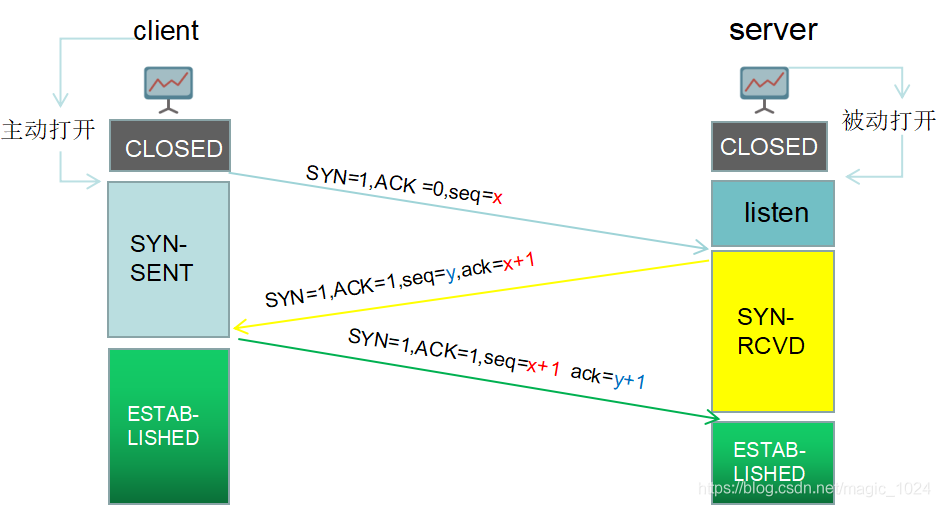
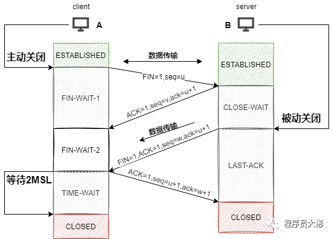

# 计算机八股
## C++
### 封装、继承、多态
- 封装：将属性和行为作为一个整体，并可以添加权限
- 继承：继承(inheritance)机制是面向对象程序设计使代码可以复用的最重要的手段
- 多态：是指同样的对象成员函数的调用被不同类型的对象接收时导致不同的行为
### 结构体和类
结构体和类的唯一区别在于，结构体和类具有不同的默认访问控制属性：

在类中，对于未指定访问控制属性的成员，其访问控制属性为私有类型；

在结构体中，对于未指定任何访问控制属性的成员，其访问控制属性为公有类型。
### public、private、protected区别
访问权限的区别
- public:可以被类成员函数、本类对象、本类派生类访问。
- protected:只允许本类的成员函数、本类派生类访问
- private:只允许本类的成员函数访问
继承的区别
public继承：
- 基类private	 --> 派生类不继承
- 基类protected	 --> 派生类变为protected
- 基类public	 --> 派生类public
protected继承：
- 基类private	--> 派生类不继承
- 基类protected	--> 派生类protected
- 基类public	--> 派生类protected
private继承：
- 基类private	--> 派生类不继承
- 基类protected	--> 派生类private
- 基类public	--> 派生类private
### static、const
static(静态):
- 在全局变量前加上关键字static，全局变量就定义成一个全局静态变量,储存在全局区.
- 在局部变量之前加上关键字static，局部变量就成为一个局部静态变量，储存在全局区
- 静态成员可以实现多个对象之间的数据共享
- 在静态成员函数的实现中不能直接引用类中说明的非静态成员，可以引用类中说明的静态成员（这点非常重要）

const（常量）:
- const修饰的成员函数表明函数调用不会对对象做出任何更改，事实上，如果确认不会对对象做更改，就应该为函数加上const限定，这样无论const对象还是普通对象都可以调用该函数。
- 常量指针是指指向常量的指针，顾名思义，就是指针指向的是常量，即，它指向的内容不能被改变，不能通过指针来修改它指向的内容，但是指针自身不是常量，它自身的值可以改变，从而指向另一个常量。int const *b = &a;
- 指针常量是指指针本身是常量。它指向的地址是不可改变的，但地址里的内容可以通过指针改变。它指向的地址将伴其一生，直到生命周期结束。有一点需要注意的是，指针常量在定义时必须同时赋初值。int *const c = &a;
### 代码区、全局区、堆区、栈区
代码区：
- 存放CPU执行的机器指令。
- 代码区是共享的，共享的目的是对于频繁被执行的程序，只需要在内存中有一份代码即可。
- 代码区是只读的，使其只读的原因是防止程序意外地修改了它的指令。

全局区：
- 全局变量和静态变量存放在此。
- 全局区还包含了常量区,字符串常量和其他常量也存放在此。
- 该区域的数据在程序结束后由操作系统释放。

栈区：
- 由编译器自动分配释放，存放函数的参数值，局部变量等。
- 不要返回局部变量的地址。

堆区：
- 由程序员分配释放，若程序员不释放，程序结束时由操作系统回收。
- 在C++中主要利用new在堆区开辟内存。
### 指针和引用、空指针、野指针
指针： 指针是一个变量，存储的是一个地址，指向内存的一个内存单元
引用： 引用是源变量的一个别名，跟原来的变量实质上是同一个东西
空指针：没有存储任何的内存地址的指针就称为空指针，被赋值为0或null的指针。
野指针：野指针就是指向一个已删除的对象或者未申请访问受限内存区域的指针
### C++11的新特性
- nullptr
- auto
- 基于范围的 for 循环
- lambda：Lambda函数也叫匿名函数，是自定义函数的一种,专指用关键字” lambda”定义的无名短函数，所以也有Lambda表达式这种说法。这种函数得名于省略了用def声明函数的标准步骤，是C++ 11中新增的特性。
- unordered_map/unordered_set
- 列表初始化

### 深拷贝和浅拷贝
浅拷贝：增加一个指向已经存在的空间的指针，对于拷贝和被拷贝的共用一块内存
深拷贝：新开辟一块内存空间，与被拷贝的只有值相同

浅拷贝的问题：
指向的是同一块内存，很容易造成堆区的内存重复释放的问题（如果释放掉这一块内存的话，没有被释放的变量再去访问这块内存会报错），深拷贝则是来解决这一问题的。
### 重写和重载

重载：两个函数名相同，但是参数列表不同（个数，类型），返回值类型没有要求，在同一作用域中
重写：子类继承了父类，父类中的函数是虚函数，在子类中重新定义了这个虚函数，这种情况是重写

### virtual关键字
多态的实现主要分为静态多态和动态多态，静态多态主要是重载，在编译的时候就已经确定；动态多态是用虚函数机制实现的，在运行期间动态绑定。
虚函数的实现：在有虚函数的类中，类的最开始部分是一个虚函数表的指针，这个指针指向一个虚函数表，表中放了虚函数的地址，实际的虚函数在代码段(.text)中。当子类继承了父类的时候也会继承其虚函数表，当子类重写父类中虚函数时候，会将其继承到的虚函数表中的地址替换为重新写的函数地址。使用了虚函数，会增加访问内存开销，降低效率。

## Python
### 多线程、多进程、GIL
多线程：thread、threading由于python的机制，只允许一个线程运行，多线程实际上是多个线程来回切
GIL：每个线程在执行的时候都需要先获取GIL，保证同一时刻只有一个线程可以执行代码，即同一时刻只有一个线程使用CPU。执行单线程程序的开发人员看不到GIL的影响，但它可能是CPU绑定多线程代码中的性能瓶颈。
多进程：multiprocessing
### lambda
匿名函数：f = lambda a,b,c: a+b+c
### 装饰器
函数也是一个对象，装饰器的作用就是将函数a也作为一个参数传给另一个指定的函数b，在b中会调用函数a并返回相应的结果
### __ new __ 和 __ init __
__ new __：用于创建实例，而__init__()则负责初始化实例
- __ new __ 至少要有一个参数cls，代表当前类，此参数在实例化时由Python解释器自动识别

- __ new __ 必须要有返回值，返回实例化出来的实例，可以return 父类__new__出来的实例 或者直接是object的__new__出来的实例

- __ int __ 有一个参数self，就是这个__new__返回的实例， __init__在__new__的基础上可以完成一些其它初始化的动作，__init__不需要返回值

- 如果__new__创建的是当前类的实例，会自动调用init函数通过return调用的__new__函数的第一个参数cls来保证是当前类实例；如果是其它类的类名实际创建返回的也是其他类的实例，不会调用当前类的__init__，也不会调用其他类的__init__

### *args，**kwargs
*args是用来发送一个非键值对的可变数量的参数列表给一个函数.
**kwargs 允许你将不定长度的键值对作为参数传递给一个函数

## 数据结构

### 树
#### 二叉排序树
树中元素是有序的，即每一课子树的左孩子的节点都小于其根节点，右孩子节点都大于其根节点，二叉搜索树容易退化成一条链
#### 二叉平衡树
平衡二叉树的左右子树高度之差不超过1，可以保证查找的最坏时间复杂度为O（log2N）

#### 红黑树
- 节点不是黑色，就是红色（非黑即红）
- 根节点为黑色
- 叶节点为黑色（叶节点是指末梢的空节点 Nil或Null）
- 一个节点为红色，则其两个子节点必须是黑色的（根到叶子的所有路径，不可能存在两个连续的红色节点）
- 每个节点到叶子节点的所有路径，都包含相同数目的黑色节点（相同的黑色高度）
- 
红黑树插入时的不平衡，不超过两次旋转就可以解决；删除时的不平衡，不超过三次旋转就能解决

#### 完全二叉树
完全二叉树非叶子节点如果有右孩子那么其一定有左孩子。
### 排序
#### 直接插入排序
```c++
void sort(int *a,int n)
{
    for(int i=1;i<n;i++)
    {
        int j=i-1,k=a[i];
        while(j>=0 && a[j]>k)
        {
            a[j+1]=a[j];
            j--;
        }
        a[j+1]=k;
    }
}
```
时间复杂度：o（n2）
空间：o（1）
稳定
适用情况：n较小
#### 冒泡排序
```c++
void BubbleSort(vector<int> &arr, int n) {
  int i, j, flag;
  int temp;
  for(i = 0; i < n-1; i++) { // 进行n-1次
    flag = 0; // 交换标志，0表示无交换，1表示有交换
    for(j = 0; j < (n-i-1); j++) { // 数组下标最大为n-1
      if(arr[j] > arr[j+1]) { // 逆序就交换
        flag = 1; // 有交换
        temp = arr[j];
        arr[j] = arr[j+1];
        arr[j+1] = temp;
      }
    }
    if(flag == 0) // 无交换,说明已经全部排好序，提前结束
      break;
  } // for
}
```
时间复杂度：o（n2）
空间：o（1）
稳定
适用情况：相对有序
#### 简单选择排序
```c++

void selectSort(vecotr<int> &arr ,int n){
	for(int i=0;i<n;i++){
		//寻找[i,n)区间里的最小值 
		int minIndex = i;  
		for(int j=i+1;j<n;j++){
			if(arr[j]<arr[minIndex]){
				minIndex = j;//更新索引		 
			}	
		}
		//找到最小位置的索引，然后交换最小位置的数和当前的位置的数
		swap(arr[i],arr[minIndex]); 
	}

```
时间复杂度：o（n2）
空间：o（1）
不稳定
适用情况：n较小
#### 快速排序
```c++
int partition(vector<int> &nums, int low, int high) {
        int pivot = nums[low];
        while (low < high) {
            while (low < high && nums[high] >= pivot) high--;
            nums[low] = nums[high];
            while (low < high && nums[low] <= pivot) low++;
            nums[high] = nums[low];
        }
        nums[low] = pivot;
        return low;
    }

    vector<int> quickSort(vector<int> &nums, int low, int high) {
        if (low >= high) return nums;
        int k = partition(nums, low, high);
        quickSort(nums, low, k - 1);
        quickSort(nums, k + 1, high);
        return nums;
    }
```
时间复杂度：o（nlog2n）
空间：递归栈
不稳定
适用情况：相对乱序
#### 归并排序
```c++
    void merge(vector<int> &nums, int low, int mid, int high) {
        vector<int> tmp(nums.begin(), nums.end());
        int i = low, j = mid + 1, k = i;
        for (; i <= mid && j <= high; k++) {
            if (tmp[i] < tmp[j])
                nums[k] = tmp[i++];
            else
                nums[k] = tmp[j++];
        }
        while (i <= mid) nums[k++] = tmp[i++];
        while (j <= high) nums[k++] = tmp[j++];
    }

    void mergeSort(vector<int> &nums, int low, int high) {
        if (low < high) {
            int mid = (low + high) / 2;
            mergeSort(nums, low, mid);
            mergeSort(nums, mid + 1, high);
            merge(nums, low, mid, high);
        }
    }
```
时间复杂度：o（nlog2n）
空间：递归栈
稳定
适用情况：相对有序
#### 堆排序
```c++
void adjustHeap(vector<int> &arr, int index, int len) {
    //左右孩子
    int left_index = 2 * index + 1, right_index = 2 * index + 2;

    int max_index = index;
    //当前节点跟哪个孩子换
    if (left_index < len && arr[max_index] < arr[left_index]) max_index = left_index;
    if (right_index < len && arr[max_index] < arr[right_index]) max_index = right_index;

    if (max_index != index) {
        swap(arr[max_index], arr[index]);
        adjustHeap(arr, max_index, len);
    }
}

void heapSort(vector<int> &arr, int len) {
    //build Max_heap
    for (int i = len / 2 - 1; i >= 0; i--) {//从最后一个非叶子节点往上调整
        adjustHeap(arr, i, len);
    }
    //adjust heap
    for (int i = len - 1; i > 0; i--) {
        swap(arr[0], arr[i]); //堆顶元素和第i个元素交换再网上调整
        adjustHeap(arr, 0, i);
    }
}
```
时间复杂度：o（nlog2n）
空间：递归栈
不稳定
#### 基数排序
按位排序
## 操作系统

### 进程和线程
#### 进程和线程的区别
进程：进程是对运行时程序的封装，是系统进行资源调度和分配的的基本单位，实现了操作系统的并发
线程：线程是进程的子任务，是CPU调度和分派的基本单位，用于保证程序的实时性，实现进程内部的并发
区别：
- 进程在执行过程中拥有独立的内存单元，而多个线程共享进程的内存
- 进程是资源分配的最小单位，线程是CPU调度的最小单位；
- 线程间通信简单，同步复杂，线程创建、销毁和切换简单，速度快，占用内存少,但是线程间会相互影响，一个线程意外终止会导致同一个进程的其他线程也终止
- 而多进程间拥有各自独立的运行地址空间，进程间不会相互影响，程序可靠性强，但是进程创建、销毁和切换复杂，速度慢，占用内存多，进程间通信复杂，但是同步简单，适用于多核、多机分布。

#### 进程通信
- 管道：速度慢，容量有限，只有父子进程能通讯    
- FIFO：任何进程间都能通讯，但速度慢    
- 消息队列：容量受到系统限制，且要注意第一次读的时候，要考虑上一次没有读完数据的问题    
- 信号量：是操作系统用来解决并发中的互斥和同步问题的一种方法。
- 共享内存区：能够很容易控制容量，速度快，但要保持同步，比如一个进程在写的时候，另一个进程要注意读写的问题，相当于线程中的线程安全，当然，共享内存区同样可以用作线程间通讯，不过没这个必要，线程间本来就已经共享了同一进程内的一块内存

### 死锁

#### 什么是死锁
死锁是指在一组进程中的各个进程均占有不会释放的资源，但因互相申请被其他进程所站用不会释放的资源而处于的一种永久等待状态。
原因：
- 系统提供的资源太少了，远不能满足并发进程对资源的需求
- 进程推进顺序不合适，互相占有彼此需要的资源，同时请求对方占有的资源，往往是程序设计不合理
#### 必要条件
- 互斥条件(Mutual exclusion)：资源不能被共享，只能由一个进程使用。
- 请求与保持条件(Hold and wait)：已经得到资源的进程可以再次申请新的资源。
- 非剥夺条件(No pre-emption)：已经分配的资源不能从相应的进程中被强制地剥夺。
- 循环等待条件(Circular wait)：系统中若干进程组成环路，该环路中每个进程都在等待相邻进程正占用的资源。
#### 死锁预防：
破坏导致死锁必要条件中的任意一个就可以预防死锁。例如，要求用户申请资源时一次性申请所需要的全部资源，这就破坏了保持和等待条件；将资源分层，得到上一层资源后，才能够申请下一层资源，它破坏了环路等待条件。预防通常会降低系统的效率。

- 打破互斥条件：允许进程同时访问资源（有些资源就是不可以同时访问的，无实用价值）
- 打破不可抢占条件：比如给进程设置优先级，高优先级的可以抢占资源(实现困难，降低系统性能)
- 打破占有且等待条件：实行资源预分配策略，即进程在运行前一次性的向系统申请它所需要的全部资源(不可预测资源的使用，利用率低，降低并发性)
- 破坏循环等待条件：采用这种策略，即把资源事先分类编号，按号分配，使进程在申请，占用资源时不会形成环路。所有进程对资源的请求必须严格按资源序号递增的顺序提出（限制和编号实现困难，增加系统开销，有些资源暂时不用也需要先申请，增加了进程对资源的占用时间）
#### 死锁避免：
避免是指进程在每次申请资源时判断这些操作是否安全，例如，使用银行家算法。死锁避免算法的执行会增加系统的开销。
允许进程动态的申请资源，但系统在进行资源分配前，应先计算此次资源分配的安全性。若此次分配不会导致系统进入不安全状态，则将资源你分配给进程，否则，让进程等待。
#### 银行家算法
思想：银行家算法是从当前状态出发，按照系统各类资源剩余量逐个检查各进程需要申请的资源量，找到一个各类资源申请量均小于等于系统剩余资源量的进程P1。然后分配给该P1进程所请求的资源，假定P1完成工作后归还其占有的所有资源，更新系统剩余资源状态并且移除进程列表中的P1，进而检查下一个能完成工作的客户。如果所有客户都能完成工作，则找到一个安全序列，银行家才是安全的。若找不到这样的安全序列，则当前状态不安全。

数据结构：

1.可利用资源向量 **Avaliable**：这是一个m个元素的数组，每个元素代表一类可利用的资源。如果Available[j]=K,则表示系统中现有Rj类资源K个。
2.最大需求矩阵**Max**：是个nm的矩阵，它定义了系统中n个进程中的每一个进程对m类资源的最大需求。如果Max[i,j]=K；则表示进程i需要Rj类资源的最大数目为K。
3.分配矩阵**Allocation**：这也是一个nm的矩阵，它定义了系统中每一类资源当前已分配给每一进程的资源数。如果Allocation[i,j]=K，则表示进程i当前已分得Rj类资源的数目为K。
4.需求矩阵**Need**：这也是一个n*m的矩阵，用以表示每一个进程尚需的各类资源数。如果Need[i,j]=K,则表示进程i还需要Rj类资源K个，方能完成任务。

#### 死锁检测：
死锁预防和避免都是事前措施，而死锁的检测则是判断系统是否处于死锁状态，如果是，则执行死锁解除策略。
#### 死锁解除：
这是与死锁检测结合使用的，它使用的方式就是剥夺。即将某进程所拥有的资源强行收回，分配给其他的进程。

[其他](https://note.youdao.com/ynoteshare/index.html?id=9510884919d8efa9a4f987de83185a1e&type=notebook&_time=1650269583881#/WEBcea224f1a24079e74c6ebd2c642f395b)


## 计算机网络
### 网络层
计算机网络体系大致分为三种，OSI七层模型、TCP/IP四层模型和五层模型。一般面试的时候考察比较多的是五层模型。


TCP/IP五层模型：应用层、传输层、网络层、数据链路层、物理层。
- 应用层：为应用程序提供交互服务。在互联网中的应用层协议很多，如域名系统DNS、HTTP协议、SMTP协议等。
- 传输层：负责向两台主机进程之间的通信提供数据传输服务。传输层的协议主要有传输控制协议TCP和用户数据协议UDP。（传送数据段）
- 网络层：选择合适的路由和交换结点，确保数据及时传送。主要包括IP协议。（传送报文）
- 数据链路层：在两个相邻节点之间传送数据时，数据链路层将网络层交下来的 IP 数据报组装成帧，在两个相邻节点间的链路上传送帧。（传送数据帧）
- 物理层：实现相邻节点间比特流的透明传输，尽可能屏蔽传输介质和物理设备的差异。（传输比特流）
### TCP/UDP
- TCP面向连接；UDP是无连接的，即发送数据之前不需要建立连接。
- TCP提供可靠的服务；UDP不保证可靠交付。
- TCP面向字节流，把数据看成一连串无结构的字节流；UDP是面向报文的。
- TCP有拥塞控制；UDP没有拥塞控制，因此网络出现拥塞不会使源主机的发送速率降低（对实时应用很有用，如实时视频会议等）。
- 每一条TCP连接只能是点到点的；UDP支持一对一、一对多、多对一和多对多的通信方式。
- TCP首部开销20字节；UDP的首部开销小，只有8个字节。
### 三次握手

- 第一次握手：客户端向服务端发起建立连接请求，客户端会随机生成一个起始序列号x，客户端向服务端发送的字段中包含标志位SYN=1，ACK=0序列号seq=x。第一次握手前客户端的状态为CLOSE，第一次握手后客户端的状态为SYN-SENT。此时服务端的状态为LISTEN。
- 第二次握手：服务端在收到客户端发来的报文后，会随机生成一个服务端的起始序列号y，然后给客户端回复一段报文，其中包括标志位SYN=1，ACK=1，序列号seq=y，确认号ack=x+1。第二次握手前服务端的状态为LISTEN，第二次握手后服务端的状态为SYN-RCVD，此时客户端的状态为SYN-SENT。（其中SYN=1表示要和客户端建立一个连接，ACK=1表示确认序号有效）
- 第三次握手：客户端收到服务端发来的报文后，会再向服务端发送报文，其中包含标志位ACK=1，序列号seq=x+1，确认号ack=y+1。第三次握手前客户端的状态为SYN-SENT，第三次握手后客户端和服务端的状态都为ESTABLISHED。此时连接建立完成。

两次行不行
- 比如客户端A发出连接请求，可能因为网络阻塞原因，A没有收到确认报文，于是A再重传一次连接请求。
- 连接成功，等待数据传输完毕后，就释放了连接。
- 然后A发出的第一个连接请求等到连接释放以后的某个时间才到达服务端B，此时B误认为A又发出一次新的连接请求，于是就向A发出确认报文段。
- 如果不采用三次握手，只要B发出确认，就建立新的连接了，此时A不会响应B的确认且不发送数据，则B一直等待A发送数据，浪费资源。

### 四次挥手

- A的应用进程先向其TCP发出连接释放报文段（FIN=1，seq=u），并停止再发送数据，主动关闭TCP连接，进入FIN-WAIT-1（终止等待1）状态，等待B的确认。
- B收到连接释放报文段后即发出确认报文段（ACK=1，ack=u+1，seq=v），B进入CLOSE-WAIT（关闭等待）状态，此时的TCP处于半关闭状态，A到B的连接释放。
- A收到B的确认后，进入FIN-WAIT-2（终止等待2）状态，等待B发出的连接释放报文段。
B发送完数据，就会发出连接释放报文段（FIN=1，ACK=1，seq=w，ack=u+1），B进入LAST-ACK（最后确认）状态，等待A的确认。
- A收到B的连接释放报文段后，对此发出确认报文段（ACK=1，seq=u+1，ack=w+1），A进入TIME-WAIT（时间等待）状态。此时TCP未释放掉，需要经过时间等待计时器设置的时间2MSL（最大报文段生存时间）后，A才进入CLOSED状态。B收到A发出的确认报文段后关闭连接，若没收到A发出的确认报文段，B就会重传连接释放报文段。

为什么是四次？

因为当Server端收到Client端的SYN连接请求报文后，可以直接发送SYN+ACK报文。但是在关闭连接时，当Server端收到Client端发出的连接释放报文时，很可能并不会立即关闭SOCKET，所以Server端先回复一个ACK报文，告诉Client端我收到你的连接释放报文了。只有等到Server端所有的报文都发送完了，这时Server端才能发送连接释放报文，之后两边才会真正的断开连接。故需要四次挥手。

### HTTP/HTTPS
HTTP允许传输任意类型的数据。传输的类型由Content-Type加以标记。
无状态。对于客户端每次发送的请求，服务器都认为是一个新的请求，上一次会话和下一次会话之间没有联系。
支持客户端/服务器模式。

HTTP请求由请求行、请求头部、空行和请求体四个部分组成。
请求行：包括请求方法，访问的资源URL，使用的HTTP版本。GET和POST是最常见的HTTP方法，除此以外还包括DELETE、HEAD、OPTIONS、PUT、TRACE。
请求头：格式为“属性名:属性值”，服务端根据请求头获取客户端的信息，主要有cookie、host、connection、accept-language、accept-encoding、user-agent。
请求体：用户的请求数据如用户名，密码等。

HTTP响应也由四个部分组成，分别是：状态行、响应头、空行和响应体。
状态行：协议版本，状态码及状态描述。
响应头：响应头字段主要有connection、content-type、content-encoding、content-length、set-cookie、Last-Modified，、Cache-Control、Expires。
响应体：服务器返回给客户端的内容。

区别：
HTTP是超文本传输协议，信息是明文传输；HTTPS则是具有安全性的ssl加密传输协议。
HTTP和HTTPS用的端口不一样，HTTP端口是80，HTTPS是443。
HTTPS协议需要到申请证书，一般需要一定的费用。
HTTP运行在TCP协议之上；HTTPS运行在SSL协议之上，SSL运行在TCP协议之上。

### DNS
域名系统
- 浏览器搜索自己的DNS缓存
- 若没有，则搜索操作系统中的DNS缓存和hosts文件
- 若没有，则操作系统将域名发送至本地域名服务器，本地域名服务器查询自己的DNS缓存，查找成功则返回结果，否- 则依次向根域名服务器、顶级域名服务器、权限域名服务器发起查询请求，最终返回IP地址给本地域名服务器
- 本地域名服务器将得到的IP地址返回给操作系统，同时自己也将IP地址缓存起来
- 操作系统将 IP 地址返回给浏览器，同时自己也将IP地址缓存起来
- 浏览器得到域名对应的IP地址
### URL请求过程
- 解析域名，找到主机 IP。
- 浏览器利用 IP 直接与网站主机通信，三次握手，建立 TCP 连接。浏览器会以一个随机端口向服务端的 web 程序 80 端口发起 TCP 的连接。
- 建立 TCP 连接后，浏览器向主机发起一个HTTP请求。
- 服务器响应请求，返回响应数据。
- 浏览器解析响应内容，进行渲染，呈现给用户。

### Cookie和Session
- 作用范围不同，Cookie 保存在客户端，Session 保存在服务器端。
- 有效期不同，Cookie 可设置为长时间保持，比如我们经常使用的默认登录功能，Session 一般失效时间较短，客户端关闭或者 Session 超时都会失效。
- 隐私策略不同，Cookie 存储在客户端，容易被窃取；Session 存储在服务端，安全性相对 Cookie 要好一些。
- 存储大小不同， 单个 Cookie 保存的数据不能超过 4K；对于 Session 来说存储没有上限，但出于对服务器的性- 能考虑，Session 内不要存放过多的数据，并且需要设置 Session 删除机制。

## 数据库
### SQL
```sql
insert into 表名(列名1,列名2,...列名n) values(值1,值2,...值n);

delete from 表名 where 列名  = 值;

update 表名 set 列名 = 值 where 列名=值;

SELECT * FROM student WHERE age = 22 OR age = 18 OR age = 25

SELECT * FROM person ORDER BY math desc;
```


### 事务
数据库事务是构成单一逻辑工作单元的操作集合，事务由单独单元的一个或者多个SQL语句组成。

事务的特性：
- 原子性(Atomicity)：原子意为最小的粒子，或者说不能再分的事物。数据库事务的不可再分的原则即为原子性。
组成事务的所有查询必须：要么全部执行，要么全部不执行

- 一致性(Consistency)：指数据的规则,在事务前/后应保持一致

- 隔离性(Isolation)：简单点说，某个事务的操作对其他事务不可见的.

- 持久性(Durability)：当事务提交完成后，其影响应该保留下来，不能撤消


### 范式

范式就是用来规范数据库的设计，是为了在设计中更好的解决数据冗余，数据有效性检查，提高存储效率。 数据规范设计之后从而带来的弊端就是会影响性能。
- 1NF:要求数据库表的每一列都是不可分割的原子数据项
- 2NF:在1NF的基础上，确保表中的每列都和主键相关，属性完全依赖于主键；
- 3NF:确保每列都和主键列直接相关，而不是间接相关；属性不依赖于非主属性，直接依赖于主属性（数据不能存在传递关系，a-->b-->c）

## linux常用指令
- ls
- cd
- pwd
- mv
- rm
- cp
- cat
- vim/vi
- source
- grep
- find
- where
- ps
- top
- netstat
- conda
- kill
- mkdir
- sudo
