<div id="title" align=center>
<font face="黑体" size=7>

**计算机视觉知识汇总**

</font>
</div>

# 前言

本文中所使用 PPT 截图皆来自于[b站up主：霹雳吧啦Wz](https://space.bilibili.com/18161609)。
文中如有不妥地方，欢迎留言指正！

# Transformer主干网络

## Transformer


<div align=center>


</div>

### input Embedding
<div id="im">
<p>

**input Embedding** 就是 **nlp** 中的 **word embedding** 词编码 (只涉及cv知识，其他方向不做详述)

</p>
</div>

### Positional Encoding
<div id="pe">

经过**word embedding** 获得了词与词之间的关系表述，但是**word embedding**是对所有词同时编码无法获得其位置关系，由于**Transforme**r中是并行的处理所有句子，因此需要加入词在句子中的位置信息，所以进行**Positional Embedding**。
论文中给出了两种位置编码形式：
* 根据所给公式进行绝对位置编码：

<div align=center>


</div>

* 使用可训练位置编码，让网络自己学习其位置编码
  由于这两种编码在实验中的效果相差很小，所以作者为了减少参数量选择了根据公式进行绝对位置编码。

</div>

### Encoder

#### Multi-Head self-[Attention](#attn)

<div align=center> 

**$Attention(Q,K,V) = softmax(\frac{QK^T}{\sqrt{d_k}})V$**

</div>


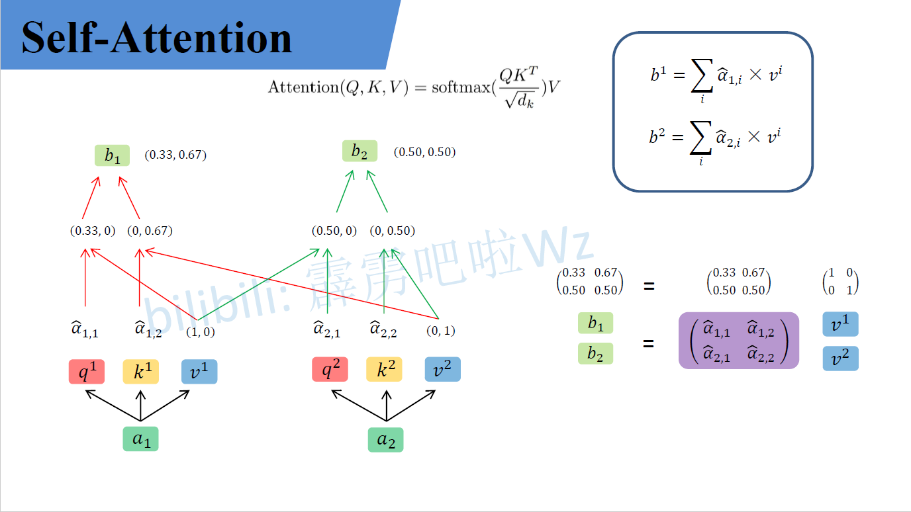
经过编码后的输入$a1$,$a2$(为了方便描述取两个输入)与$W_Q,W_K,W_V$(可训练)权重矩阵相乘生成对应的$q_1,k_1,v_1$ 与 $q_2,k_2,v_2$,再每一个$q_i$与每一个$k_i$做**点积 (dot product)**，由于transformer全都可以并行化操作所以这里其实就是$QK^T$，然后再比上$\sqrt{d_k}$($d_k$是K的维度)，再经过$softmax$后与$V$进行矩阵乘。

这里有几个问题：
* $Q1$：$Q,K,V$分别是什么意思？
* $A1$：首先$Q,K,V$分别是**Query，Key，Value**的缩写，**Query，Key，Value**的概念取自于信息检索系统，举个简单的搜索的例子来说。当你在某电商平台搜索某件商品（年轻女士冬季穿的红色薄款羽绒服）时，你在搜索引擎上输入的内容便是**Query**，然后搜索引擎根据**Query**为你匹配**Key**（例如商品的种类，颜色，描述等），然后根据**Query**和**Key**的相似度得到匹配的内容（Value)。[来源 https://zhuanlan.zhihu.com/p/48508221](https://zhuanlan.zhihu.com/p/48508221)
* $Q2$: **Transformer**中为什么使用不同的$K$ 和 $V$， 为什么不能使用同一个值？或者为什么是$Q,K,V$而不是$K$ 和 $V$ 或者$Q$ 和 $V$？
* $A2$: $Q$ 如果自己跟自己($Q$)相乘的话，那么根据向量点积知识知道，俩个向量越相似，内积越大，当一个向量与自己做内积，再与其他不同词的向量做内积后(行成一个打分向量)，该向量经过**softmax**后，就会变为一个有一个位置的值特殊的大(自己与自己相乘)，其他位置的值非常非常小的状况出现，比如[0.98,0.01,0.05,0.05]那么,这样的得分再与$V$矩阵相乘后得出的加权向量就是一个基本上跟自己本身差不多的矩阵，那就失去了**self attention**的意义了。
* $Q3$：为什么$QK^T$要先除以$\sqrt{d_k}$再**softmax**？
* $A3$:对于一个输入向量  ，**softmax**函数将其映射/归一化到一个分布。在这个过程中，**softmax**先用一个自然底数$\exp$将输入中的元素间差距先“拉大”，再除以$\sum e^x_i$后归一化为一个分布。假设某个输入$x$中最大的的元素下标是$k$，如果输入的数量级变大（每个元素都很大），那么会非常接近1。数量级对**softmax**得到的分布影响非常大。在数量级较大时，**softmax**将几乎全部的概率分布都分配给了最大值对应的标签。那么就将产生一个接近**one-hot**的向量,所以反向传播时梯度就消失为0。
* $Q4$: 为什么$QK^T$是除以$\sqrt{d_k}$而不是随便除以一个数？
* $A4$: $q$ 和 $k$ 的各个分量是互相独立的随机变量，均值是0，方差是1，那么点积 $q·k$的均值是0，方差是$\sqrt{d_k}$，所以$\frac{QK^T - 0}{\sqrt{d_k}}$拉回到均值为0， 方差为1的标准正态分布，防止了数量级大使得梯度消失的情况。


<div align=center> 
**$$MultiHead(Q,K,V) = Concat(head_1,head_2,...,head_h)W^O$$**
**$$where head_i = Attention(QW_i^Q,KW_i^K,VW_i^V)$$**

</div>


**self attention**中的输入分别与$W^Q,W^K,W^V$相乘产生$q_i,k_i,v_i(Q,K,V)$, **multi-head self attention** 中每一个head都是一个**self attention**，每一个head都有$W^Q_j,W^K_j,W^V_j$生成每一个head中的$q_j,k_j,v_j$，原文(**线性映射**)直接把**self attention**中的$q_i,k_i,v_i$均分给每个head的$q_i^j,k_i^j,v_i^j$,每一个**head**再做**self attention**然后把每个head的结果$Concat$，最后在做一个线性变换，变换到与输入相同的维度。

问题：
* $Q$: 为什么需要**multi head**呢，只用一个head不行吗？
* $A$: 每个**head**空间中注意到的东西可能都不一样，比如**head1**注意到的东西**head2**没注意到，**head2**注意到的事情**head3**没注意到，所以把所有**head**的结果$Concat$相当于注意的更加全面。

#### Add & Norm

**Add** 指残差结构，把**multi-head self attention**的输入与其输出做一个相加，因为**multi-head**后的结果经过了一个线性变换使得输入输出是相同的维度，所以可以相加。

**Norm**指 **Layer Normalization**，通常用于 **RNN** 结构，**Layer Normalization** 会将每一层神经元的输入都转成均值方差都一样的，这样可以加快收敛。
问题：
* $Q$: 为什么不用 **Batch Normalization** 而是用 **Layer Normalization**？
* $A$: [答案](#bn_vs_ln)

#### Feed Forward

**Feed Forward** 层比较简单，是一个**两层的全连接层**，第一层的激活函数为 **Relu**，第二层不使用激活函数，对应的公式如下:
<div align=center> 

**$Max(0,XW_1+b_1)W_2 + b2$**

</div>

$X_{(n,d)}$经过**multi-head self attention、add & norm 、feed forward**之后输入$O_{(n,d)}$


### Decoder

#### Masked Multi-Head Self Attention

**Decoder**中的第一个**multi-head self attention**为 ***Masked***  **multi-head self attention**，所谓**mask**是一个$n * n$的下三角矩阵如图：[https://zhuanlan.zhihu.com/p/338817680](https://zhuanlan.zhihu.com/p/338817680)
<div align=center>

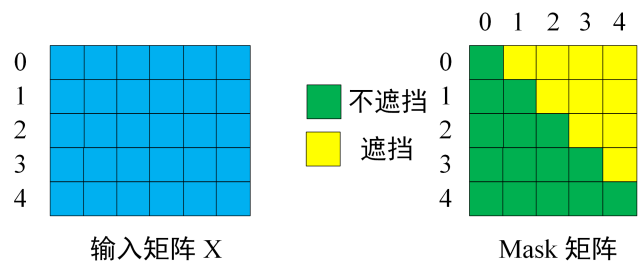

</div>

由于**Transform**的并行操作，所以当$QK^T$经过一些列操作后需要与$V$进行矩阵乘，即$QK^T$中的每一个向量需要与$V$中的每一个向量做点积，但是由于句子是序列化，即当第$k$个单词应该只能注意到$k$以及$k$之前的单词，所以这个操作与我们所希望的是违背的，所以需要一个**mas**k矩阵与$QK^T$按位相乘，产生Mask $QK^T$,再softmax后与$V$相乘得相应结果。操作如下：

<div align=center>


</div>
<div align=center>


</div>

#### 第二个Multi-Head Self Attention

**Decoder block** 第二个 **Multi-Head Attention** 变化不大， 主要的区别在于其中 **Self-Attention** 的 $K, V$矩阵不是使用 上一个 **Decoder block** 的输出计算的，而是使用 **Encoder** 的编码信息矩阵 $C$ 计算的。

根据 **Encoder** 的输出 $C$计算得到 $K, V$，根据上一个 **Decoder block** 的输出 $Z$ 计算 $Q$ (如果是第一个 **Decoder block** 则使用输入矩阵 $X$ 进行计算)，后续的计算方法与之前描述的一致。

这样做的好处是在 **Decoder** 的时候，每一位单词都可以利用到 **Encoder** 所有单词的信息 (这些信息无需 **Mask**)。

#### Softmax 预测输出单词

**Decoder block** 最后的部分是利用 **Softmax** 预测下一个单词，在之前的网络层我们可以得到一个最终的输出 $Z$，因为 **Mask** 的存在，使得单词 $0$ 的输出 $Z_0$ 只包含单词 $0$ 的信息，如下：
<div align=center>


</div>

**Softmax** 根据输出矩阵的每一行预测下一个单词：
<div align=center>

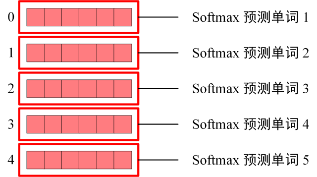
</div>

### Transformer 总结

* **Transformer** 与 **RNN** 不同，可以比较好地并行训练。
* **Transformer** 本身是不能利用单词的顺序信息的，因此需要在输入中添加位置 **Embedding**，否则 **Transformer** 就是一个词袋模型了。
* **Transformer** 的重点是 **Self-Attention** 结构，其中用到的 $Q, K, V$ 矩阵通过输出进行线性变换得到。
* **Transformer** 中 **Multi-Head Attention** 中有多个 **Self-Attention**，可以捕获单词之间多种维度上的相关系数 **attention score**。

---

## Vision Transformer(ViT)
<div id="vit">
<div align=center>


</div>

<div id="patch_linear">

### Patches & Linear Projection of Flattened Patches


由于**标准的transformer模块**要求输入的是一个**token**序列，而一张图片并不是一个序列，把图像分块（**patches**），由块来组成序列，对于$2D$图像$x\in \mathbb{R}^{H×W×C}$将其分为$P \times P$的 **patches**，$x_p\in \mathbb{R}^{N\times(P^2\cdot C)}$，共分成N个，$N = HW/P^2$，最终获得$N$个 $P^2 \cdot C$特征大小的向量(**768**)。在代码实现中直接用一个卷积层来实现的，以为**Vit-B 16**为例，使用卷积核**kernal size**为$16 \times 16$，**stride**为$16$，卷积核个数为$768$来实现，以$224 \times 224 \times 3$($H  W$为224，的$RGB$ $3 channel$)为例：
$H  W$为**224**的图片 分成 $H  W$为**16** 的**patches** $\frac{224 \times 224}{16\times16}$共可以分成**196**（$14 \times 14$）个**patch**，每个**patch**依然是**3**个**channel**，所以对于每一个patch的维度为为**768**（$16 \times16 \times 3$），一张$H$为224，$W$为224的图片生成一个$[196\times768]$的二维**token**矩阵。

</div>

<div id="pe_token">

### Position Embedding & token


对应的每一个patch生成一个**token**，每个**token**都是768维（$[196\times768]$），在所有**token**前面需要**拼接**一个$[1\times768]$可训练的**class token**（该图片所对应的类别）：$Concat([1 \times 768],[196\times768]) \longrightarrow [197\times768]$

$[196\times768]$ **token** 矩阵再经过**Position Embedding** **添加** 可训练的位置信息$[196\times768] \longrightarrow [196\times768]$，对于使用1D、2D、相对位置编码效果其实相差很小，但是使用位置编码对比不适用位置编码的效果还是很明显:
<div align=center>

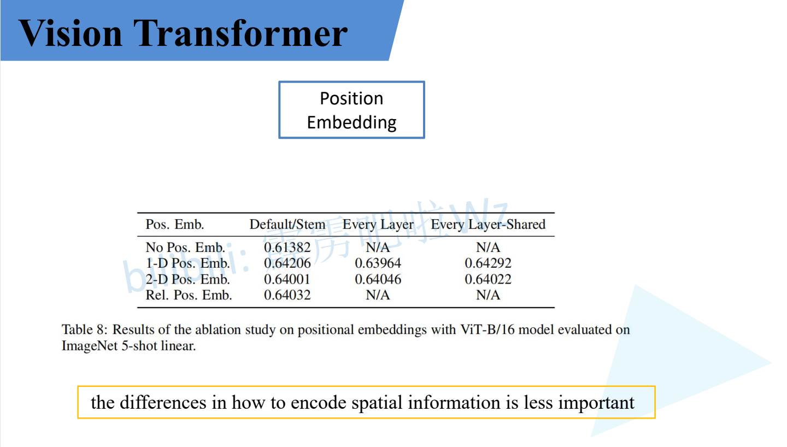

</div>


</div>

### Transformer Encoder
<div align=center>


</div>

首先Vit中没有**Decoder**，只有**Transformer Encoder**，**Encoder block**也有几点与标准**transformer block**有差别：
* **Vit**中的**Norm**在**Multi-Head Attention**前面，标准**Transformer**中**Norm**在后面，这样做的好处是**Norm**在前面可以加速模型训练
* 在**Multi-Head Attention**与**Add**之间有一个**dropout/dropPath**，图中并没有显示出来

### MLP head

标准的**transformer**中最后的预测因为masked的关系，所以每个每个向量只与他前面的向量有关，每个向量负责预测他当前位置的值。而**Vit**中只需要预测类别，即$Concat([1 \times 768],[196\times768]) \longrightarrow [197\times768]$中的$[1 \times 768]$，所以只预测新拼接的第$0$个**token**即可

### ViT-Base、Large、Huge的区别
<div align=center>


</div>

* **Patch Size**是指，**patch**大小，**patch size**越小 则 **patch** 越多
* **Layer**s是指，**Transformer Encoder** 中 堆叠 **Encoder Block** 的次数
* **Hidden Size**是通过**Embedding**层后每个**token**的**dim**（向量的长度），也是卷积核的个数
* **MLP size**是**Transformer Encoder**中**MLP Block**第一个全连接的节点个数（是**Hidden Size**的四倍）
* **Heads**代表**Transformer**中**Multi-Head Attention**的**heads**数

</div>

## Swin Transformer(SwinT)
### SwinT VS ViT
<div align=center>


</div>

* 特征层的下采样倍率不同，**Swin Transformer**的特征层先经过$4$倍下采样，再经过$8$倍下采样，最后是$16$倍下采样，**ViT**中最开始经过一个$16$倍下采样，之后的所有层都是保持这个$16$倍。可以融合不同倍率特征层的特征。
* **Swin Transformer**中的特征层都是被一个一个的小 [Window](#W_SW) 给分割开了，**ViT** 则是整个特征层没有被分割。

### Swin Transformer 结构

<div align=center>

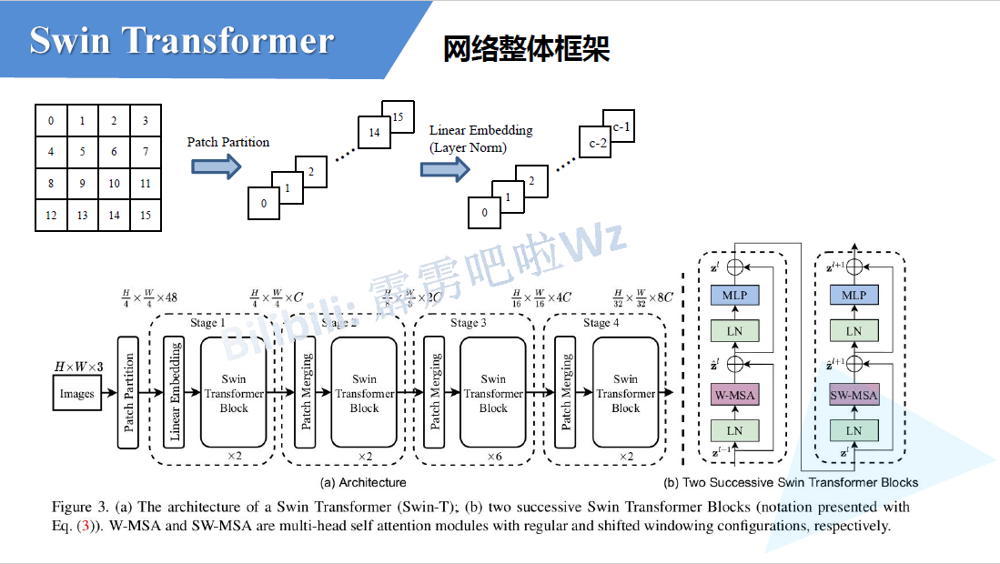

</div>

#### Architecture

$H\times W \times 3$ 的图像经过 **Patch Partition** 和 **Linear Embedding（Layer Normal）**，变成$\frac{H}{4} \times \frac{W}{4} \times 48$，再经过**Stage1**变为$\frac{H}{4} \times \frac{W}{4} \times C$，再由**Stage2**变成$\frac{H}{8} \times \frac{W}{8} \times 2C$，再经过**Stage3**、**Stage4**变成$\frac{H}{16} \times \frac{W}{16} \times 4C$、$\frac{H}{32} \times \frac{W}{32} \times 8C$，每经过一个 [Patch Merging](#patch_merge) 图像宽高缩减为原来的 <font color="#d71345">一半</font> ，**channel** 变为原来的<font color="#d71345">2倍</font>，**Stage1**由**Linear Embedding**和$2$个**Swin Transformer Block**堆叠而成，而后面的**Stage**均是由**Patch Merging**和 <font color="#d71345">偶数个</font> **Swin Transformer Block**堆叠而成。

偶数个是因为，**Swin Transformer Block**的第一个**block**中**Self Attention**的是[Window Multi-Head Self Attention](#W_MSA)(右图中的<font color="#d71345">W-MSA</font>),第二个**block**中**Self Attention**的是[Shifted-Window Multi-Head Self Attention](#SW_MSA)(右图中的<font color="#d71345">SW-MSA</font>)

<div id="pp_le"></div>

#### Patch Partition & Linear Embedding
**Patch Partition**如上图，$H\times W \times 3$的图像被一个$4 \times 4$大小的窗口分割，每个窗口内分成$16$个**patch**，然后**patch**延**channel**方向进行$Concat$，所以$H\times W \times 3$的图像经过**Patch Partition**宽高变成原来的$\frac{1}{4}$，**channel**由3变成48($3 \times 16$)

**Linear Embedding（Layer Normal）**，经过**Patch Partition**后再通过一个线性层对channel进行调整，调整成图中的$C$（具体的$C$根据，**Swin-Tiny、Swin-Small、Swin-Base、Swin-Large**有所不同）。

实现：**Patch Partition** 和 **Linear Embedding**都是通过卷积层实现的，**kernal size** 为 $4 \times 4$，**stride** 为 $4$， **channel** 为 $48$，类似于ViT中的[Patches & Linear Projection of Flattened Patches](#patch_linear)，还要经过一层**LayerNorm**

<div id="patch_merge"></div>

### Patch Merging

<div align=center>


</div>

如上图，一个$4\times 4$大小的窗口，按位置进行拆分，如上原图中**蓝、黄、绿、红**对应位置的元素，进行拆分合并成**蓝、黄、绿、红**的$2 \times 2$大小的小窗口给，然后在**channel**方向上进行$Concat$，再经过一个**LayerNorm**后，通过一个全连接层将**channel**整合成原图的<font color="#d71345">2倍</font>，宽高变为原来的<font color="#d71345">1半</font>。类似于[Focus](#focus)操作。

这里的全连接层Linear是**权值共享**的

<div id="W_SW"></div>

### Window & Shifted Window

<div id="W_MSA"></div>

#### W-MSA

<div align=center>


</div>

对于普通的**Multi-Head Self Attention**的每一个**token**都会去计算$Q,K,V$，$QK^T$运算完之后再去与&V&联系，每一个**token**都会与所有的**token**去进行沟通。

**Window Multi-Head Self Attention** 把特征图进行分块，每个块内部去进行**Self Attention**，这样做的有点是减少了计算量，但是其缺点是只能块内进行沟通，但是块和块之间是无法通信的。


<div id="SW_MSA"></div>

#### SW-MSA

**Shifted-Window Multi-Head Self Attention** 解决了 **Window Multi-Head Self Attention** 块与块之间无法通讯的问题。

<div align=center>

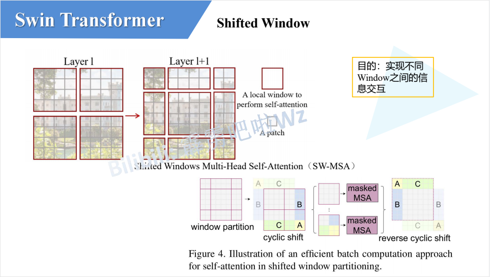

</div>

如上图，对于 **W-MSA** 中的Window向下向右偏移了两个 **patch**，生成了一个新的 **Window**（上图中**Layer+1** 所示），这个新的 **Window** 就是 **SW-MSA**，对于**Layer+1**中的上方中间的 **Window**，融合了 **Layer** 中的上面两个 **Window** ，对应** Layer+1** 中左侧中间的** Window** 融合了**Layer**中的左侧两个 **Window**，对于**Layer+1**中的中间大的 **Window** 融合了 **Layer** 中的所有四个**Window**，其他**Window**依次类推。这样就解决了 **W-MSA** Window之间无法通讯的问题。

但是这样**SW-MSA**分成$9$个**window**是不利于并行计算的，不像**W-MSA**每一个**Window**都是一个$4\times4$大小的，作者提出了一个方法来解决这个问题：
<div align=center>


</div>

对于$9$个Window标记为$0\sim8$，先将上边的$0,1,2$(图中标记的$A，C$)整体移动到下边，如下图：

<div align=center>


</div>

对于移动后的新的特征图，再把左侧的$3,6,0$(图中标记的$B,A$)整体移动到左边，这样就又组成了一个新的$4\times 4$的特征图，($5$和$3$看作一个整体，$7$和$1$看作一个整体，$8、6、2、0$看作一个整体)，这样就又可以做$4\times4$的并行计算了如下图：

<div align=center>

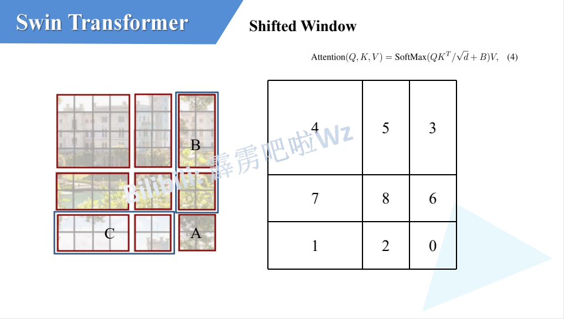

</div>

但是这样又会有一个新问题，即 $5$ 和 $3$原本是不相邻的，把他们强行划到同一个 $4\times4$ 的Window中去做 **Self Attention**是不对的，$5$ 和 $3$应该在自己的 **Window** 内去进行 **Self Attention** (其他Window类似)，解决方法如下：

<div align=center>


</div>


对$5$ 和 $3$ 中的每一个 **patch** 标记为 $0\sim15$，对于 $patch_0$ 的 $q_0$ 对其他所有 **patch** 的 $k_i$ 做点积生成 $\alpha_{0,0}$,$\alpha_{0,1}$,……,$\alpha_{0,15}$ ，对于跟 $patch_0$ 不在同一个区域中的 patch 的点积结果如图中**蓝色方框内的$\alpha$**，先减去100再做 $softmax$，这样这些 $\alpha$ 经过 $softmax$ 之后就会变为0，一个很大的负数取 $exp$ 结果趋于 $0$，这样就会只做同一区域内的 **Self Attention**，计算结束后再还原会原来的位置即可。


### Relative position bias
<div id="rpb">

<div align=center>

**$Attention(Q,K,V) = softmax(\frac{QK^T}{\sqrt{d_k}} + B)V$**

</div>

与普通的 **Attention** 相比，$\frac{QK^T}{\sqrt{d_k}}$先加$B$，在进行$softmax$，这个$B$就是 **Relative position bias**（相对位置偏置）

<div align=center>


</div>

对于一个$2\times2$的 **feature map**，分别以不同颜色**蓝、黄、红、绿**标识，以**蓝色**为例，当以**蓝色**为基准去计算其他位置的索引时，其他位置的行列坐标减去蓝色的坐标即为关于蓝色的位置索引，然后进行 $flatten$，再把所有位置的 $flatten$ 的索引 $Concat$ 成一个相对位置矩阵。但是作者使用的并不是二维的位置索引，而是一维的位置索引，变化如下图：

<div align=center>


</div>

偏移从 $0$ 开始，行列坐标加上 $M-1$ ，这里的 $M$ 是 **feature map** 的 大小 这里是 $2$， $M-1$ 为 $1$

<div align=center>


</div>

再行列坐标乘上$2M-1$
* Q:为什么是$2M-1$ ？
* A：对于$2\times2$的feature map，其他位置关于基准位置的索引从 $-M + 1 \sim M - 1$ ,以蓝色位列可以去到的最极端的索引为$(-1,-1)$，而对于绿色的来说可以取到的最极端的索引为$(1，1)$，所以对于$2\times2$的 feature map 索引范围是$[-1,0,1]$，二维索引即$[-1,0,1]$的排列组合共有$9$个，即$(2M-1)^2$个。

<div align=center>


</div>

然后再行列坐标相加，变成一维的 **位置索引** 。

<div align=center>


</div>

注意上面是 **位置索引** 而不是 **位置偏置** ，需要拿对应的**位置索引** 去 **相对位置偏置表(Relative position bias table)** 中去取对应的 **相对位置偏置** 即 **Attention** 中的 $B$。

</div>

### Swin-T/S/B/L 区别

<div align=center>


</div>

* **win. sz.** 是指 **Swin Transformer Block** 中的 **Window** 大小，这里四个模型的任何阶段均相同。
* **dim** 是指经过每个 **Stage** 后输出的维度
* **head** 是指 **Swin Transformer Block** 中头的个数
* **S、B、L** 中 **Stage3** 都是堆叠了$18$个 **block**
* **T、S** 除了 **Stage3** 的堆叠次数外完全一样
* **S、B、L** 的 **Stage1** 的 **dim** 分别是$96，128，192$，之后的每一个 **Stage** 的 **dim** 都是之前两倍

### [Swin Transformer Object Detection](#swinod)

---
<div id="cnn"></div>

# CNN主干网络
## CNN基础
### 卷积特性
* ***局部感知***
* ***权值共享***
### 普通2D卷积

<div align=center>


</div>
<div align=center>


</div>

**PYTORCH** 参数：

* **$in\_channels (int)$** – 输入特征图的维度

* **$out\_channels (int)$** – 输出特征图的维度

* **$kernel\_size (int or tuple)$** – 卷积核大小

* **$stride (int or tuple, optional)$** – 步距. 默认: 1

* **$padding (int, tuple or str, optional)$** – 填充添加到输入的所有四个边. 默认: 0

* **$padding\_mode (string, optional)$** – 'zeros', 'reflect', 'replicate' or 'circular'. 默认: 'zeros'

* **$dilation (int or tuple, optional)$** – 空洞卷积. 默认: 1

* **$groups (int, optional)$** – 组卷积的组数. 默认: 1

* **$bias (bool, optional)$** – 是否添加偏置. 默认: True

**PYTORCH** 中 **tensor** 的 **shape**
* input:$(N,C_{in},H_{in},W_{in})$ or $(N,H_{in},W_{in})$ 
* output:$(N,C_{out},H_{out},W_{out})$ or $(N,H_{out},W_{out})$


<div align=center>

  $$H_{out} = \lfloor \frac{H_{in} + 2 \times padding[0] - dilation[0] \times (kernel\_size[0] - 1) - 1}{stride[0]} + 1\rfloor$$
  $$W_{out} = \lfloor \frac{W_{in} + 2 \times padding[1] - dilation[1] \times (kernel\_size[1] - 1) - 1}{stride[1]} + 1\rfloor$$


  可以简化为 $$N{out} = \lfloor \frac{N_{in} + 2 \times padding -  kernel \_ size}{stride} + 1 \rfloor$$
</div>

卷积复现代码:
```python
def _zero_padding2d(x: Tensor, padding: int) -> Tensor:
    """零填充(F.pad())

    :param x: shape = (N, C, Hin, Win)
    :param padding: int
    :return: shape = (N, C, Hout, Wout)"""

    # 开辟一个全为0的特征矩阵
    output = torch.zeros((*x.shape[:2],  # N, C
                          x.shape[-2] + 2 * padding,  # Hout
                          x.shape[-1] + 2 * padding), dtype=x.dtype, device=x.device)  # Wout
    h_out, w_out = output.shape[-2:]

    # 把原特征矩阵 放入 新特征矩阵的 的 padding:h_out - padding, padding:w_out - padding 位置
    output[:, :, padding:h_out - padding, padding:w_out - padding] = x
    return output

def _conv2d(x: Tensor, weight: Tensor, bias: Tensor = None, stride: int = 1, padding: int = 0) -> Tensor:
    """2d卷积(F.conv2d()). 点乘

    :param x: shape = (N, Cin, Hin, Win)
    :param weight: shape = (Cout, Cin, KH, KW)
    :param bias: shape = (Cout,)
    :param stride: int
    :param padding: int
    :return: shape = (N, Cout, Hout, Wout)
    """
    if padding:
        x = _zero_padding2d(x, padding)
    kernel_size = weight.shape[-2]
    
    # Out = (In + 2*P − K) // S + 1
    output_h, output_w = (x.shape[2] - kernel_size) // stride + 1, \
                         (x.shape[3] - kernel_size) // stride + 1
    
    # 开辟一个 shape 为 (x.shape[0], weight.shape[0], output_h, output_w) 空间来存放输出特征图
    output = torch.empty((x.shape[0], weight.shape[0], output_h, output_w),
                         dtype=x.dtype, device=x.device)
    
    # 把 输入特征图的进行切片 start : start + ks 与 与卷积核运算 填入 对应的 输出特征图位置
    for i in range(output.shape[2]):  # Hout
        for j in range(output.shape[3]):  # Wout
            h_start, w_start = i * stride, j * stride
            # h_pos, w_pos = slice(h_start, (h_start + kernel_size)), \
            #                slice(w_start, (w_start + kernel_size))

            # 把原特征图需要卷积的部分切片 
            sample_x = x[:, None, :, h_start:(h_start + kernel_size),
                       w_start: (w_start + kernel_size)]  # N , 1, Cin, kH, kW
            
            weight_ = weight[None, :, :, :, :]  # 1, Cout, Cin, kH, kW

            # 卷积操作
            out_result = sample_x * weight_ # N, Cout, Cin, KH, KW

            # 把 Cin KH KW 相加 填入目标位置
            output[:, :, i, j] = torch.sum(out_result, dim=(-3, -2, -1))

    return output + (bias[:, None, None] if bias is not None else 0)  # 后对齐
```

卷积反向传播

<div align=center>


</div>

<div align=center>


</div>

<div align=center>


</div>

### 空洞卷积（膨胀卷积）

<div align=center>


<font size = 5> $s = 1, r = 2（表示两个kernel元素距离）,p = 0, k = 3$ </font>

</div>

作用：增大感受野，保持原输入特征图的 $W、H$（通常设置 **padding** ）
优点：在不做池化损失信息的情况下，加大感受野，让每个卷积的输出都包含较大范围的信息
缺点：网格效应如果仅仅多次叠加多个 dilation rate=2 的 3x3 的卷积核时，会发现：并不是所有的输入像素都得到计算，也就是卷积核不连续。这对于逐像素的预测任务来说，是致命的问题

<div id="group_conv"></div>

### 组卷积

<div align=center>


<font size = 5> $s = 1, r = 2（表示两个kernel元素距离）,p = 0, k = 3$ </font>

</div>

作用：
减少参数量，相比不分组，则分 $g$ 个组的参数量则为不分组的 **$\frac{1}{g}$**

把 **feature map** 分组，每个卷积核只负责对应该组内的卷积

### 深度可分离卷积


### 不对称卷积


### 转置卷积（Transposed Convolutional）

<div align=center>


<font size = 5> $s = 1, p = 0, k = 3$ </font>

</div>

<div align=center>


<font size = 5> $s = 2, p = 0, k = 3$ </font>

</div>

<div align=center>


<font size = 5> $s = 2, p = 1, k = 3$ </font>

</div>

注意：
* **转置卷积不是卷积的逆运算**
* **转置卷积也是卷积**

作用：
* **上采样（upsampling）**

Step：
* **在输入特征图元素间填充 $s-1 $ 行、$s-1 $列 $0$**
* **在输入特征图四周填充 $k-p-1$ 行、$k-p-1$ 列 $0$**
* **将卷积核参数上下、左右翻转**
* **做正常卷积运算（填充 $0$，步距 $1$，这里的步距并不是上述所说转置卷积的s，而是正常卷积的新步距）**

<div align=center>

$H_{out} = (H_{in} - 1) \ times stride[0] - 2 \ times padding[0] + kernel \_ size[0]$

$W_{out} = (W_{in} - 1) \ times stride[1] - 2 \ times padding[1] + kernel \_ size[1]$

</div>

### 转置卷积的高效操作
<div align=center>


<font size = 5> $把卷积核填入全为0的矩阵对应位置生成稀疏矩阵$ </font>
</div>
<div align=center>


<font size = 5> $把输入特征图展平$ </font>
</div>
<div align=center>


<font size = 5> $把每个位置生成的稀疏矩阵展平再拼接$ </font>
</div>
<div align=center>


<font size = 5> $矩阵乘$ </font>
</div>

<div align=center>


<font size = 5> $O^{1\times4} C^T = P ^{1\times 16} \not ={ I ^{1\times 16}}$ </font>
</div>

<div align=center>


</div>

## AlexNet
### 网络结构
<div align=center>


</div>

### 亮点
* ***首次利用 **GPU** 进行网络加速训练。***
* ***使用了 [ReLU](#relu) 激活函数，而不是传统的 [$Sigmoid$](#sigmoid) 激活函数以及 [$Tanh$](#tanh) 激活函数。***
* ***使用了 **LRN** 局部响应归一化。***
* ***在全连接层的前两层中使用了 **Dropout** 随机失活神经元操作，以减少过拟合。***

LRN：

<div align=center>

$$b_{x,y}^i = \Bigg(\frac{a_{x,y}^i}{\alpha \sum^{min(N-1,i + n / 2)}_{j = max(0,i - n / 2)}(a_{x,y}^i)^2} + k \Bigg)^\beta$$

</div>

从附近的 **channel** 中 不同 **feature map**中的相同位置进行归一化，以如下 $4$ 个**feature map** 为例：

<div align=center>


</div>

**LRN** 的作用：防止过拟合

但是在 **VGG** 中被证明 其实并没有什么用

## VGGNet


### 网络结构
<div align=center>


</div>

### 亮点

* ***通过堆叠多个$3\times3$的卷积核来代替大尺寸的卷积核，论文中提到：可以通过两个$3\times3$的卷积核来代替一个$5\times5$的卷积核，通过堆叠三个$3\times3$的卷积核来代替一个$7\times7$的卷积核，因为他们具有相同的感受野。***

感受野计算公式：
<div align=center>

$F(i) = [F(i + 1) - 1] \times Stride + Kernel\_Size (F(i) 表示 第i层的感受野)$

</div>


## GoogLeNet

<div align=center>


</div>

### Incetption v1

<div align=center>


</div>

#### 亮点

* ***引入了Inception结构（融合不同尺度的特征信息）***
* ***使用1x1的卷积核进行降维以及映射处理，vgg网络中也有使用，这里给出了详细介绍***
* ***添加两个辅助分类器帮助训练***
* ***丢弃全连接层，使用平均池化层（大大减少模型参数）***

#### 结构

与以往的串联的结构不同，**Inception** 结构采用的是多分支的并行结构，$a$ 分为 $4$ 个分支最左侧采用$1\times1$的卷积，第二个分支为$3\times3$的卷积，第三个分支为$5\times5$的卷积，第四个分支为一个$3\times3$的 **max pooling** ，$b$ 在 $a$ 的基础上再第二个和第三个分支的前面加了以$1\times1$的卷积核进行降维，第四个分支在 **max pooling** 层的后面接了一个$1\times1$的卷积，最后把所有分支的结果进行 $Concat$。采用$1\times1$的卷积是为了降维，以降低参数量，第四个分支的卷积在池化后面也是为了降低参数量，先 **pooling** 再 **conv** 可以降低 **conv** 的参数量。

#### 辅助分类器

<div align=center>


</div>


在 **Inception 4(a)** 和 **Inception 4(d)** 的后面都接了一个辅助分类器，两个辅助分类器一样，都是先经过一个$5\times5$ 步距为3的平均池化，在经过一个$1\times1$ 步距为1的卷积层，再经过两个全连接层，最后通过 **softmax** 进行输出预测

### Incetption v2

<div align=center>


</div>

在V1的基础上:
* ***采用了之前vgg网络的通过两个$3\times3$的卷积堆叠来代替$5\times5$的卷积来代减少参数量***
* ***创新性的用了$1\times3 ，3 \times 1$的不对称卷积，同样可以用 $1\times n ，n \times 1$来降低参数量***


### Incetption v3

在V2的基础上:

* ***在辅助分类器中采用了 [Batch Normalization](#bn)***


### Incetption v4

<div align=center>


</div>

在V3的基础上：
* ***引用了残差结构，设计了多种Inception-ResNet结构***

## ResNet

<div align=center>


</div>

### 亮点

* ***超深的网络结构(突破1000层)，解决了模型退化的问题***
* ***提出residual模块，解决了梯度消失的问题***
* ***使用Batch Normalization加速训练(丢弃dropout)***

### 残差结构

<div align=center>


</div>

左侧是ResNet 18/34的残差结构，右侧是ResNet  $50/101/152$ 的残差结构，其中右侧$1\times1$的卷积使用来升降维的，右侧的结构是输入channel为 $256$，经过一个 $64$ 个$1\times1$的卷积对输入特征图进行降维，再经过一个$3\times3$的提却特征，最后经过一个$1\times1$的升维回 $256$ 再与原来的输入进行相加后再relu激活。

### 反向传播

<div align=center>

$y_l = h(x_l) + F(x_l,W_l)$
$x_{l+1} = f(y_l)$

</div>

其中 $x_l$ 和 $x_{l+1}$ 分别表示的是第 $l$ 个残差单元的输入和输出，注意每个残差单元一般包含多层结构。 $F$ 是残差函数，表示学习到的残差，而 $h(x_l) = x_l$ 表示恒等映射， $f$ 是ReLU激活函数。基于上式，我们求得从浅层 $l$ 到深层 $L$ 的学习特征为：

<div align=center>

$$x_L = x_l + \sum_{i=1}^{L-1} F(x_i,W_i)$$

</div>

根据链式求导法则，可以求得反向过程的梯度

<div align=center>

$$ \frac{\partial loss}{\partial x_L} = \frac{\partial loss}{\partial x_L} \cdot \frac{\partial x_L}{\partial x_l} = (1 + \frac{\partial }{ \partial x_l} \sum_{i=l}^{L-1}F(x_i,W_i)) $$

</div>

式子的第一个因子 **$\frac{\partial loss}{\partial x_L}$** 表示的损失函数到达 $L$ 的梯度，小括号中的1表明短路机制可以无损地传播梯度，而另外一项残差梯度则需要经过带有 **weights** 的层，梯度不是直接传递过来的。残差梯度不会那么巧全为 $-1$，而且就算其比较小，有1的存在也不会导致梯度消失。所以残差学习会更容易。要注意上面的推导并不是严格的证明。

### 不同深度的ResNet

<div align=center>


</div>


## ResNeXt

### [组卷积](#group_conv)

<div align=center>


</div>

更新了resnet 50及更深的网络的block


<div align=center>


</div>

上面的 $3$ 种结构在数学计算上是完全等价的，$b$ 的第一层为32组$1\times1$的 **output channel** 为 $4$ 的卷积，$c$ 的第一层为 $128$ 个 $1\times1$的卷积，是等价的，同样的，$b$ 的第二层为32组 $3\times3$的 **output channel** 为 $4$ 的卷积,再 **channel** 方向进行拼接为 $128$ 的特征层，$c$ 的第二层为 $128$ 个$3\times3$的卷积，最后都经过 $256$ 个$1\times1$的卷积升维回 $256维$，$a$ 种的第三层等价于 $b$ 中的 $concat$ 和升维操作。


### resnet 与 resnext结构的对比

<div align=center>


</div>


## MobileNet

**MobileNet** 网络是由google团队在2017年提出的，专注于移动端或者嵌入式设备中的轻量级CNN网络。相比传统卷积神经网络，在准确率小幅降低的前提下大大减少模型参数与运算量。(相比 **VGG16** 准确率减少了$ 0.9\% $，但模型参数只有 **VGG** 的 $1/32$ )

### V1
#### 亮点
* ***Depthwise Convolution(大大减少运算量和参数数量)***
* ***增加超参数α、β(α是控制卷积核个数的倍率银子，β是控制分辨率的因子)***

#### Depthwise Separable Convolution
##### Depthwise Convolution

<div align=center>


</div>


普通卷积的卷积核的 **channel(input channel)** 与 输入特征层的 **channel** 一致，输出特征层的**channel** 与 卷积核的个数一样。***深度卷积的卷积核的 channel 为 1，输入特征矩阵的 channel = 卷积核个数 = 输出特征矩阵的 channel。（每一个卷积核只负责对一个特征层channel进行卷积，然后对应输出一个特征层）***

##### Pointwise Convolution

<div align=center>


</div>

其实就是**kernel_size** 为 $1$ 的普通卷积，**Pointwise Convolution** 通常和 **Depthwise Convolution** 一起使用来构成 **Depthwise Separable Convolution**

对比普通卷积减少的参数量如下：

<div align=center>


</div>

### V2

#### 亮点

* ***Inverted Residuals（倒残差结构）***
* ***Linear Bottlenecks***

#### Inverted Residuals

<div align=center>


</div>

**residual block** 先采用$1\times1$的卷积进行降维，再通过$3\times3$的卷积提取特征，最后通过$1\times1$的卷积进行升维，先降后升是为了减少参数量，而 **Inverted Residuals block** 则相反，先通过$1\times1$的卷积进行升维，再通过DW卷积进行提取特征，最后通过$1\times1$的卷积进行降维，因为 **DW卷积** 对比普通卷积已经减少了很多参数量，这里采用先升后降是为了更好的提取特征。

#### Linear Bottlenecks

<div align=center>


</div>

论文中验证了 **ReLU** 激活函数对低维特征信息照成大量损失，而 **Inverted Residuals** 的最后输出就是低维特征，所以 **Inverted Residuals** 的最后的激活函数是一个线性的激活函数。

<div id="densenet"></div>

## DenseNet

<div align=center>


</div>

### 亮点

* ***减轻了梯度消失***。

* ***加强了 feature 的传递***

* ***加强了特征的重用***

* ***一定程度上减少了参数数列***。
### 对比ResNet

假设输入为一个图片 $X_0$ , 经过一个L层的神经网络, 其中第i层的非线性变换记为 $H_i(*)$ , $H_i(*)$ 可以是多种函数操作的累加如 **BN、ReLU、Pooling或Conv** 等. 第 $i$ 层的特征输出记作 $X_i$ .

传统卷积前馈神经网络将第i层的输出 $X_i$ 作为i+1层的输入,可以写作$X_i = H_i(X_{i- 1})$. 
**ResNet** 增加了旁路连接,可以写作 $X_l = H_l(X_{l - 1}) + X_{l-1}$.
**DenseNet** 如上图所示,第 $i$ 层的输入不仅与 $i-1$ 层的输出相关,还有所有之前层的输出有关.记作:$X_l = H_l \: Concat([X_0,X_1,...,X_{i-1}])$ ,既将 $X_0$ 到 $X_1$ 层的所有输出 **feature map**按**Channel** 组合在一起.这里所用到的非线性变换H为$BN+ReLU+ Conv(3×3)$的组合

由于在 **DenseNet** 中需要对不同层的 **feature map** 进行 $Concat$ 操作,所以需要不同层的 **feature map** 保持相同的 **feature size**,这就限制了网络中**Down sampling**的实现.为了使用 **Down sampling**,作者将 **DenseNet** 分为多个 **Denseblock**,如下图所示:

<div align=center>


</div>

在同一个 **Denseblock** 中要求 **feature size** 保持相同大小,在不同 **Denseblock** 之间设置**transition layers** 实现 **Down sampling** , 在作者的实验中 **transition layer**由$BN + Conv(1×1) ＋2×2 average-pooling$组成.

# 目标检测主流模型

<div align=center>


</div>

## Two Stage
### RCNN系列
#### RCNN

<div align=center>


</div>

##### 算法步骤

- 一张图像生成$1K\sim2K$个候选区域(使用 **Selective Search** 方法) 
- 对每个候选区域，使用深度网络**提取特征**
- 特征送入每一类的 **[SVM](#svm) 分类器**，判别是否属于该类
- 使用**回归器精细修正候选框位置**

##### 候选区域的生成

<div align=center>


</div>

利用**Selective Search**算法通过图像分割的方法得到一些原始区域，然后使用一些合并策略将这些区域合并，得到一个**层次化的区域结构**，而这些结构就包含着可能需要的物体。

##### 提取特征

<div align=center>


</div>

将 $2000$ 候选区域缩放到 $227\times227$ pixel，接着将候选区域输入事先训练好的 **AlexNet CNN** 网络获取 $4096$ 维的特征得到 $2000×4096$ 维矩阵。

##### 分类

<div align=center>


</div>

将 $2000\times4096$ 的特征矩阵与 $20$ 个 **SVM** 组成的权值矩阵 $4096×20$ 相乘，获得 $2000×20$ 的概率矩阵，每一行代表一个建议框归于每个目标类别的概率。分别对上述 $2000×20$ 维矩阵中每一列即每一类进行[非极大值抑制(NMS)](#nms)剔除重叠建议框，得到该列即该类中得分最高的一些建议框。


##### 回归候选框位置

<div align=center>


</div>

对NMS处理后剩余的建议框进一步筛选。接着分别用 $20$ 个回归器对上述 $20$ 个类别中剩余的建议框进行回归操作，最终得到每个类别的修正后的得分最高的bounding box。
如图，黄色框口 **P** 表示建议框**Region Proposal**，绿色窗口 **G** 表示实际框**Ground Truth**，红色窗口表示**Region Proposal**进行回归后的预测窗口，可以用最小二乘法解决的线性回归问题。

##### 框架

<div align=center>

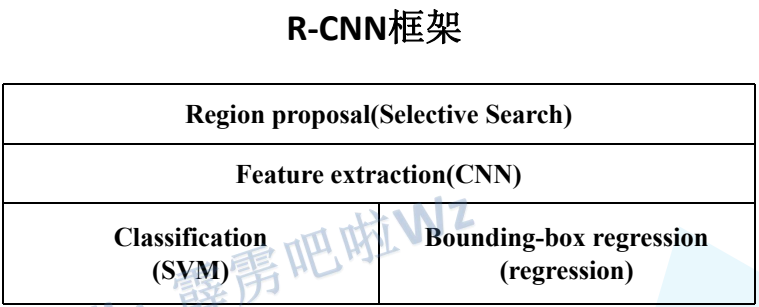

</div>

##### 问题

* **推理速度慢**：测试一张图片约53s(CPU)。用**Selective Search**算法提取候选框用时约2秒，一张图像内候选框之间存在大量重叠，提取特征操作冗余。
* **训练速度慢**：过程及其繁琐
* **训练所需空间大**：对于SVM和bbox回归训练，需要从每个图像中的每个目标候选框提取特征，并写入磁盘。对于非常深的网络，如VGG16，从VOC07训练集上的5k图像上提取的特征需要数百GB的存储空间。

#### Fast RCNN

<div align=center>


</div>

##### 算法步骤

- 一张图像生成 $1K\sim2K$ 个候选区域(使用 **Selective Search** 方法) 
- 将图像输入网络得到相应的特征图，将SS算法生成的候选框 **投影** 到特征图上获得相应的特征矩阵
- 将每个特征矩阵**通过ROI pooling层缩放到7x7大小的特征图**，接着将特征图展平通过一系列全连接层得到预测结果

##### 特征图投影

<div align=center>


</div>

##### POI pooling

<div align=center>


</div>

<div align=center>


</div>

原文中经过ROI pooling 将特征矩阵统一缩放成$7\times7$大小，这里为了方便理解以 $2\times2$ 为例

<div align=center>


</div>

假如现在有一个 $8\times8$ 的 feature map，现在希望得到 $2\times2$的输出，有一个bbox坐标为 $[0,3,7,8]$。

这个bbox的 **w=7，h=5**，如果要等分成四块是做不到的，因此在**ROI Pooling**中会进行取整。就有了上图看到的 $h$ 被分割为$2,3$，$w$ 被分割成$3,4$。这样之后在每一块(称为bin)中做 **max pooling**，可以得到下图的结果。

<div align=center>


</div>

缺点：
- 两次 **量化**

1)Conv layers使用的是VGG16，feat_stride=32(即表示，经过网络层后图片缩小为原图的$1/32$),原图$800\times800$,最后一层特征图feature map大小:$25*25 $     

2)假定原图中有一region proposal，大小为$665\times665$，这样，映射到特征图中的大小：$665/32=20.78,即20.78\times20.78$，如果你看过Caffe的Roi Pooling的C++源码，在计算的时候会进行取整操作，于是，进行所谓的**第一次量化**，即映射的特征图大小为$20*20$      

3)假定pooled_w=7,pooled_h=7,即pooling后固定成$7\times7$大小的特征图，所以，将上面在 feature map上映射的$20\times20$的 region proposal划分成$49$个同等大小的小区域，每个小区域的大小$20/7=2.86$,即$2.86\times2.86$，此时，进行**第二次量化**，故小区域大小变成$2\times2$

4)每个$2\times2$的小区域里，取出其中最大的像素值，作为这一个区域的‘代表’，这样，$49$个小区域就输出$49$个像素值，组成$7\times7$大小的feature map    

总结，所以，通过上面可以看出，经过**两次量化**，即将浮点数取整，原本在特征图上映射的$20\times20$大小的region proposal，偏差成大小为$14\times14$的，这样的像素偏差势必会对后层的回归定位产生影响   

改进：
- **ROI Align**
  

1)**Conv layers** 使用的是 **VGG16** ，**feat_stride=32** (即表示，经过网络层后图片缩小为原图的 $1/32$),原图$800\times800$,最后一层特征图**feature map**大小:$25\times25$

2)假定原图中有一 **region proposal** ，大小为 $665\times665$，这样，映射到特征图中的大小：$665/32=20.78,即20.78\times20.78$，此时，没有像 **RoiPooling** 那样就行取整操作，保留浮点数

3)假定**pooled_w=7,pooled_h=7**,即 **pooling** 后固定成7x7大小的特征图，所以，将在 **feature map**上映射的$20.78x20.78$的 **region proposal** 划分成49个同等大小的小区域，每个小区域的大小$20.78/7=2.97,即2.97\times2.97$

4)假定采样点数为$4$，即表示，对于每个$2.97\times2.97$的小区域，平分四份，每一份取其中心点位置，而中心点位置的像素，采用 **双线性插值法**（下面介绍）进行计算，这样，就会得到四个点的像素值，如下图

<div align=center>


</div>

##### 分类

<div align=center>


</div>

这里的 $20$ 为 **PASCAL VOC**的数据集的类别

##### 边界框回归

<div align=center>


</div>

<div align=center>


</div>

##### Loss

<div align=center>


</div>

<div align=center>


</div>

[Smooth L1](#smoothl1)

##### 框架

<div align=center>


</div>


#### Faster RNN

<div align=center>


</div>

$$Faster RCNN = PRN + Fast RCNN$$

##### Region Proposal Network

###### 原理

**rpn** 网络可以通过 **联合训练** 的方式进行 **end-to-end** 进行训练，并且速度要比 **fast rcnn** 快

<div align=center>


</div>

对于特征图上的每个$3\times3$的滑动窗口，计算出滑动窗口中心点的对应原始图像上的中心点，并计算出$k$个 **anchor boxes**。这里的滑动窗口采用$3\times3$ **padding** 为 $1$ 的卷积来实现，卷积后的**shape**，与卷积之前的特征图的**shape**完全一致。

<div align=center>

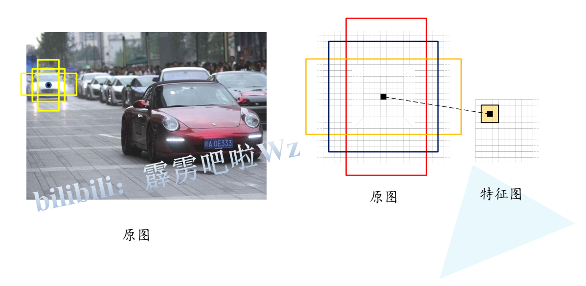

</div>

<div align=center>


</div>

对于 $k$ 个**anchor boxes** 分别生成 $2k$ 个 **scores** 和 $4k$ 个 **bbox reg**参数，$2k$ 是指只负责预测目标为正样本和负样本（前景和背景），$4k$ 个 **bbox reg**参数，分别为 $x,y,w,h$ 的坐标偏移量。在上面所说的$3\times3$滑动窗口（卷积）产生的特征图上，分别并联两个$1\times1$的卷积核用来实现对类别的预测，和对 **bbox** 参数的回归，以 **cls** 为例，就是采用 kernel_size 为 $1\times1$ ,卷积核个数为 $2k$ 的卷积来预测。

<div align=center>


</div>

上面所说的k一般是值 $9$，即每个 **anchor** 都有三种不同的面积$\{128^2,256^2,512^2\}$，每个面积都有三种不同的尺度$\{1:1,1:2,2:1\}$，

<div align=center>


</div>

###### 采样
对于正负样本的采样问题，随机选取 $256$ 个样本并且保持正样本和负样本的比例为 $1:1$，对于不足 $128$ 个正样本的情况，那么负样本也减至同样的数量。

对于分配的正样本有两种策略：
* 对于一个 **GT** 与他 **IOU** 最大的 **anchor** 分配为正样本
* 对于任意一个 **anchor** 如果他与任意一个 **GT** 的 **IOU** 超过 $0.7$ 也分配为正样本

对于负样本的分配：
* 一个 **anchor** 与任意的 **GT** 的 **IOU** 都低于 0.3 则认为是负样本

对于超过 $0.3$ 却低于 $0.7$ **iou** 值的 **anchor**不参与训练

###### 损失函数

$$L(\{p_i\},\{t_i\}) = \frac{1}{N_{cls}}\sum_i L_{cls}(p_i,p_i^*) + \lambda\frac{1}{N_{reg}}p^*\sum_i L_{reg}(t_i,t_i^*)$$

$$L_{cls} = -[p_i^*log(p_i) + (1-p_i^*)log(1-p_i)]$$
$$L_{reg} = \sum_i Smooth_{L_1}(t_i,t_i^*)$$
$$t_i \in \{t_x,t_y,t_w,t_h\}$$
$$lt_i^* \in \{t_x^*,t_y^*,t_w^*,t_h^*\}$$
$$t_x = (x - x_a) / w_a \:,\: t_y = (y - y_a) / h_a$$
$$t_w = log(w/w_a) \:,\: t_h = log(h/h_a)$$
$$t_x^* = (x^* - x_a) / w_a \:,\: t_y^* = (y^* - y_a) / h_a$$
$$t_w^* = log(w^*/w_a) \:,\: t_h^* = log(h^*/h_a)$$
$$
smooth_{L_i}(x) =  \left \{
\begin{aligned}
0.5x^2  ,\: \:\:\: \:\:if|x|<1\\
|x| - 0.5 , \: \:\:otherwise
\end{aligned}
\right.
$$


$p_i$ 表示第$i$个anchor预测为目标的概率
$p_i^*$ 为正样本时为$1$，负样本时为$0$
$t_i$ 表示第$i$个anchor的边界框回归参数,$t_i$是通过预测得到的 通过上式还原回特征图的坐标和宽高，
$t_i^*$ 表示第$i$个anchor对应的真实 $Ground \:\: Truth \:\: Box$ 的回归参数，$t_i^*$是通过GT在原特征图上的坐标和宽高，根据上式计算得到的，用来和$t_i$计算损失，回归边界框
<div id="swinod"></div>

### Swin Transformer Object Detection

**Swin Transformer Object Detection** 是基于 **MMDetection** 搭建的这里提供了两种目标检测的方法（**Mask RCNN / Cascade Mask RCNN**），这里以 **Mask RCNN** 为例，整体结构分为四个部分：**backbone、neck、rpn head、roi head**。

$$
Mask \: RCNN 
\left\{
\begin{aligned}
Backbone \\
Neck \\
RPN \: head \\
ROI \: head
\end{aligned}
\right.
$$

#### BackBone

由四个 **BasicLayer** 组成，包含 **blocks** 和 **patch merging** 两个结构。**blocks** 中包含若干个基本 **swin transformer** 模块，**patch merging** 负责下采样，每经过一个 **patch merging** 特征图的宽高变为原来的一半，**channel** 变为原来的两倍。以输入图象 $（3，800，1216）$ 为例，首先经过[patch partation & linear embedding](#pp_le)变成$（96，200，304）$，依次输入4个 **BasicLayer** 。输出out依次为：$（1，96，200，304）$ $（1，192，100，152）$ $（1，384，50，76）$ $（1，768，25，38）$。将输出**out** 送进 **FPN** 

#### Neck

$$
Neck \left \{
\begin{aligned}
lateral \_ convs \\\\
fpn\_convs
\end{aligned}
\right.
$$

**Neck** 为 **FPN** 结构，从 **Backbone** 的四个 **Stage** 每一层的输出形成一个金字塔结构，每个 **stage** 输出特征层的 **channe** l作为 **FPN** 的 **input channel**，**FPN**的**output channel**为$256$，输出特征层的数量为$5$。**lateral_convs**通过**kernel size为1，stride为1的卷积** 把四个 **stage**的**channel** $[96, 192, 384, 768]$，统一变成$256$，再通过**fpn_convs**用**kernel size为3，stride为1，padding为1的卷积** 对上述4个 **channel** 为$256$的特征图进行卷积，通过上层特征图通过双线性插值（**F.interpolate**）加到下一层特征图中，最后最上层特征图 $（25，38，256）$直接maxpool生成第五层特征图 $（13，19，256）$。这里共有五个特征层。

#### RPN Head

$$
RPN \: Head \left\{
\begin{aligned}
rpn\_conv \\
rpn\_cls \\
rpn\_reg
\end{aligned}
\right.
$$

这里 **RPN** 结构用三个卷积，把5层特征图—>分类和回归，**rpn_conv** 为 **Conv2d($256, 256$, kernel_size=($3, 3$), stride=($1, 1$), padding=($1, 1$))** 用来提取特征，**rpn_cls** 为 **Conv2d($256, 3$, kernel_size=($1, 1$), stride=$(1, 1$))** 用来分类，这里**out_channel** 为 $3$ 表示 $3$ 个**anchor** 尺度分别为 $（2:1，1:1，1:2）$，**rpn_reg** 为 **Conv2d($256, 12$, kernel_size=($1, 1$), stride=($1, 1$))** 用来对bbox回归，**out_put channel** 代表：($4$个坐标值*$3$ anchor）。

具体运算细节为：根据 **score**(如$200，308，256$)分数得到每层前$1000$个目标，然后加一起，得到**bbox**：$（4741，5）$（因为第五层只有$13 *19 *3$，只有$741$个，不足$1000$个目标）。最后送入**NMS**得到$1426$个目标，只选$1000$ 个得到最后输出的Rois：$（1000，5）$

#### ROI Head 

通过计算 **rois** 中目标的面积，将其分配到5层特征图

$$
  \begin{aligned}
  \bigg[ \log_2 (\frac{S_{1000}}{56+ \epsilon})\bigg]_{floor}
\end{aligned}
$$

**$S_{1000}$** 表示 $1000$ 个候选框的面积，$56+ \epsilon$ 是已经调到最好的尺度比例，$\epsilon $ 为 $1e-6$，这个公式用来判断每一个面积属于哪一个特征层。

通过

```python
# 循环5层特征图i：
roi_feats_t = self.roi_layers[i]（feats[i],rois）
# self.roi_layers：
                  RoIAlign(out=(7,7,scale=0.25)
                  RoIAlign(out=(7,7,scale=0.125)
                  RoIAlign(out=(7,7,scale=0.0625) 
                  RoIAlign(out=(7,7,scale=0.03175)
```
以第一层特征图为例，**feats[i]** 为$（1，200，304，256$）,**rois**为$（689，5）$。$689$是从$1000$个感兴趣区域中计算出的属于第一层特征图的目标。
输出 **roi_feats_t** 维度为$(689,256,7,7)$。
最终输出 **roi_feats** 维度为$（1000，256，7，7）$

最后再对特征图$(1000,256,7,7,)$：分类+回归

```python
cls_score,bbox_pred = self.bbox_head(bbox_feats)
# (1000,81)  (1000,320)
det_bbox,det_label = multiclass_nms(bbox,score)
# (57,5) (57) 
```

## One Stage
### SSD系列

#### SSD

<div align=center>


</div>

##### Faster RCNN缺点

- 对**小目标检测效果很差**，因为Faster RCNN只在缩放后的$7\times7$的ROI后预测，而且经过了两次量化，这是特征已经被压缩的很厉害，小目标在ROI上几乎无法体现
- **模型大，检测速度较慢**，有RPN网络的存在导致，模型参数多，模型大检测速度也慢。

##### 亮点
- 不存在RPN，是One Stage的目标检测器，速度快
- 在6个不同的特征层上分别预测，在低层的特征层上预测小目标，在高层的特征层预测大目标。

##### 算法流程
<div align=center>


</div>

- 在输入到VGG16 backbone之前，统一把图片缩放到 $300\times300$
- 经过VGG16 一直到Conv_5的第三层，也就是上图虚线之前的部分，也就是去掉了预测部分
- 输入图像经过Conv_4之后的特征层变为$38\times38\times512$，也就是Conv_5的输入，这个特征层作为6个预测特征层的第一个
- vgg16的最后一个max pooling的参数从 $2\times2 \: s2$ 变为 $3\times3 \: 1$，保持特征图的大小不变
- 在第一个预测特征图后接1024个 $3\times3$ 的卷积把特征层调整到 $19\times19\times1024$（位置为vgg16的第一个全连接层的位置即 **FC6**），再经过1024个卷积核为$1\times1$的卷积输出的特征层即第二个预测特征层
- 再经过一个 $1\times1\times256$ 和 $3\times3\times512 \:s=2$ 的卷积输出一个 $10\times10\times512$ 的特征层作为第三个预测特征层
- 再经过一个 $1\times1\times128$ 和 $3\times3\times256 \:s=2$ 的卷积输出一个 $5\times5\times256$ 的特征层作为第四个预测特征层
- 再经过一个 $1\times1\times128$ 和 $3\times3\times256 \:s=1$ 的卷积输出一个 $3\times3\times256$ 的特征层作为第五个预测特征层
- 再经过一个 $1\times1\times128$ 和 $3\times3\times256 \:s=1$ 的卷积输出一个 $1\times1\times256$ 的特征层作为第六个预测特征层

##### Default Box（anchor）

<div align=center>


</div>

在第一个和后两个预测特征层上有4个default box，中间三个预测特征层是6个default box，每个预测特征层上的尺度和比例也不完全相同，如上图所示，以$38\times38$的特征图为例，尺寸为21的default box 有 $1:1, 1:2,2:1$三种比例，还有一个尺寸为$\sqrt{21\times45}$只有一个$1\times1$的比例，所以对于$38\times38$共有$38\times388\times4$ 个defalut box，后面的特征层同理，共有：

<div align=center>


</div>

##### Predict

对于每个特征层，都是用两个$3\times3$的卷积去分别预测坐标的类别（c个类别）的分数score，和4个坐标偏移量，这里跟faster rcnn的预测类似，对于k个default box 会预测 $k\times(c + 4)$个参数，如下图：

<div align=center>


</div>

##### 采样

正样本：
- 于gt box去匹配IOU最大的default box
- 对于任意的default box 与任意一个gt的IOU 大于0.5也认为是正样本

负样本：
- 计算所有负样本的confidence loss并排序，confidence loss越大则会预测为正样本的概率越大
- 以正负样本$1:3$的比例去选取得分靠前的负样本进行训练

##### Loss

$$L = \frac{1}{N}(L_{conf}(x,c) + \alpha L_{loc}(x,l,g)) $$

$$L_{conf}(x,c) = -\sum_{i\subseteqq Pos} ^N x_{ij}^p log(\hat{c}_i^p) - \sum_{i\subseteqq Pos} log(\hat{c}_i^0)
\: \: where \: \hat{c}_i^p = \frac{exp(c^p_i)}{\sum_p exp(c^p_i)}
$$
<div align=center>


</div>
<div align=center>


</div>

#### DSSD
<div align=center>


</div>

##### 亮点
- 使用ResNet101作为特征提取网络，提取更深层次的特征。
- 提出基于top down的网络结构，并用反卷积代替传统的双线性插值上采样，与之前的特征图进行特征融合。
- 在预测阶段引入残差单元，优化候选框回归和分类任务输入的特征图。

方法就是把红色层做反卷积操作，使其和上一级蓝色层尺度相同，再把二者融合在一起，得到的新的红色层用来做预测。如此反复，仍然形成多尺度检测框架。在图中越往后的红色层分辨率越高，而且包含的上下文信息越丰富，综合在一起，使得检测精度得以提升。

修改了预测模块：

<div align=center>


</div>


### Yolo系列

<div align=center>


</div>

#### Yolov1

yolov1是anchor free的鼻祖，后面的yolox也是anchor free

##### 算法步骤

- 将一幅图像分成 $S\times S$ （一般指 $7\times7$）个网格(grid cell)， 如果某个object的中心 落在这个网格 中，则这个网格就负责预测这个object。
- 每个网格要预测 $B$ （$B$ 一般为 2，即为正样本和负样本或前景和背景）个bounding box，每个bounding box除了要预测位置之外，还要附带预测一个confidence值。 论文思想 每个网格还要预测C个类别的分数。confidence 是 yolo独有的。

<div align=center>

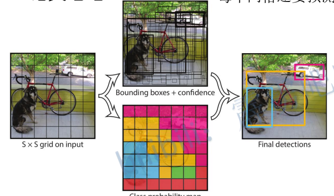

</div>

对于PASCAL VOC数据集而言，类别数为 20， 所以这里c为20，B 为 2， S 为 7，所以这里预测 $7\times7\times30$，这里30是指 $2 \times (4 + 1) + 20$，即 2 个 bbox 的$ x,y,w,h $（这里时直接预测坐标，而不是坐标的偏移量）和confidence。

$$confidence = Pr(obj) + IOU^{truth}_{pred}$$

这里的 $Pr(obj) \in \{0,1\}$ 即有目标时为1，无目标时0，$IOU^{truth}_{pred}$，真实bbox与预测bbox的交并比。

##### 网络结构

<div align=center>


</div>

##### Loss

<div align=center>


</div>

注意这里confidence有两个：正样本和负样本的Loss
Yolov1的Loss即 x，y，w，h的bbox损失，正负样本的confidence损失，还有每个类别的损失

##### 缺点
- 对成群的小目标效果差
- 定位效果差

#### Yolov2

##### 改进

- Batch Normalization，在每个卷积层的后面都加上了BN层，BN可以加速训练，正则化起到防止过拟合的作用，防止梯度消失。
- High Resolution Classifier，图像的分辨率由$224\times224$ 提升到$448\times448$
- Convolutional With Anchor Boxes，引入anchor，recall提升很大
- Dimension Clusters，anchor聚类，通过kmeans聚类
- Direct location prediction，通过限制坐标的偏移量使得预测的bbox只在负责的网格里，而不会出现在别的网格的情况。
- Fine-Grained Features ，通过pasthrough layer特征融合，类似于Fouces + FPN
- Multi-Scale Training，每10个epoch随机选择，选择的尺寸都是32的倍数

##### 网络结构

<div align=center>


</div>

##### darknet-19

<div align=center>


</div>

#### Yolov3

##### 改进
- backbone 由 darknet19 提升到 darknet53
- 采用FPN结构

##### darknet53

<div align=center>


</div>

亮点：
- 引入残差结构
- 不含max pooling层
##### 网络结构

<div align=center>


</div>

<div id="fpn"></div>

原始FPN结构

<div align=center>


</div>

修改后的FPN结构

<div align=center>


</div>

图中FPN结构中采用的是Concat而不是直接相加如上图，CBL*5如下图：

<div align=center>


</div>

##### predict

yolov3在三层特征层上分别进行预测，同样使用kmeans聚类得到九组scale，如下图

<div align=center>


</div>

对于每个 anchor 预测 $4 + 1 + 80$，4表示4个坐标的偏移量，1表示confidence，80代表coco数据集的类别，所以对于一个$N\times N$的特征图，预测3个scale，共有$N\times N \times 3 (4 + 1 + 80)$( $N \in \{13,26,52 \}$)

对于目标边界框的回归参数，$t_x,t_y$来说是基于grid的cell 的左上角来说的，而faster rcnn 、ssd都是基于anchor的，所以通过一个sigmoid函数把$t_x,t_y$的范围限制在$[0,1]$之间。如下：

<div align=center>


</div>

对于faster rcnn 和 ssd的回归参数方程：

$$ x = w_a t_x + x_a $$
$$ y = h_a t_y + y_a $$
$$ w = w_a e^{t_w }$$
$$ h = h_a e^{t_h} $$

**yolo** 中的坐标的是基于当前前 **cell** 的左上角的，且每一个 **grid**的范围都是$[0,1]$，所以如果不对$t_x,t_y$进行限制，并且再乘以一个系数的话会出现偏移出当前的**cell**的情况，这与**yolo**的如果一个目标落在一个**cel**l里那么这个**cell**就预测这个目标的初衷是违背的

##### 采样

对于每一个gt只选取得分最大的anchor，如果由anchor不是最大但是超过了给定阈值那么则直接丢弃，对于既不是正样本也不是负样本的anchor ，它既没有类别损失也没有定位损失，只有confidence损失，对于yolov3 u版的采样问题，是使用template计算IOU得出的，对于模板与gt的iou大于某一个阈值那么就认为是正样本，所以正样本得到了扩充，如下：

<div align=center>


</div>


##### Loss

<div align=center>


</div>
<div align=center>


</div>
<div align=center>


</div>
<div align=center>


</div>


#### Yolov3 spp

##### 改进
- Mosaic图像增强
- SPP 模块
- CIOU Loss
- [Focal Loss](#focal_loss)

##### Mosaic

<div align=center>


</div>

1. 一次整合了4张图片(随机缩放裁剪整合四张为1张)，相较于只合了两张的CutMix，这运训了模型能够检测到更多的物体，
2. 同时在计算BN的时候，一次相当于计算了四张，那么就减少了对大batch-size的依赖

<div id="spp"></div>

##### SPP 模块

<div align=center>


</div>

feature map经过spp模块有4个分支，第一个分支是原feature map不变，第二三四个分支分别是$5\times5,9\times9,13\times13 stride = 1$的max pooling，最后四个分支再进行Concat拼接，实现了特征融合。

##### CIOU

###### IOU

$$ IoU = \frac{|A\cap B|}{|A\cup B|}$$

优点：
- 尺度不变
- 更好的反应重叠情况

缺点：
- 如果两个框没有相交，根据定义，IoU=0，不能反映两者的距离大小（重合度）。同时因为loss=0，没有梯度回传，无法进行学习训练。
- IoU无法精确的反映两者的重合度大小。如下图所示，三种情况IoU都相等，但看得出来他们的重合度是不一样的，左边的图回归的效果最好，右边的最差。

<div align=center>


</div>

###### GIOU

$$GIoU = IoU - \frac{|A^c - U|}{|A^c|}$$
$$ -1\le GIou \le 1$$

$A^c$即最小外接边界框的面积，$U$即两个框的并集，如下图，$A^c$即蓝色的外边框，$U$为绿色并上红色

<div align=center>


</div>

优点：
- 解决了IOU 不重叠时 Loss为0的情况

缺点：
- 在某些情况下会退化成Iou，例如水平/垂直对

###### DIOU

$$ DIoU = IoU - \frac{d^2}{c^2}$$
$$ -1\le DIou \le 1$$

$d$表示两个框之间中心坐标的距离，$c$表示最小外接边界框对角线的长度，如下图

<div align=center>


</div>

优点：
- DIoU Loss可以直接最小化两个目标框的距离，因此收敛快。

缺点：
- 没有考虑吧长宽比


<div id="ciou"></div>

###### CIOU

$$ DIoU = IoU - (\frac{d^2}{c^2} + \alpha v)$$

<div align=center>


</div>

优点：
- 全面的考虑了重叠面积、中心点距离、长宽比。

#### Yolov4

##### 改进
- backbone由Darknet53升级为CSPDarknet53
- 使用了大量数据增强和技巧

##### 网络结构

<div align=center>

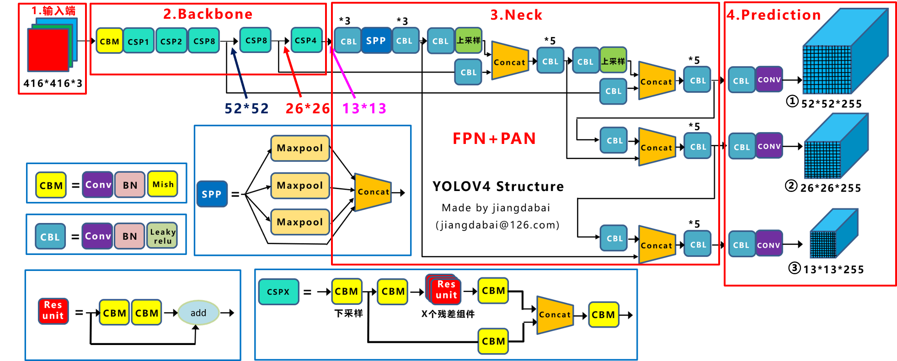

</div>

##### CSPDarknet53

<div align=center>


</div>

[DenseNet](#densenet) 在每一个dense block内采用密集连接，每一个输出都与之前的所有输入进行Concat，最后在经过transition layer下采样，CSPDenseNet，再dense block 的输入会与transition layer的输出再进行一个Concat后再经过一个transition如下图，更大程度的特征融合。

<div align=center>


</div>

##### Backbone

###### BOF

- cutMix

<div align=center>


</div>

把另一幅图像随机裁剪贴到当前图上。

- [Mosaic](#mosaic)
- DropBlock，对于dropout随机失活神经元，下次以仍然可以从附近的神经元学到东西，所以dropblock丢弃一整块区域
  
<div align=center>


</div>

- class-label-smoothing， label smoothing就是一种正则化的方法而已，让分类之间的cluster更加紧凑，增加类间距离，减少类内距离，避免over high confidence的adversarial examples。

<div align=center>


</div>

###### BOS
- [Mish 激活函数](#mish)
- csp结构 如上

##### Detector

###### BOF

- [CIoU Loss](#ciou)
- CmBN，BN在batch 较小的情况下效果并不好，CBN在认为连续几次训练iteration中模型参数的变化是平滑的，作者将前几次iteration的BN参数保存起来，当前iteration的BN参数由当前batch数据求出的BN参数和保存的前几次的BN参数共同推算得出（Cross-Interation BN）,比如每次迭代都需要之前三次迭代的数据来计算BN。CBN的每次计算都需要前三次的数据，例如5时刻迭代需要2、3、4时刻的数据，4时刻迭代需要1、2、3时刻的数据，而CmBN则是把4个一组分块，4时刻迭代需要1、2、3时刻的数据，但是5时刻不能用上个组中4、3、2时刻的数据，8时刻可以用该组的7、6、5时刻的数据一次类推。

<div align=center>


</div>

<div align=center>


</div>
<div align=center>


</div>

- SAT，在输入特征层上加上一些扰动，这些扰动不会改变图片的类别但是模型却根据这些扰动导致判断错误

<div align=center>


</div>

- Eliminate grid sensitivity
- Using multiple anchors for a single ground truth，扩充正样本的数量，分配三个模板，把gt缩放到预测特征层上，如果gt的中心落入某个cell那个就与模板二进行匹配，如果gt与每一个anchor模板都超过一定的阈值那么都算作正样本。
- Cosine annealing scheduler
- Optimal hyperparameters
- Random training shapes

###### BOS

- [Mish 激活函数](#mish)
- SPP-block
- SAM-block,对于SE module，将不同的通道进行加权，让模型去学哪个channel更重要,SAM则是对所有个通道的不同参数加权，YOLOV4,则把spatial-wise注意力变成了point-wise注意力机制如下：

<div align=center>


</div>

<div align=center>


</div>

<div align=center>


</div>

- PAN ,先经过FPN，最高层特征逐个上采样与上一层特征层拼接，再经过下采样与下一层特特征层拼接

<div align=center>


</div>

- [DIou NMS](#diounms)


#### Yolov5

##### 网络结构

<div align=center>


</div>

##### 改进
- Foucs 模块
- 添加CSP结构到Neck
- SPPF

<div id="focus"></div>

##### Foucs

把图片分成多个$多个2\times2$的小矩阵，每个对应相同的位置进行拼接。经过foucs模块宽高变为原来的一半，深度变为原来的四倍。类似于Swin transformer中的 patch merging。

<div align=center>


</div>
<div align=center>


</div>

Focus的计算量和参数量要比普通卷积要多一些，是普通卷积的4倍，但是下采样时没有信息的丢失。
同样的有人提出用$6\times6$的卷积来代替foucs模块效率会更高。

##### SPPF

<div align=center>


</div>

对比[SPP](#spp)，把SPP中并联的不同kernel size 的max pooling，改成串联的相同大小的max pooling，再把每个层的输出进行拼接，这样效果相同，但是SPPF速度却是SPP两倍多。

##### 数据增强
- [Mosaic](#mosaic)
- Copy paste(分割)
- 随机放射变化（只起用了缩放和平移）
- MixUp
- 随机水平反转

##### 训练策略
- Multi-scale training (0.5~1.5x)，多尺度训练，假设设置输入图片的大小为$640 \times 640$，训练时采用尺寸是在$ 0.5 \times 640 \sim 1.5 \times 640$ 之间随机取值，注意取值时取得都是32的整数倍（因为网络会最大下采样32倍）。
- AutoAnchor(For training custom data)，训练自己数据集时可以根据自己数据集里的目标进行重新聚类生成Anchors模板。
- Warmup and Cosine LR scheduler，训练前先进行Warmup热身，然后在采用Cosine学习率下降策略，以$\cos $的形式慢慢降低学习率。
- EMA(Exponential Moving Average)，可以理解为给训练的参数加了一个动量，让它更新过程更加平滑。
- Mixed precision，混合精度训练，能够减少显存的占用并且加快训练速度，前提是GPU硬件支持。
- Evolve hyper-parameters，超参数优化，没有炼丹经验的人勿碰，保持默认就好。

基于yolov3的消除网格敏感度的改进，如果某些极端情况，例如gt的中心坐标就是grid cell的左上角的话，$t_x,t_y$的sigmoid应该是为0的，由于sigmoid的函数的特点值为0是，$t_x,t_y应该是取负无穷的，所以作者加了scale缩放因子来平衡sigmoid因子，如下：

<div align=center>


</div>

对于上说所scale为2，所以其范围是$[-0.5，1.5]$之间，所以在匹配正负样本的template也做了调整，在原grid cell的基础上在其上方和左侧又扩充了一个grid cell，所以正样本也就增加了。

<div align=center>


</div>

对于gt的中心点，在当前gridcell的左上角的时候，就往上左扩充一个grid cell，对于在右下角的情况就往右下扩充一个grid，以此类推

<div align=center>


</div>

##### Loss

<div align=center>


</div>

- Classes loss，分类损失，采用的是BCE loss，注意只计算正样本的分类损失。
- Objectness loss，obj损失，采用的依然是BCE loss，注意这里的obj指的是网络预测的目标边界框与GT Box的CIoU。这里计算的是所有样本的obj损失。yolov3、v4的时候采用的是有目标则为1，无目标则为0。
- Location loss，定位损失，采用的是CIoU loss，注意只计算正样本的定位损失。

##### 平衡不同尺度的损失

这里是指针对三个预测特征层（P3, P4, P5）上的obj损失采用不同的权重。在源码中，针对预测小目标的预测特征层（P3）采用的权重是4.0，针对预测中等目标的预测特征层（P4）采用的权重是1.0，针对预测大目标的预测特征层（P5）采用的权重是0.4，作者说这是针对COCO数据集设置的超参数。

<div align=center>


</div>


#### YoloX

##### 改进

- backbone，跟yolov5一样也用到了focus模块
- 分类回归层，Decoupled Head，Yolo之前的版本所用的预测head是一起的，也就是分类和回归通过一个$1\times1$的卷积实现，Yolox分为了两个部分，最后预测的时候再进行整合。
- 数据增强去 Mosaic、MixUp
- Anchor Free： 不使用先验目标框
- SimOTA，为不同大小的目标匹配正样本

##### 网络结构

<div align=center>


</div>

##### Decoupled Head
对比：
<div align=center>


</div>

细节：
<div align=center>


</div>

为什么要用 Decoupled Head？

作者想继续改进，比如输出端改进为End-to-end的方式，在偶然间，作者将End-to-End中的Yolo Head，修改为Decoupled Head的方式。惊喜的发现，End-to-end Yolo的AP值，从34.3增加到38.8。然后作者又将Yolov3 baseline 中Yolo Head，也修改为Decoupled Head。发现AP值，从38.5，增加到39.6。当然作者在实验中还发现，不单单是精度上的提高。替换为Decoupled Head后，网络的收敛速度也加快了。

但是需要注意的是：将检测头解耦，会增加运算的复杂度。因此作者经过速度和性能上的权衡，最终使用 1个1x1 的卷积先进行降维，并在后面两个分支里，各使用了 2个3x3 卷积，最终调整到仅仅增加一点点的网络参数。

以$20\times20\times512$的分支为例，从图上可以看出，Concat前总共有三个分支：

- **cls_output**：主要对目标框的类别，预测分数。因为COCO数据集总共有80个类别，且主要是N个二分类判断，因此经过Sigmoid激活函数处理后，变为$20\times20\times80$大小。

- **obj_output**：主要判断目标框是前景还是背景，因此经过Sigmoid处理好，变为$20\times20\times1$大小。

- **reg_output**：主要对目标框的坐标信息$（x，y，w，h）$进行预测，因此大小为$20\times20\times4$。

最后三个output，经过Concat融合到一起，得到$20\times20\times85$的特征信息。

Decoupled Head②输出特征信息，并进行Concate，得到$40\times40\times85$特征信息。

Decoupled Head③输出特征信息，并进行Concate，得到$80\times80\times85$特征信息。

最后reshape成 $N\times85$后再三个分支进行拼接，得到$8400\times85$的预测信息。并经过一次Transpose，变为$85*\times8400$大小的二维向量信息。这里的8400，指的是预测框的数量，而85是每个预测框的信息（reg，obj，cls）。

##### Anchor Free

yolov1采用的是anchor free的方式，而v2、3、4、5都是anchor base的方式。

###### Anchor Based

以yolov3_spp网络结构为例：最后的三个Feature Map上，基于每个单元格，都有三个不同尺寸大小的锚框，anchor的尺寸是通过聚类得到的。

<div align=center>


</div>

<div align=center>


</div>

当输入为$416×416$时，网络最后的三个特征图大小为$13×13，26×26，52×52$。我们可以看到，黄色框为小狗的Groundtruth，即标注框。而蓝色的框，为小狗中心点所在的单元格，所对应的锚框，每个单元格都有3个蓝框。

当采用COCO数据集，即有80个类别时。基于每个锚框，都有$x、y、w、h、obj$（前景背景）、class（80个类别），共 $85$ 个参数。因此会产生 $3×(13×13+26×26+52×52）×85=904995$ 个预测结果。如果将输入从 $416×416$ ，变为 $640×640$，最后的三个特征图大小为 $20×20,40×40,80×80$。则会产生 $3×（20×20+4040+8080）×85=2142000$ 个预测结果。

###### Anchor Free

<div align=center>


</div>

比如上图中，最上面的分支，下采样了5次，2的5次方为32。
并且Decoupled Head①的输出，为20×20×85大小。

<div align=center>


</div>

因此如上图所示：
最后 $8400$ 个预测框中，其中有 $400$ 个框，所对应锚框的大小，为 $32×32$ 。同样的原理，中间的分支，最后有 $1600$ 个预测框，所对应锚框的大小，为 $ 16×16$。最下面的分支，最后有 $6400$ 个预测框，所对应锚框的大小，为 $8×8$ 。当有了 $8400$ 个预测框的信息，每张图片也有标注的目标框的信息。这时的锚框，就相当于桥梁。这时需要做的，就是将 $8400$ 个锚框，和图片上所有的目标框进行关联，挑选出正样本锚框。而相应的，正样本锚框所对应的位置，就可以将正样本预测框，挑选出来。

##### 正样本分配

初步筛选：
- 根据中心点来判断：寻找anchor_box中心点，落在groundtruth_boxes矩形范围的所有anchors。
- 根据目标框来判断：以groundtruth中心点为基准，设置边长为5的正方形，挑选在正方形内的所有锚框。

精细化筛选：
- 初筛正样本信息提取，以3个gt，2个类别（两个猫一个狗）为例，设8400个anchor中有1000个正样本，然后取出这些正样本对应的类别分数[1000,2]、confidence[1000,1]、以及预测的坐标[1000,4]。
- Loss计算 分别计算其位置损失、分类损失
- cost计算 对位置损失和分类损失加权即为cost
- SimOTA 选出1000个正样本中，即IoU最大的10个候选框[3,10]，三个目标。然后对10个候选框的三个目标分数，分别求和得出[3,1]（torch.sum），再向下取整，如下图所示：

<div align=center>


</div>

- 最后得出的 $[[3],[4],[3]]$，即为对于每个目标所分配的候选框的数量，对于目标1、3给他们分配3个候选框，对于目标2则分配4个候选框。
- 分配标准：对于选出的目标框每个目标取cost最低的，如下图所示：

<div align=center>


</div>

因为目标框1和3，dynamic_ks值都为3，因此matching_matrix的第一行和第三行，有3个1。而目标框2，dynamic_ks值为4，因此matching_matrix的第二行，有4个1。
对于两个目标都有的候选框，根据cost得分保留得分低的

<div align=center>


</div>

<div align=center>


</div>

最后根据挑选出来的正样本和目标框计算Loss，检测框位置的iou_loss，Yolox中使用传统的iou_loss，和giou_loss两种，可以进行选择。而obj_loss和cls_loss，都是采用BCE_loss的方式。

### RetinaNet

#### One Stage VS Two Stage

Two Stage：例如Faster-RCNN算法。第一级专注于proposal的提取，第二级对提取出的proposal进行分类和精确坐标回归。两级结构准确度较高，但因为第二级需要单独对每个proposal进行分类/回归，速度上就打了折扣
One Stage：例如SSD，YOLO算法。此类算法摒弃了提取proposal的过程，只用一级就完成了识别/回归，虽然速度较快但准确率远远比不上两级结构、

产生精度差异的主要原因：类别失衡（Class Imbalance）。One Stage方法在得到特征图后，会产生密集的目标候选区域，而这些大量的候选区域中只有很少一部分是真正的目标，这样就造成了机器学习中经典的训练样本正负不平衡的问题。它往往会造成最终算出的training loss为占绝对多数但包含信息量却很少的负样本所支配，少样正样本提供的关键信息却不能在一般所用的training loss中发挥正常作用，从而无法得出一个能对模型训练提供正确指导的loss。

<div id="focal_loss"></div>

#### Focal Loss

***Focal Loss的目的：消除类别不平衡 + 挖掘难分样本***

Focal Loss非常简单，就是在原有的交叉熵损失函数上增加了一个因子，让损失函数更加关注hard examples，以下是用于二值分类的交叉熵损失函数。其中 $y \in \{\pm1\}$ 为类别真实标签， $p \in [0,1]$ 是模型预测的 $y = 1$ 的概率。

$$ CE(p, y ) = \left \{
\begin{aligned}
-log(p) , if \quad  y = 1\\
-log(1-p),otherwise
\end{aligned}
\right.
$$

重新定义CE如下：

$$ p_t = \left \{
\begin{aligned}
p , if \quad  y = 1\\
1-p,otherwise
\end{aligned}
\right.
$$
$$CE(p,y) = CE(pt) = -log(p_t)$$

对于这种类别不均衡问题常用的方法是引入一个权重因子 $\alpha$ ，对于类别1的使用权重 $\alpha$ ，对于类别-1使用权重 $1-\alpha$ ，公式如下所示。但采用这种加权方式可以平衡正负样本的重要性，但无法区分容易分类的样本与难分类的样本。

$$CE(p_t) = -\alpha_t log(p_t)$$

因此论文中提出在交叉熵前增加一个调节因子 $(1-p_t)^\gamma$ ，其中 $ \gamma $ 为focusing parameter，且 $\gamma \ge 0$ ，其公式变为如下，当 $ \gamma $ 取不同数值时loss曲线如图1所示。通过途中可以看到，当 $ \gamma $ 越来越大时，loss函数在容易分类的部分其loss几乎为零，而 $ p_t $ 较小的部分（hard examples部分）loss值仍然较大，这样就可以保证在类别不平衡较大时，累加样本loss，可以让hard examples贡献更多的loss，从而可以在训练时给与hard examples部分更多的优化。

$$ FL(p_t) = -(1-p_t)^\gamma log(p_t)$$

在实际使用时，论文中提出在上述公式的基础上，增加一个 $\alpha$ 平衡因子，可以产生一个轻微的精度提升，公式如下所示。

$$ FL(p_t) = -\alpha_t (1-p_t)^\gamma log(p_t)$$

<div align=center>


</div>

#### 网络结构

<div align=center>


</div>

backbone 是 resnet101+ FPN

### DETR

#### 网络结构

<div align=center>


</div>

#### 算法流程

<div align=center>


</div>


- 经过CNN backbone提取特征，再加上对应position encoding，展平后送入transformer encoder
- transformer encoder的输出与pe再送入decoder的第二个 self attention位置，第一个self attention位置的输入是object queries ，object queries 就是 query_embed。```self.query_embed = nn.Embedding(num_queries, hidden_dim)```,其中，num_queries是预定义的目标查询的个数，代码中默认为100。它的意义是：根据Encoder编码的特征，Decoder将100个查询转化成100个目标。
- 最后经过decoder的输出，分别送入两个FFN进行类别的预测和边界框的回归。对于预测类别的分支而言，是一个linear层，隐藏层的维度为512，输出的维度为类别数加1（因为存在空类），这里得到的维度是[2,100,92],（92表示类别数加1），这个预测用于后边的匈牙利匹配。对于预测bbox的分支而言，主要由3个linear层组成，隐藏层的维度都为512，输出层的维度为4,即输出维度为[2,100,4],为了保证最后的数值为正做一个sigmoid。


---
# RNN系列
## RNN

<div align=center>


</div>


## LSTM

<div align=center>


</div>

<div align=center>


遗忘门，决定丢弃信息
</div>

<div align=center>


更新门，确定更新的信息
</div>

<div align=center>


更新细胞状态
</div>

<div align=center>


输出门，输出信息
</div>

rnn为什么梯度消失爆炸，lstm如何解决

<div align=center>


</div>

## GRU

<div align=center>


</div>

## BiLSTM（双向lstm）
---
# 神经网络知识
## 梯度消失梯度爆炸
### 梯度消失
#### 什么是

目前优化神经网络的方法都是基于 **BP**，即根据损失函数计算的误差通过梯度反向传播的方式，指导深度网络权值的更新优化。其中将误差从末层往前传递的过程需要 **链式法则（Chain Rule）**，而链式法则是一个 **连乘** 的形式，所以当层数越深的时候，梯度将以指数形式传播。当梯度累乘一个$0\sim1$之间的数时，梯度会无限接近于0，这个时候梯度无法回传，这就是梯度消失。

#### 原因

- 网络**层数太多**
- 采用了**不合适的损失函数**，比如**sigmoid**。当梯度消失发生时，接近于输出层的隐藏层由于其梯度相对正常，所以权值更新时也就相对正常，但是当越靠近输入层时，由于梯度消失现象，会导致靠近输入层的隐藏层权值更新缓慢或者更新停滞。这就导致在训练时，只等价于后面几层的浅层网络的学习。
- 

### 梯度爆炸
#### 什么是

同梯度消失的原因类似，当梯度累乘一个大于 $1$ 之间的数时，会导致梯度无限大，但是计算机的存储是有上限的，例如 **tensor** 是 $32$ 位的，当梯度超过 $32$ 位上限时，计算机无法存储。

#### 原因

一般出现在深层网络和**权值初始化值太大**的情况下。在深层神经网络或循环神经网络中，误差的梯度可在更新中累积相乘。如果网络层之间的梯度值大于 1.0，那么重复相乘会导致梯度呈指数级增长，梯度变的非常大，然后导致网络权重的大幅更新，并因此使网络变得不稳定

### 解决办法
- ***pre-training+fine-tunning***
- ***梯度剪切：对梯度设定阈值***
- ***权重正则化***
- ***选择relu等梯度大部分落在常数上的激活函数***
- ***batch normalization***
- ***残差网络的捷径（shortcut）***
- ***LSTM的“门（gate）”结构***

## 激活函数

<div id="sigmoid"></div>

### Sigmoid

<div align=center>


</div>


#### 函数
$$f(x) = \frac{1}{1 + e^{-x}}$$
#### 导数
$$f'(x) = f(x)(1-f(x))$$
#### 缺点
- 激活函数**计算量大**（在正向传播和反向传播中都包含幂运算和除法）；
- 反向传播求误差梯度时，求导**涉及除法**；
- Sigmoid导数取值范围是$[0, 0.25]$，由于神经网络反向传播时的“链式反应”，很容易就会出现**梯度消失**的情况
- Sigmoid的输出不是0均值（即zero-centered），**不关于 $0$ 对称**；这会导致后一层的神经元将得到上一层输出的非0均值的信号作为输入，随着网络的加深，**会改变数据的原始分布**。

<div id="tanh"></div>

### Tanh

<div align=center>


</div>

#### 函数 
$$ f(x) = tanh(x) = \frac{e^{x} - e^{-x}}{e^{x} + e^{-x}}$$
#### 导数
$$ f'(x) = 1 - f^2(x)$$

#### 优点
解决了sigmoid函数不关于0的对称问题
#### 缺点
梯度消失问题和幂运算问题依然存在

<div id="relu"></div>

### ReLU

<div align=center>


</div>

函数
$$
f(x) =  \left \{
\begin{aligned}
0  ,x < 0\\
x  ,x \ge 0
\end{aligned}
\right.
$$
导数
$$
f'(x) =  \left \{
\begin{aligned}
0  ,x < 0\\
1  ,x \ge 0
\end{aligned}
\right.
$$
#### 优点
-  解决了gradient vanishing问题 (在正区间)
- 计算速度非常快，只需要判断输入是否大于0
- 收敛速度远快于sigmoid和tanh
- Relu会使一部分神经元的输出为0，这样就造成了网络的稀疏性，并且减少了参数的相互依存关系，缓解了过拟合问题的发生

#### 缺点
- 在学习率较大时，可能会造成神经元失活问题，死掉的神经元之后也不会更新

解决问题：
- 好的学习率策略
- LeakyRelu

<div id="leakyrelu"></div>

### LeakyReLU

<div align=center>


</div>

函数
$$
f(x) =  \left \{
\begin{aligned}
0.01x  ,x < 0\\
x  ,x \ge 0
\end{aligned}
\right.
$$
导数

<div id="elu"></div>

### ELU

<div align=center>


</div>

<div align=center>


</div>

函数
$$
ELU =  \left \{
\begin{aligned}
\alpha (e^x - 1) ,x < 0\\
x  ,x \ge 0
\end{aligned}
\right.
$$
导数
$$
ELU'(x) =  \left \{
\begin{aligned}
ELU(x) + \alpha ,x < 0\\
1  ,x \ge 0
\end{aligned}
\right.
$$
<div id="mish"></div>

### Mish

<div align=center>


</div>

函数

$$f(x) = x* tanh(ln(1+e^x))$$

### 激活函数汇总

<div align=center>

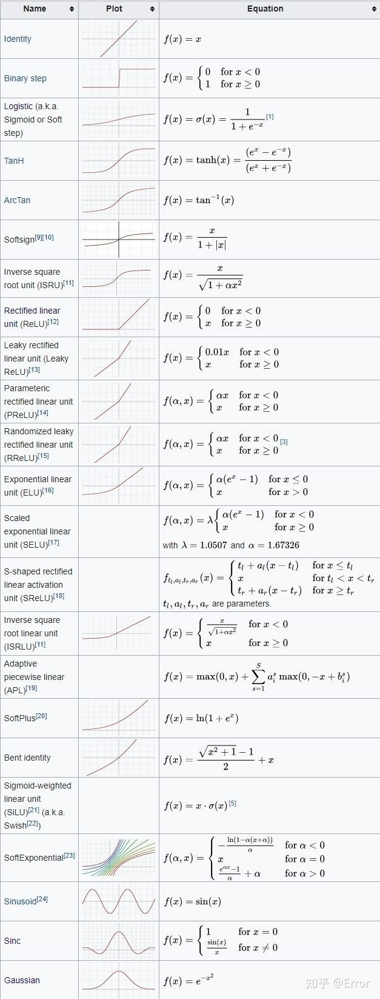

</div>

## Normalization

<div align=center>


</div>

<div id="bn"></div>

### Batch Normalization

batchNorm是在batch上，对NHW做归一化，（Batch Normalization 是对这批样本的同一维度特征做归一化）对小batchsize效果不好。

#### 伪代码

<div align=center>


</div>

#### 代码

```python
def my_batch_norm(x: Tensor, running_mean: Tensor, running_var: Tensor, weight: Tensor = None, bias: Tensor = None,
                training: bool = False, momentum: float = 0.1, eps: float = 1e-5) -> Tensor:
    """BN(F.batch_norm()). 对NHW做归一化.

    :param x: shape = (N, In) or (N, C, H, W)
    :param running_mean: shape = (In,) 或 (C,) 下同
    :param running_var:
    :param weight: gamma
    :param bias: beta
    :param training:
    :param momentum: 动量实际为 1 - momentum. (同torch)
    :param eps:
    :return: shape = x.shape"""

    if training:
        if x.dim() == 2:
            _dim = (0,)
        elif x.dim() == 4:
            _dim = (0, 2, 3)
        else:
            raise ValueError("x dim error")
        mean = eval_mean = torch.mean(x, _dim)  # 总体 = 估计. shape = (In,) or (C,)
        eval_var = torch.var(x, _dim, unbiased=True)  # 无偏估计, x作为样本
        var = torch.var(x, _dim, unbiased=False)  # 用于标准化, x作为总体
        running_mean.data = (1 - momentum) * running_mean + momentum * eval_mean
        running_var.data = (1 - momentum) * running_var + momentum * eval_var  # 无偏估计
    else:
        mean = running_mean
        var = running_var
    # 2D时, mean.shape = (In,)
    # 4D时, mean.shape = (C, 1, 1)
    if x.dim() == 4:  # 扩维
        mean, var = mean[:, None, None], var[:, None, None]
        weight, bias = weight[:, None, None], bias[:, None, None]
    return (x - mean) * torch.rsqrt(var + eps) * (weight if weight is not None else 1.) + (bias if bias is not None else 0.)
```

#### 注意点

- 对于样本的均值和方差在训练时无法直接查看，他们会通过 momentum 累加到 running_mean/var
- 训练时累加 running_mean/var 测试时直接用训练时的 running_mean/var
- 对于$\gamma（weights） , \beta (bias)$，训练时会通过反向传播进行更新，测试时不会更新
- 每一个channel都有一个不同均值和方差。
- bn对batch 敏感，batch size越大效果越好，batch size为1时效果反而又可能会变差
- 对DNN、CNN比较适用，对RNN之类的channel 不固定的计算很麻烦


<div id="ln"></div>

### Layer Normalization

layerNorm在通道方向上，对CHW归一化（ Layer Normalization 是对这单个样本的所有维度特征做归一化。），主要对RNN作用明显，对batch 不敏感


BN与LN的区别在于：
- LN中同层神经元输入拥有相同的均值和方差，不同的输入样本有不同的均值和方差；
- BN中则针对不同神经元输入计算均值和方差，同一个batch中的输入拥有相同的均值和方差。

所以，LN 不依赖于 batch 的大小和输入 sequence 的深度，因此可以用于batchsize为1和RNN中对变长的输入sequence的normalize操作。

<div align=center>


</div>


<div id="bn_vs_ln"></div>

### Instance Normalization

IN的计算就是把每个HW单独拿出来归一化处理，不受通道和batchsize 的影响


### Group Normalization

GN的计算就是把先把通道C分成G组，然后把每个gHW单独拿出来归一化处理，最后把G组归一化之后的数据合并成CHW

GN介于LN和IN之间，当然可以说LN和IN就是GN的特列，比如G的大小为1或者为C


## 正则

### DropOut

<div align=center>


</div>

随机失活神经元，对失活的神经元的输出置为0。

### L1 & L2

L1正则化和L2正则化可以看做是损失函数的惩罚项。

- L1正则化是指权值向量w ww中各个元素的绝对值之和，通常表示为 $||w||_1$（一范数）
- L2正则化是指权值向量w ww中各个元素的平方和然后再求平方根（可以看到Ridge回归的L2正则化项有平方符号），通常表示为$||w||_2$（二范数）

L1正则化和L2正则化的作用：
- L1正则化可以产生稀疏权值矩阵，即产生一个稀疏模型，可以用于特征选择
- L2正则化可以防止模型过拟合（overfitting）；一定程度上，L1也可以防止过拟合

为什么L1正则可以产生稀疏矩阵，l2正则为什么可产生防止过拟合

<div align=center>


</div>


从拉格朗日乘数法的角度出发，即原始损失函数 $J(W)$ 在 后面约束项的约束下使得数值最小。C为阈值，w的2范数在不超过C的情况下，才能约束过拟合。

<div align=center>


</div>

约束条件的最值问题，即通过拉格朗日乘数法求导为 $0$ 得出，以 $l2$ 正则为例，对于绿色的 $L$ 即是原始问题，红色 $L$ 是 $l2$ 正则的表达式，这两个表达式在求极值问题时是等价的，因为后面的常数项求导后为 $0$，对于$J(W)$和$||W||_2$的导数大概率是不等的，所以通过一个$\lambda$去使得$J(W)$和$\lambda||W||_2$的导数相加为$0$,$\lambda$为拉格朗日乘子，$\lambda$不同对应的极值点的位置也不同，确定$\lambda$之后极值点也就确定了。红色箭头就是损失函数的梯度，绿色的箭头是约束条件的梯度，他们的梯度一定是相反的，因为只有相反的所以相加才能等于$0$，方向相反并不一定（大概率不一定）相加为$0$，需要$\lambda$调整。

<div align=center>


</div>

所以根据 $l1,l2$（以 $2$ 维为例）的图像与损失函数的图像，沿梯度相反方向，通过$\lambda$的控制求得极值点。对于 $l1$ 来说，极值点大概率在坐标轴上，以上图为例，横轴表示 $w1$,纵轴表示 $w2$，则取极值是 $w1$ 为 $0$，对于 $l2$ 来说根据图像的性质，取极值点是大概率不是在坐标轴上，但是他们的平方和确实最小的，所以 $l1$ 会使得部分 $w$ 为 $0$，而 $l2$ 会使得他们的平方和最小但是不为 $0$。

## 损失函数

### softmax

$$softmax = \frac{e^{x_i}}{\sum_i e ^{x_i}}$$

### BCELoss

$$ BCE = - \frac{1}{N} \sum_i [y_i \cdot log(p_i) + (1 - y_i) log(1 - p_i)]$$

### CELoss

$$ CE = - \frac{1}{N} \sum_i \sum_{c=1}^M [y_{ic} \cdot log(p_{ic})]$$

反向传播包括softmax：

<div align=center>


</div>

### NLLLoss

```python
torch.mean(torch.tensor([-_x[t] for _x, t in zip(x, target)])) # 把对应target位置的预测值取出然后求均值
```


### MSE(l2 loss)

$$MSE = \frac{1}{N} \sum (x_i)^2$$

### MAE(l1 loss)

$$MSE = \frac{1}{N} \sum |x_i|$$

<div id="smoothl1"></div>

### Smooth L1 loss

<div align=center>


</div>

L2 L1 Smooth_L1 函数对比

<div align=center>

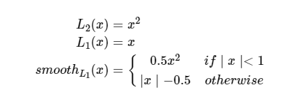

</div>

L2 L1 Smooth_L1 梯度对比

<div align=center>


</div>

L2 L1 Smooth_L1 函数曲线

<div align=center>


</div>

优缺点：

* 根据 $L2$ 的梯度公式，当 $x$ 增大时，$L2$ 的损失也增大。 这就导致在训练初期，预测值与 groud truth 差异过于大时，损失函数对预测值的梯度十分大，训练不稳定。
* 根据 $L1$ 的梯度公式，$L1$ 对 $x$ 的导数为常数，在训练的后期，预测值与ground truth差异很小时，L1的导数的绝对值仍然为 $1$，而 learning rate 如果不变，损失函数将在稳定值附近波动，难以继续收敛以达到更高精度。
* 根据 $Smooth \: L1$ 的梯度公式，$Smotth L1$ 在 $x$ 较小时，对 $x$ 的梯度也会变小。 而当 $x$ 较大时，对 $x$ 的梯度的上限为 $1$，也不会太大以至于破坏网络参数。$Smooth \: L1$完美的避开了L1和L2作为损失函数的缺陷。


## 后处理

<div id="nms"></div>

### NMS

<div align=center>


</div>

通常对于目标检测来说，无论是 **One Stage** 还是 **Two Stage**，在处理目标边界框的时候往往有大量的边界框是对同一目标的，且这些边界框位置或者Score都非常相近，所以 **NMS** 用来处理这些冗余的边界框，对于多个类似的边界框，只留下得分最高的即可。

#### 原理
* 寻找 **得分最高** 的目标
* 计算其他目标与该目标的 **IOU** 值
* **删除所有iou值大于给定阈值的目标**

#### 代码
```python
def NMS(arr: np.ndarray, thresh: float) -> list:
    # arr [[x1,y1,x2,y2,score],[x1,y1,x2,y2,score],···[x1,y1,x2,y2,score]]
    x1 = arr[:, 0]  # all x1
    y1 = arr[:, 1]  # all y1
    x2 = arr[:, 2]  # all x2
    y2 = arr[:, 3]  # all y2
    score = arr[:, 4]  # all score
    areas = (x2 - x1 + 1) * (y2 - y1 + 1)  # all area
    order = score.argsort()[::-1]  # index of score sort high to low
    keep = []
    while order.size > 0:
        i = order[0]  # the first must be the highest score in its related bbox
        keep.append(i)

        xx1 = np.maximum(x1[i], x1[order[1:]])
        yy1 = np.maximum(y1[i], y1[order[1:]])
        xx2 = np.minimum(x2[i], x2[order[1:]])
        yy2 = np.minimum(y2[i], y2[order[1:]])

        w = np.maximum(0, xx2 - xx1 + 1)
        h = np.maximum(0, yy2 - yy1 + 1)

        inter = w * h
        ious = inter / (areas[i] + areas[order[1:]] - inter)
        index = np.where(ious <= thresh)[0]
        order = order[index + 1]
        draw(arr[order])
    return keep
```
#### 缺点

- 将得分较低的边框强制性地去掉，如果物体出现较为密集时，本身属于两个物体的边框，其中得分较低的也有可能被 抑制掉，**降低了模型的召回率** 。
- 速度：NMS的实现存在较多的循环步骤，GPU的并行化实现不是特别容易，尤其是**预测框较多时，耗时较多**。
- 将得分作为衡量指标。NMS简单地将得分作为一个边框的置信度，但在一些情况下，**得分高的边框不一定位置更准**。
- **阈值难以确定**。过高的阈值容易出现大量误检，而过低的阈值则容易降低模型的召回率，超参很难确定。
- **IOU本身也存在问题**，参考GIOU/DIOU/CIOU

### Soft NMS
#### 原理
对于 **Traditional NMS** 有：
$$
s_i =  \left \{
\begin{aligned}
0  ,IOU(M,B_i) \ge thresh\\
s_i  ,IOU(M,B_i) \ge thresh
\end{aligned}
\right.
$$
显然，对于 $IoU≥NMS$ 阈值的相邻框，**Traditional NMS** 的做法是将其得分 **暴力置0**。这对于有遮挡的案例较不友好。因此 **Soft-NMS** 的做法是采取 **得分惩罚机制**，使用一个与IoU正相关的惩罚函数对得分 s 进行惩罚，时期得分降低，并不是直接丢弃。

线性惩罚：
$$
s_i =  \left \{
\begin{aligned}
s_i(1-IOU(M,B_i))  , \: IOU(M,B_i) \ge thresh\\
s_i  ,\: IOU(M,B_i) \ge thresh
\end{aligned}
\right.
$$
但是，上式并不是一个连续的函数，**不光滑**，当一个边框与M的重叠IoU超过阈值Nt时，其得分会发生跳变，这种跳变会对检测结果产生较大的波动。
因此还需要寻找一个更为稳定、连续的得分重置函数，最终Soft NMS给出了如下式所示的重置函数。高斯Soft NMS计算公式：
$$s_i = s_i\cdot e^{-\frac{IOU(M,B_i)^2}{\sigma}}$$

#### 缺点
- 仍然是顺序处理的模式，运算**效率比Traditional NMS更低**。
- 对双阶段算法友好，而在一些 **单阶段算法上可能失效**。
- 如果存在定位与得分不一致的情况，则可能导致**定位好而得分低的框比定位差得分高的框惩罚更多**(遮挡情况下)。
- 评判标准是IoU，即只考虑两个框的重叠面积，这对描述box重叠关系或许不够全面。


<div id="diounms"></div>

### DIOU NMS
#### 原理
$$
s_i =  \left \{
\begin{aligned}
0  ,DIOU(M,B_i) \ge thresh\\
s_i  ,DIOU(M,B_i) \ge thresh
\end{aligned}
\right.
$$

把 NMS 中的 **IOU 换成 DIOU**，**DIOU** 考虑了中心坐标的偏移，DIOU：
$$DIOU = IOU - \frac{d^2}{c^2}$$

实际操作中作者还加入了$\beta$ ，用以控制$\frac{d^2}{c^2}$的惩罚程度

$$DIOU = IOU - (\frac{d^2}{c^2})^\beta$$

#### 优点
- 从几何直观的角度，将中心点考虑进来有助于 **缓解遮挡** 案例。
- 可以与前述 NMS 变体结合使用。
- 保持 NMS 阈值不变的情况下，必然能够 **获得更高recall** (因为保留的框增多了)，至于 precision 就需要调 β来平衡了。

#### 缺点
- 依然是**顺序处理**模式，**运算效率低**。
- DIoU的计算比IoU**更复杂**一些，这会降低运算效率。
- 在保持NMS阈值不变的情况下，使用DIoU-NMS会导致每次迭代剩余更多的框，这会增加迭代轮数，进一步降低运算效率。

<div id="opti"></div>

## 优化器

### SGD(Stochastic Gradient Descent)

$$W_{t+1} = W_t - \alpha \frac{\partial L}{ \partial W}$$

缺点： 易受噪声影响，可能会陷入局部最优解

BGD 一次迭代使用所有样本进行计算
SGD 一次迭代只是用随机一个样本进行计算
mini-batch GD 一次迭代选取一定数目组成一个小batch样本进行计算

### SGD + Momentum

$$V_t = \eta \cdot V_{t-1} + \alpha \frac{\partial L}{ \partial W}$$($\eta 位动量系数 通常为0.9$)
$$W_{t+1} = W_t - V_t$$

优点：有效抑制样本噪声干扰

### Adagrad

$$S_t = S_{t-1} + (\frac{\partial L}{ \partial W} )^2$$

$$W_{t + 1} = W_t - \frac{\alpha}{\sqrt{S_t + \epsilon}} \cdot \frac{\partial L}{ \partial W}$$

缺点： 学习率下降太快，可能导致还没收敛就停止训练

### RMSProp

$$S_t = \eta S_{t-1} + (1-\eta)(\frac{\partial L}{ \partial W} )^2$$
$$W_{t+1} = W_t - \frac{\alpha}{\sqrt{S_t + \epsilon}} \cdot \frac{\partial L}{ \partial W}$$

添加动量系数来缓解学习率的衰减速度

### Adam

$$m_t = \beta_1 m_{t-1} + (1-\beta_1)\frac{\partial L}{ \partial W}$$
$$v_t = \beta_2 v_{t-1} + (1-\beta_2)(\frac{\partial L}{ \partial W})^2$$
$$\hat{m_t} = \frac{m_t}{1-(\beta_1)^t} , \hat{v_t} = \frac{v_t}{1-(\beta_2)^t}$$
$$W_{t+1} = W_t - \frac{\alpha}{\sqrt{\hat{v_t} + \epsilon}} \cdot \hat{m_t}$$

$m_t$ 为一阶动量，$v_t$ 为二阶动量，$\beta_1（0.9）$,$\beta_2（0.999）$用来控制衰减速度

优点： 收敛快

<div id="attn"></div>

## 样本不均衡的解决办法
* ***欠采样、过采样***
* ***数据增强***
* ***惩罚项/加权***
* ***OHEM 和 Focal Loss***
* ***选用对样本均衡不敏感的模型，逻辑回归等***
* ***采样+集成学习***
* ***异常检测，把分类问题修改为异常检测问题***
* ***迁移学习***

## Attention

[Attention 和 fc 的 区别](https://www.zhihu.com/question/320174043)

---
# 机器学习
## 朴素贝叶斯
[朴素贝叶斯](https://www.cnblogs.com/lyq2021/p/14253771.html)
## 逻辑回归
[逻辑回归](https://www.cnblogs.com/lyq2021/p/14253818.html)
## 牛顿法/拟牛顿法
[牛顿法/拟牛顿法](https://zhuanlan.zhihu.com/p/46536960)
## 感知机
[感知机](https://www.cnblogs.com/lyq2021/p/14253768.html)
## SVM
[SVM](https://www.cnblogs.com/lyq2021/p/14253858.html)
## PCA
[PCA](https://zhuanlan.zhihu.com/p/77151308)
## 决策树
[决策树](https://zhuanlan.zhihu.com/p/85731206)
## 随机森林
[随机森林](https://zhuanlan.zhihu.com/p/86263786)
## AdaBoost
[AdaBoost](https://www.cnblogs.com/lyq2021/p/14253860.html)
## XGBoost
[XGBoost](https://zhuanlan.zhihu.com/p/87885678)
## Kmeans
[Kmeans](https://zhuanlan.zhihu.com/p/78798251)
## KNN

[KNN](https://www.cnblogs.com/lyq2021/p/14253756.html)
---
# 图像处理知识
## Fundamental

### Algebraic Processing

#### Intensity Adjustment

<div align=center>


</div>

<div align=center>


</div>

#### Contrast Adjustment

<div align=center>


</div>

#### Highlighting Specific Gray-Level

<div align=center>


</div>

<div align=center>


</div>

#### Bit-Plane Slicing

<div align=center>


</div>


#### XOR

<div align=center>

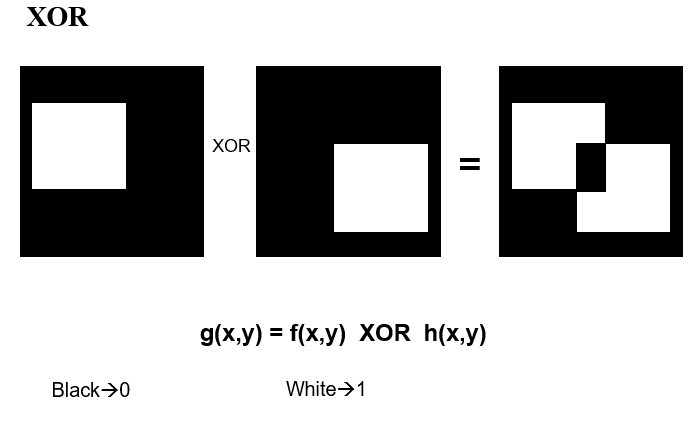

</div>


#### OR

<div align=center>


</div>


#### AND

<div align=center>


</div>

### Geometric Processing

#### Horizontal/Vertical Flip

<div align=center>


</div>

```c++
void vflip(const void *in, int width, int height, int istep,  int pix_size, void *out, int ostep)
{
       out=(char*)out+(height-1)*ostep;
       for(int yi=0; yi<height; ++yi, in=(char*)in+istep, out=(char*)out-ostep)
       {
            memcpy(out, in, width*pix_size);
        }
}

void hflip(const void *in, int width, int height, int istep,  int pix_size, void *out, int ostep)
{
       char * _in=(char*)in;
       char *_out=(char*)out+(width-1)*pix_size;
      
       for(int yi=0; yi<height; ++yi, _in+=istep, _out+=ostep)
       {
            char *in_x=_in, 
            char *out_x=_out;
             for(int xi=0; xi<width; ++xi, in_x+=px_size, out_x-=px_size)
                  memcpy(out_x, in_x, px_size) ;
        }
}

```

#### Resize

<div align=center>


</div>

##### 放大

###### Nearest Neighbor

<div align=center>


</div>

###### Bilinear Interpolation

<div align=center>


</div>

```c++
//双线性差值
int InterpBilinear(const QImage &image,double x,double y)
{
    int width = image.width();
    int height = image.height();

    //四个临近点的坐标 (x1,y1)、(x1,y2),(x2,y1)，(x2,y2)
    int x1,x2;
    int y1,y2;

    //两个差值的中值
    double f12,f34;
    double	epsilon = 0.0001;

    //四个临近像素坐标x像素值
    double f1,f2,f3,f4;

    //计算四个临近坐标
    x1 = (int)x;
    x2 = x1 + 1;
    y1 = (int)y;
    y2 = y1+1;

    //不在图片的范围内
    if((x < 0) || (x > width - 1) || (y < 0) || (y > height - 1))
    {
        return -1;
    }else{
        if(fabs(x - width+1)<=epsilon) //如果计算点在右测边缘
        {
            //如果差值点在图像的最右下角
            if(fabs(y - height+1)<=epsilon)
            {
                f1 = qGray(image.pixel(x1,y1));
                return f1;
            }else {
                f1 = qGray(image.pixel(x1,y1));
                f3 = qGray(image.pixel(x1,y2));

                //图像右方的插值
                return ((int) (f1 + (y-y1)*(f3-f1)));
            }
        }
        //如果插入点在图像的下方
        else if(fabs(y - height+1)<=epsilon){
           f1 = qGray(image.pixel(x1,y1));
           f2 = qGray(image.pixel(x2,y1));

           //图像下方的插值
           return ((int) (f1 + (x-x1)*(f2-f1)));
        }
        else {
            //得计算四个临近点像素值
            f1 = qGray(image.pixel(x1,y1));
            f2 = qGray(image.pixel(x2,y1));
            f3 = qGray(image.pixel(x1,y2));
            f4 = qGray(image.pixel(x2,y2));

            //第一次插值
            f12 = f1 + (x-x1)*(f2-f1); //f(x,0)

            //第二次插值
            f34 = f3 + (x-x1)*(f4-f3); //f(x,1)

            //最终插值
            return ((int) (f12 + (y-y1)*(f34-f12)));
        }
    }

}

```
###### Bicubic Interpolation

#### Rotation

<div align=center>


</div>

<div align=center>


</div>

<div align=center>


</div>

<div align=center>


</div>

<div align=center>


</div>

#### Affine

<div align=center>


</div>
<div align=center>


</div>

#### Perspective

<div align=center>


</div>

## Spatial Filtering
### Linear
#### Smoothing

<div align=center>


</div>

<div align=center>


</div>

#### Sharpening
##### Basic High-Pass

<div align=center>


</div>

##### Derivative Filters

###### First Derivatives: The Gradient

Roberts Operators

<div align=center>


</div>


Prewitt Operators

<div align=center>


</div>


Sobel Operators

<div align=center>


</div>


###### Second Derivatives: The Laplacian

<div align=center>


</div>
<div align=center>

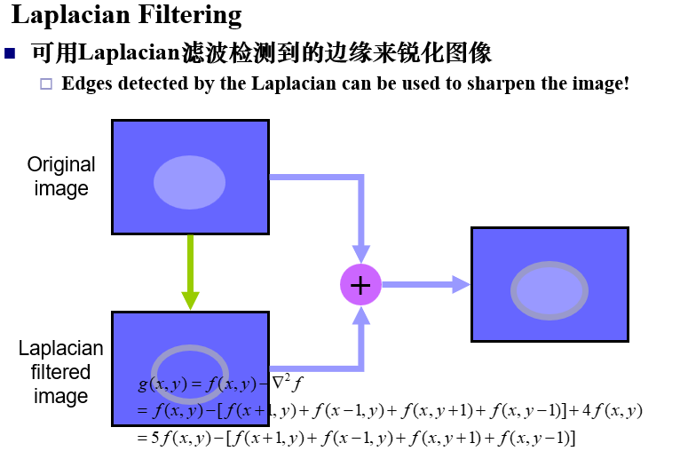

</div>

###### High-Boost Filter(高频补偿滤波器)

<div align=center>


</div>
<div align=center>


</div>

### Nonlinear
#### Median  filter

<div align=center>


</div>

<div align=center>


</div>


#### Max  filter

<div align=center>


</div>

#### Min  filter

<div align=center>


</div>

#### Bilateral Filter 

<div align=center>


</div>

## Structures

### 膨胀和腐蚀

<div align=center>


</div>
<div align=center>


</div>

### 开运算闭运算

<div align=center>


</div>
<div align=center>

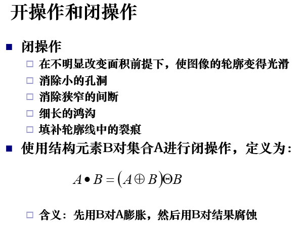

</div>

## Machting

### Corner Detection

<div align=center>


</div>
<div align=center>


</div>

### Blob Detection

<div align=center>


</div>

### Hog

[Hog](https://blog.csdn.net/sinat_34474705/article/details/80219617)

### SIFT

[SIFT](https://www.itheima.com/news/20210604/113227.html)