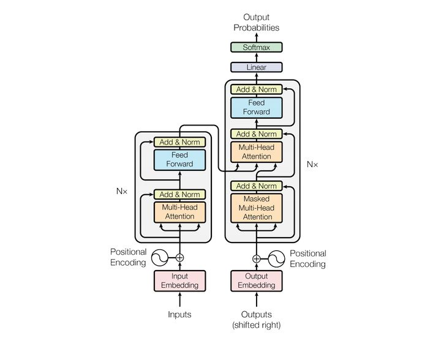
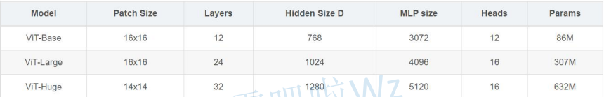
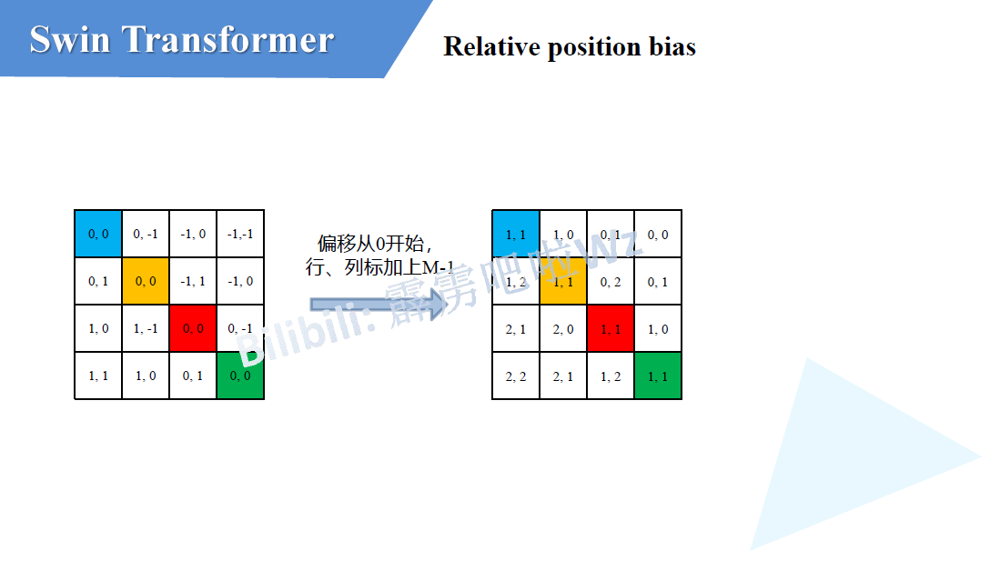
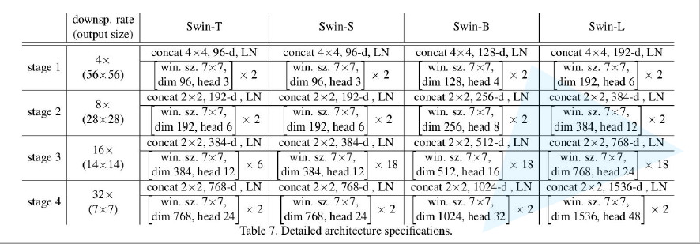

**计算机视觉知识汇总**

# Transformer主干网络

## Transformer

### input Embedding

**input Embedding** 就是 **nlp** 中的 **word embedding** 词编码 (只涉及cv知识，其他方向不做详述)

### Positional Encoding

经过**word embedding** 获得了词与词之间的关系表述，但是**word embedding**是对所有词同时编码无法获得其位置关系，由于**Transforme**r中是并行的处理所有句子，因此需要加入词在句子中的位置信息，所以进行**Positional Embedding**。
论文中给出了两种位置编码形式：
* 根据所给公式进行绝对位置编码：

* 使用可训练位置编码，让网络自己学习其位置编码
  由于这两种编码在实验中的效果相差很小，所以作者为了减少参数量选择了根据公式进行绝对位置编码。

### Encoder

#### Multi-Head self-Attention

 

**$Attention(Q,K,V) = softmax(\frac{QK^T}{\sqrt{d_k}})V$**

经过编码后的输入$a1$,$a2$(为了方便描述取两个输入)与$Q,K,V$(可训练)权重矩阵相乘生成对应的$q_1,k_1,v_1$ 与 $q_2,k_2,v_2$,再每一个$q_i$与每一个$k_i$做**点积 (dot product)**，由于transformer全都可以并行化操作所以这里其实就是$QK^T$，然后再比上$\sqrt{d_k}$($d_k$是K的维度)，再经过$softmax$后与$V$进行矩阵乘。

这里有几个问题：
* $Q1$：$Q,K,V$分别是什么意思？
* $A1$：首先$Q,K,V$分别是**Query，Key，Value**的缩写，**Query，Key，Value**的概念取自于信息检索系统，举个简单的搜索的例子来说。当你在某电商平台搜索某件商品（年轻女士冬季穿的红色薄款羽绒服）时，你在搜索引擎上输入的内容便是**Query**，然后搜索引擎根据**Query**为你匹配**Key**（例如商品的种类，颜色，描述等），然后根据**Query**和**Key**的相似度得到匹配的内容（Value)。[来源 https://zhuanlan.zhihu.com/p/48508221](https://zhuanlan.zhihu.com/p/48508221)
* $Q2$: **Transformer**中为什么使用不同的$K$ 和 $V$， 为什么不能使用同一个值？或者为什么是$Q,K,V$而不是$K$ 和 $V$ 或者$Q$ 和 $V$？
* $A2$: $Q$ 如果自己跟自己($Q$)相乘的话，那么根据向量点积知识知道，俩个向量越相似，内积越大，当一个向量与自己做内积，再与其他不同词的向量做内积后(行成一个打分向量)，该向量经过**softmax**后，就会变为一个有一个位置的值特殊的大(自己与自己相乘)，其他位置的值非常非常小的状况出现，比如[0.98,0.01,0.05,0.05]那么,这样的得分再与$V$矩阵相乘后得出的加权向量就是一个基本上跟自己本身差不多的矩阵，那就失去了**self attention**的意义了。
* $Q3$：为什么$QK^T$要先除以$\sqrt{d_k}$再**softmax**？
* $A3$:对于一个输入向量  ，**softmax**函数将其映射/归一化到一个分布。在这个过程中，**softmax**先用一个自然底数$\exp$将输入中的元素间差距先“拉大”，再除以$\sum e^x_i$后归一化为一个分布。假设某个输入$x$中最大的的元素下标是$k$，如果输入的数量级变大（每个元素都很大），那么会非常接近1。数量级对**softmax**得到的分布影响非常大。在数量级较大时，**softmax**将几乎全部的概率分布都分配给了最大值对应的标签。那么就将产生一个接近**one-hot**的向量,所以反向传播时梯度就消失为0。
* $Q4$: 为什么$QK^T$是除以$\sqrt{d_k}$而不是随便除以一个数？
* $A4$: $q$ 和 $k$ 的各个分量是互相独立的随机变量，均值是0，方差是1，那么点积 $q·k$的均值是0，方差是$\sqrt{d_k}$，所以$\frac{QK^T - 0}{\sqrt{d_k}}$拉回到均值为0， 方差为1的标准正态分布，防止了数量级大使得梯度消失的情况。

 

**$MultiHead(Q,K,V) = Concat(head_1,head_2,...,head_h)W^O$**
**$where head_i = Attention(QW_i^Q,KW_i^K,VW_i^V)$**

**self attention**中的输入分别与$W^Q,W^K,W^V$相乘产生$q_i,k_i,v_i(Q,K,V)$, **multi-head self attention** 中每一个head都是一个**self attention**，每一个head都有$W^Q_j,W^K_j,W^V_j$生成每一个head中的$q_j,k_j,v_j$，原文(**线性映射**)直接把**self attention**中的$q_i,k_i,v_i$均分给每个head的$q_i^j,k_i^j,v_i^j$,每一个**head**再做**self attention**然后把每个head的结果$Concat$，最后在做一个线性变换，变换到与输入相同的维度。

问题：
* $Q$: 为什么需要**multi head**呢，只用一个head不行吗？
* $A$: 每个**head**空间中注意到的东西可能都不一样，比如**head**注意到的东西**head**没注意到，**head**注意到的事情**head**没注意到，所以把所有**head**的结果$Concat$相当于注意的更加全面。

#### Add & Norm

**Add** 指残差结构，把**multi-head self attention**的输入与其输出做一个相加，因为**multi-head**后的结果经过了一个线性变换使得输入输出是相同的维度，所以可以相加。

**Norm**指 **Layer Normalization**，通常用于 **RNN** 结构，**Layer Normalization** 会将每一层神经元的输入都转成均值方差都一样的，这样可以加快收敛。
问题：
* $Q$: 为什么不用 **Batch Normalization** 而是用 **Layer Normalization**？
* $A$: [答案](#bn_vs_ln)

#### Feed Forward

**Feed Forward** 层比较简单，是一个**两层的全连接层**，第一层的激活函数为 **Relu**，第二层不使用激活函数，对应的公式如下:

 

**$Max(0,XW_1+b_1)W_2 + b2$**

$X_{(n,d)}$经过**multi-head self attention、add & norm 、feed forward**之后输入$O_{(n,d)}$

### Decoder

#### Masked Multi-Head Self Attention

**Decoder**中的第一个**multi-head self attention**为 ***Masked***  **multi-head self attention**，所谓**mask**是一个$n * n$的下三角矩阵如图：[https://zhuanlan.zhihu.com/p/338817680](https://zhuanlan.zhihu.com/p/338817680)

由于**Transform**的并行操作，所以当$QK^T$经过一些列操作后需要与$V$进行矩阵乘，即$QK^T$中的每一个向量需要与$V$中的每一个向量做点积，但是由于句子是序列化，即当第$k$个单词应该只能注意到$k$以及$k$之前的单词，所以这个操作与我们所希望的是违背的，所以需要一个**mas**k矩阵与$QK^T$按位相乘，产生Mask $QK^T$,再softmax后与$V$相乘得相应结果。操作如下：

#### 第二个Multi-Head Self Attention

**Decoder block** 第二个 **Multi-Head Attention** 变化不大， 主要的区别在于其中 **Self-Attention** 的 $K, V$矩阵不是使用 上一个 **Decoder block** 的输出计算的，而是使用 **Encoder** 的编码信息矩阵 $C$ 计算的。

根据 **Encoder** 的输出 $C$计算得到 $K, V$，根据上一个 **Decoder block** 的输出 $Z$ 计算 $Q$ (如果是第一个 **Decoder block** 则使用输入矩阵 $X$ 进行计算)，后续的计算方法与之前描述的一致。

这样做的好处是在 **Decoder** 的时候，每一位单词都可以利用到 **Encoder** 所有单词的信息 (这些信息无需 **Mask**)。

#### Softmax 预测输出单词

**Decoder block** 最后的部分是利用 **Softmax** 预测下一个单词，在之前的网络层我们可以得到一个最终的输出 $Z$，因为 **Mask** 的存在，使得单词 $0$ 的输出 $Z_0$ 只包含单词 $0$ 的信息，如下：

**Softmax** 根据输出矩阵的每一行预测下一个单词：

### Transformer 总结

* **Transformer** 与 **RNN** 不同，可以比较好地并行训练。
* **Transformer** 本身是不能利用单词的顺序信息的，因此需要在输入中添加位置 **Embedding**，否则 **Transformer** 就是一个词袋模型了。
* **Transformer** 的重点是 **Self-Attention** 结构，其中用到的 $Q, K, V$ 矩阵通过输出进行线性变换得到。
* **Transformer** 中 **Multi-Head Attention** 中有多个 **Self-Attention**，可以捕获单词之间多种维度上的相关系数 **attention score**。

---

## Vision Transformer(ViT)

### Patches & Linear Projection of Flattened Patches

由于**标准的transformer模块**要求输入的是一个**token**序列，而一张图片并不是一个序列，把图像分块（**patches**），由块来组成序列，对于$2D$图像$x\in \mathbb{R}^{H×W×C}$将其分为$P \times P$的 **patches**，$x_p\in \mathbb{R}^{N\times(P^2\cdot C)}$，共分成N个，$N = HW/P^2$，最终获得$N$个 $P^2 \cdot C$特征大小的向量(**768**)。在代码实现中直接用一个卷积层来实现的，以为**Vit-B 16**为例，使用卷积核**kernal size**为$16 \times 16$，**stride**为$16$，卷积核个数为$768$来实现，以$224 \times 224 \times 3$($H  W$为224，的$RGB$ $3 channel$)为例：
$H  W$为**224**的图片 分成 $H  W$为**16** 的**patches** $\frac{224 \times 224}{16\times16}$共可以分成**196**（$14 \times 14$）个**patch**，每个**patch**依然是**3**个**channel**，所以对于每一个patch的维度为为**768**（$16 \times16 \times 3$），一张$H$为224，$W$为224的图片生成一个$[196\times768]$的二维**token**矩阵。

### Position Embedding & token

对应的每一个patch生成一个**token**，每个**token**都是768维（$[196\times768]$），在所有**token**前面需要**拼接**一个$[1\times768]$可训练的**class token**（该图片所对应的类别）：$Concat([1 \times 768],[196\times768]) \longrightarrow [197\times768]$

$[196\times768]$ **token** 矩阵再经过**Position Embedding** **添加** 可训练的位置信息$[196\times768] \longrightarrow [196\times768]$，对于使用1D、2D、相对位置编码效果其实相差很小，但是使用位置编码对比不适用位置编码的效果还是很明显:

### Transformer Encoder

首先Vit中没有**Decoder**，只有**Transformer Encoder**，**Encoder block**也有几点与标准**transformer block**有差别：
* **Vit**中的**Norm**在**Multi-Head Attention**前面，标准**Transformer**中**Norm**在后面，这样做的好处是**Norm**在前面可以加速模型训练
* 在**Multi-Head Attention**与**Add**之间有一个**dropout/dropPath**，图中并没有显示出来

### MLP head

标准的**transformer**中最后的预测因为masked的关系，所以每个每个向量只与他前面的向量有关，每个向量负责预测他当前位置的值。而**Vit**中只需要预测类别，即$Concat([1 \times 768],[196\times768]) \longrightarrow [197\times768]$中的$[1 \times 768]$，所以只预测新拼接的第$0$个**token**即可

### ViT-Base、Large、Huge的区别

* **Patch Size**是指，**patch**大小，**patch size**越小 则 **patch** 越多
* **Layer**s是指，**Transformer Encoder** 中 堆叠 **Encoder Block** 的次数
* **Hidden Size**是通过**Embedding**层后每个**token**的**dim**（向量的长度），也是卷积核的个数
* **MLP size**是**Transformer Encoder**中**MLP Block**第一个全连接的节点个数（是**Hidden Size**的四倍）
* **Heads**代表**Transformer**中**Multi-Head Attention**的**heads**数

## Swin Transformer(SwinT)
### SwinT VS ViT

* 特征层的下采样倍率不同，**Swin Transformer**的特征层先经过$4$倍下采样，再经过$8$倍下采样，最后是$16$倍下采样，**ViT**中最开始经过一个$16$倍下采样，之后的所有层都是保持这个$16$倍。可以融合不同倍率特征层的特征。
* **Swin Transformer**中的特征层都是被一个一个的小 [Window](#W_SW) 给分割开了，**ViT** 则是整个特征层没有被分割。

### Swin Transformer 结构

#### Architecture

$H\times W \times 3$ 的图像经过 **Patch Partition** 和 **Linear Embedding（Layer Normal）**，变成$\frac{H}{4} \times \frac{W}{4} \times 48$，再经过**Stage1**变为$\frac{H}{4} \times \frac{W}{4} \times C$，再由**Stage2**变成$\frac{H}{8} \times \frac{W}{8} \times 2C$，再经过**Stage3**、**Stage4**变成$\frac{H}{16} \times \frac{W}{16} \times 4C$、$\frac{H}{32} \times \frac{W}{32} \times 8C$，每经过一个 [Patch Merging](#patch_merge) 图像宽高缩减为原来的 一半 ，**channel** 变为原来的2倍，**Stage1**由**Linear Embedding**和$2$个**Swin Transformer Block**堆叠而成，而后面的**Stage**均是由**Patch Merging**和 偶数个 **Swin Transformer Block**堆叠而成。

偶数个是因为，**Swin Transformer Block**的第一个**block**中**Self Attention**的是[Window Multi-Head Self Attention](#W_MSA)(右图中的W-MSA),第二个**block**中**Self Attention**的是[Shifted-Window Multi-Head Self Attention](#SW_MSA)(右图中的SW-MSA)

#### Patch Partition & Linear Embedding
**Patch Partition**如上图，$H\times W \times 3$的图像被一个$4 \times 4$大小的窗口分割，每个窗口内分成$16$个**patch**，然后**patch**延**channel**方向进行$Concat$，所以$H\times W \times 3$的图像经过**Patch Partition**宽高变成原来的$\frac{1}{4}$，**channel**由3变成48($3 \times 16$)

**Linear Embedding（Layer Normal）**，经过**Patch Partition**后再通过一个线性层对channel进行调整，调整成图中的$C$（具体的$C$根据，**Swin-Tiny、Swin-Small、Swin-Base、Swin-Large**有所不同）。

实现：**Patch Partition** 和 **Linear Embedding**都是通过卷积层实现的，**kernal size** 为 $4 \times 4$，**stride** 为 $4$， **channel** 为 $48$，类似于ViT中的[Patches & Linear Projection of Flattened Patches](#patch_linear)，还要经过一层**LayerNorm**

### Patch Merging

如上图，一个$4\times 4$大小的窗口，按位置进行拆分，如上原图中**蓝、黄、绿、红**对应位置的元素，进行拆分合并成**蓝、黄、绿、红**的$2 \times 2$大小的小窗口给，然后在**channel**方向上进行$Concat$，再经过一个**LayerNorm**后，通过一个全连接层将**channel**整合成原图的2倍，宽高变为原来的1半。类似于[Focus](#focus)操作。

这里的全连接层Linear是**权值共享**的

### Window & Shifted Window

#### W-MSA

对于普通的**Multi-Head Self Attention**的每一个**token**都会去计算$Q,K,V$，$QK^T$运算完之后再去与&V&联系，每一个**token**都会与所有的**token**去进行沟通。

**Window Multi-Head Self Attention** 把特征图进行分块，每个块内部去进行**Self Attention**，这样做的有点是减少了计算量，但是其缺点是只能块内进行沟通，但是块和块之间是无法通信的。

#### SW-MSA

**Shifted-Window Multi-Head Self Attention** 解决了 **Window Multi-Head Self Attention** 块与块之间无法通讯的问题。

如上图，对于 **W-MSA** 中的Window向下向右偏移了两个 **patch**，生成了一个新的 **Window**（上图中**Layer+1** 所示），这个新的 **Window** 就是 **SW-MSA**，对于**Layer+1**中的上方中间的 **Window**，融合了 **Layer** 中的上面两个 **Window** ，对应** Layer+1** 中左侧中间的** Window** 融合了**Layer**中的左侧两个 **Window**，对于**Layer+1**中的中间大的 **Window** 融合了 **Layer** 中的所有四个**Window**，其他**Window**依次类推。这样就解决了 **W-MSA** Window之间无法通讯的问题。

但是这样**SW-MSA**分成$9$个**window**是不利于并行计算的，不像**W-MSA**每一个**Window**都是一个$4\times4$大小的，作者提出了一个方法来解决这个问题：

对于$9$个Window标记为$0\sim8$，先将上边的$0,1,2$(图中标记的$A，C$)整体移动到下边，如下图：

对于移动后的新的特征图，再把左侧的$3,6,0$(图中标记的$B,A$)整体移动到左边，这样就又组成了一个新的$4\times 4$的特征图，($5$和$3$看作一个整体，$7$和$1$看作一个整体，$8、6、2、0$看作一个整体)，这样就又可以做$4\times4$的并行计算了如下图：

但是这样又会有一个新问题，即 $5$ 和 $3$原本是不相邻的，把他们强行划到同一个 $4\times4$ 的Window中去做 **Self Attention**是不对的，$5$ 和 $3$应该在自己的 **Window** 内去进行 **Self Attention** (其他Window类似)，解决方法如下：

对$5$ 和 $3$ 中的每一个 **patch** 标记为 $0\sim15$，对于 $patch_0$ 的 $q_0$ 对其他所有 **patch** 的 $k_i$ 做点积生成 $\alpha_{0,0}$,$\alpha_{0,1}$,……,$\alpha_{0,15}$ ，对于跟 $patch_0$ 不在同一个区域中的 patch 的点积结果如图中**蓝色方框内的$\alpha$**，先减去100再做 $softmax$，这样这些 $\alpha$ 经过 $softmax$ 之后就会变为0，一个很大的负数取 $exp$ 结果趋于 $0$，这样就会只做同一区域内的 **Self Attention**，计算结束后再还原会原来的位置即可。

### Relative position bias

**$Attention(Q,K,V) = softmax(\frac{QK^T}{\sqrt{d_k}} + B)V$**

与普通的 **Attention** 相比，$\frac{QK^T}{\sqrt{d_k}}$先加$B$，在进行$softmax$，这个$B$就是 **Relative position bias**（相对位置偏置）

对于一个$2\times2$的 **feature map**，分别以不同颜色**蓝、黄、红、绿**标识，以**蓝色**为例，当以**蓝色**为基准去计算其他位置的索引时，其他位置的行列坐标减去蓝色的坐标即为关于蓝色的位置索引，然后进行 $flatten$，再把所有位置的 $flatten$ 的索引 $Concat$ 成一个相对位置矩阵。但是作者使用的并不是二维的位置索引，而是一维的位置索引，变化如下图：

偏移从 $0$ 开始，行列坐标加上 $M-1$ ，这里的 $M$ 是 **feature map** 的 大小 这里是 $2$， $M-1$ 为 $1$

再行列坐标乘上$2M-1$
* Q:为什么是$2M-1$ ？
* A：对于$2\times2$的feature map，其他位置关于基准位置的索引从 $-M + 1 \sim M - 1$ ,以蓝色位列可以去到的最极端的索引为$(-1,-1)$，而对于绿色的来说可以取到的最极端的索引为$(1，1)$，所以对于$2\times2$的 feature map 索引范围是$[-1,0,1]$，二维索引即$[-1,0,1]$的排列组合共有$9$个，即$(2M-1)^2$个。

然后再行列坐标相加，变成一维的 **位置索引** 。

注意上面是 **位置索引** 而不是 **位置偏置** ，需要拿对应的**位置索引** 去 **相对位置偏置表(Relative position bias table)** 中去取对应的 **相对位置偏置** 即 **Attention** 中的 $B$。

### Swin-T/S/B/L 区别

* **win. sz.** 是指 **Swin Transformer Block** 中的 **Window** 大小，这里四个模型的任何阶段均相同。
* **dim** 是指经过每个 **Stage** 后输出的维度
* **head** 是指 **Swin Transformer Block** 中头的个数
* **S、B、L** 中 **Stage3** 都是堆叠了$18$个 **block**
* **T、S** 除了 **Stage3** 的堆叠次数外完全一样
* **S、B、L** 的 **Stage1** 的 **dim** 分别是$96，128，192$，之后的每一个 **Stage** 的 **dim** 都是之前两倍

---

# CNN主干网络
## CNN基础
---
# 目标检测主流模型
## Two Stage
### RCNN系列
#### RCNN
#### Fast RCNN
#### Faster RNN
## One Stage
### SSD系列
#### SSD
#### DSSD
### Yolo系列
#### Yolov1
#### Yolov2
#### Yolov3
#### Yolov3 spp
#### Yolov4
#### Yolov5

---
# RNN系列
## RNN
## LSTM
## GRU
## BiLSTM
---
# 神经网络知识
## 梯度消失梯度爆炸
## 激活函数
## Normalization
### Batch Normalization
### Layer Normalization

### Instance Normalization
### Group Normalization
## 正则
## 损失函数
## 优化器
---
# 机器学习
---
# 图像处理知识
