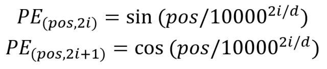
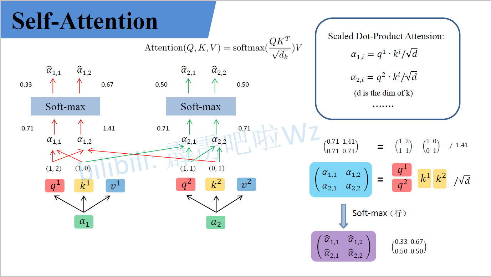
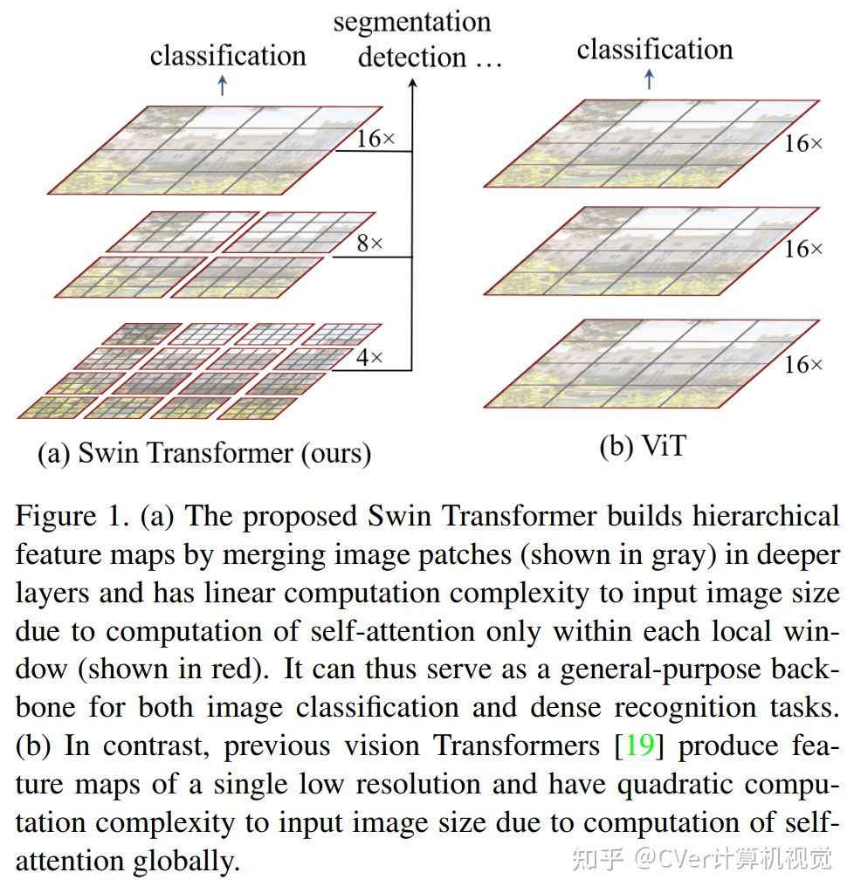
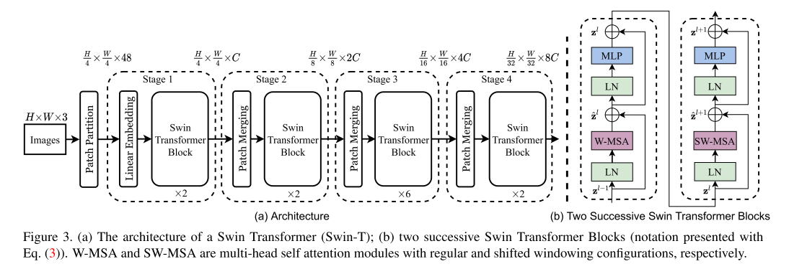
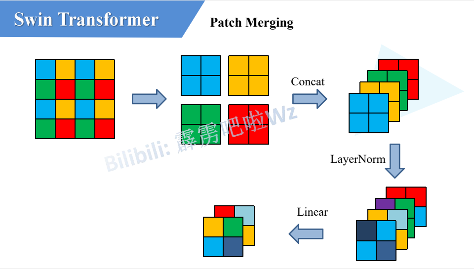

**计算机视觉知识汇总**

# Transformer主干网络

## Transformer

### input Embedding

**input Embedding** 就是 **nlp** 中的 **word embedding** 词编码 (只涉及cv知识，其他方向不做详述)

### Positional Encoding

经过**word embedding** 获得了词与词之间的关系表述，但是**word embedding**是对所有词同时编码无法获得其位置关系，由于**Transforme**r中是并行的处理所有句子，因此需要加入词在句子中的位置信息，所以进行**Positional Embedding**。
论文中给出了两种位置编码形式：
* 根据所给公式进行绝对位置编码：

* 使用可训练位置编码，让网络自己学习其位置编码
  由于这两种编码在实验中的效果相差很小，所以作者为了减少参数量选择了根据公式进行绝对位置编码。

### Encoder

#### Multi-Head self-Attention

 

**$Attention(Q,K,V) = softmax(\frac{QK^T}{\sqrt{d_k}})V$**

经过编码后的输入$a1$,$a2$(为了方便描述取两个输入)与$Q,K,V$(可训练)权重矩阵相乘生成对应的$q_1,k_1,v_1$ 与 $q_2,k_2,v_2$,再每一个$q_i$与每一个$k_i$做**点积 (dot product)**，由于transformer全都可以并行化操作所以这里其实就是$QK^T$，然后再比上$\sqrt{d_k}$($d_k$是K的维度)，再经过$softmax$后与$V$进行矩阵乘。

这里有几个问题：
* $Q1$：$Q,K,V$分别是什么意思？
* $A1$：首先$Q,K,V$分别是**Query，Key，Value**的缩写，**Query，Key，Value**的概念取自于信息检索系统，举个简单的搜索的例子来说。当你在某电商平台搜索某件商品（年轻女士冬季穿的红色薄款羽绒服）时，你在搜索引擎上输入的内容便是**Query**，然后搜索引擎根据**Query**为你匹配**Key**（例如商品的种类，颜色，描述等），然后根据**Query**和**Key**的相似度得到匹配的内容（Value)。[来源 https://zhuanlan.zhihu.com/p/48508221](https://zhuanlan.zhihu.com/p/48508221)
* $Q2$: **Transformer**中为什么使用不同的$K$ 和 $V$， 为什么不能使用同一个值？或者为什么是$Q,K,V$而不是$K$ 和 $V$ 或者$Q$ 和 $V$？
* $A2$: $Q$ 如果自己跟自己($Q$)相乘的话，那么根据向量点积知识知道，俩个向量越相似，内积越大，当一个向量与自己做内积，再与其他不同词的向量做内积后(行成一个打分向量)，该向量经过**softmax**后，就会变为一个有一个位置的值特殊的大(自己与自己相乘)，其他位置的值非常非常小的状况出现，比如[0.98,0.01,0.05,0.05]那么,这样的得分再与$V$矩阵相乘后得出的加权向量就是一个基本上跟自己本身差不多的矩阵，那就失去了**self attention**的意义了。
* $Q3$：为什么$QK^T$要先除以$\sqrt{d_k}$再**softmax**？
* $A3$:对于一个输入向量  ，**softmax**函数将其映射/归一化到一个分布。在这个过程中，**softmax**先用一个自然底数$\exp$将输入中的元素间差距先“拉大”，再除以$\sum e^x_i$后归一化为一个分布。假设某个输入$x$中最大的的元素下标是$k$，如果输入的数量级变大（每个元素都很大），那么会非常接近1。数量级对**softmax**得到的分布影响非常大。在数量级较大时，**softmax**将几乎全部的概率分布都分配给了最大值对应的标签。那么就将产生一个接近**one-hot**的向量,所以反向传播时梯度就消失为0。
* $Q4$: 为什么$QK^T$是除以$\sqrt{d_k}$而不是随便除以一个数？
* $A4$: $q$ 和 $k$ 的各个分量是互相独立的随机变量，均值是0，方差是1，那么点积 $q·k$的均值是0，方差是$\sqrt{d_k}$，所以$\frac{QK^T - 0}{\sqrt{d_k}}$拉回到均值为0， 方差为1的标准正态分布，防止了数量级大使得梯度消失的情况。

 

**$MultiHead(Q,K,V) = Concat(head_1,head_2,...,head_h)W^O$**
**$where head_i = Attention(QW_i^Q,KW_i^K,VW_i^V)$**

**self attention**中的输入分别与$W^Q,W^K,W^V$相乘产生$q_i,k_i,v_i(Q,K,V)$, **multi-head self attention** 中每一个head都是一个**self attention**，每一个head都有$W^Q_j,W^K_j,W^V_j$生成每一个head中的$q_j,k_j,v_j$，原文(**线性映射**)直接把**self attention**中的$q_i,k_i,v_i$均分给每个head的$q_i^j,k_i^j,v_i^j$,每一个**head**再做**self attention**然后把每个head的结果$Concat$，最后在做一个线性变换，变换到与输入相同的维度。

问题：
* $Q$: 为什么需要**multi head**呢，只用一个head不行吗？
* $A$: 每个**head**空间中注意到的东西可能都不一样，比如**head**注意到的东西**head**没注意到，**head**注意到的事情**head**没注意到，所以把所有**head**的结果$Concat$相当于注意的更加全面。

#### Add & Norm

**Add** 指残差结构，把**multi-head self attention**的输入与其输出做一个相加，因为**multi-head**后的结果经过了一个线性变换使得输入输出是相同的维度，所以可以相加。

**Norm**指 **Layer Normalization**，通常用于 **RNN** 结构，**Layer Normalization** 会将每一层神经元的输入都转成均值方差都一样的，这样可以加快收敛。
问题：
* $Q$: 为什么不用 **Batch Normalization** 而是用 **Layer Normalization**？
* $A$: [答案](#bn_vs_ln)

#### Feed Forward

**Feed Forward** 层比较简单，是一个**两层的全连接层**，第一层的激活函数为 **Relu**，第二层不使用激活函数，对应的公式如下:

 

**$Max(0,XW_1+b_1)W_2 + b2$**

$X_{(n,d)}$经过**multi-head self attention、add & norm 、feed forward**之后输入$O_{(n,d)}$

### Decoder

#### Masked Multi-Head Self Attention

**Decoder**中的第一个**multi-head self attention**为 ***Masked***  **multi-head self attention**，所谓**mask**是一个$n * n$的下三角矩阵如图：[https://zhuanlan.zhihu.com/p/338817680](https://zhuanlan.zhihu.com/p/338817680)

由于**Transform**的并行操作，所以当$QK^T$经过一些列操作后需要与$V$进行矩阵乘，即$QK^T$中的每一个向量需要与$V$中的每一个向量做点积，但是由于句子是序列化，即当第$k$个单词应该只能注意到$k$以及$k$之前的单词，所以这个操作与我们所希望的是违背的，所以需要一个**mas**k矩阵与$QK^T$按位相乘，产生Mask $QK^T$,再softmax后与$V$相乘得相应结果。操作如下：

#### 第二个Multi-Head Self Attention

**Decoder block** 第二个 **Multi-Head Attention** 变化不大， 主要的区别在于其中 **Self-Attention** 的 $K, V$矩阵不是使用 上一个 **Decoder block** 的输出计算的，而是使用 **Encoder** 的编码信息矩阵 $C$ 计算的。

根据 **Encoder** 的输出 $C$计算得到 $K, V$，根据上一个 **Decoder block** 的输出 $Z$ 计算 $Q$ (如果是第一个 **Decoder block** 则使用输入矩阵 $X$ 进行计算)，后续的计算方法与之前描述的一致。

这样做的好处是在 **Decoder** 的时候，每一位单词都可以利用到 **Encoder** 所有单词的信息 (这些信息无需 **Mask**)。

#### Softmax 预测输出单词

**Decoder block** 最后的部分是利用 **Softmax** 预测下一个单词，在之前的网络层我们可以得到一个最终的输出 $Z$，因为 **Mask** 的存在，使得单词 $0$ 的输出 $Z_0$ 只包含单词 $0$ 的信息，如下：

**Softmax** 根据输出矩阵的每一行预测下一个单词：

### Transformer 总结

* **Transformer** 与 **RNN** 不同，可以比较好地并行训练。
* **Transformer** 本身是不能利用单词的顺序信息的，因此需要在输入中添加位置 **Embedding**，否则 **Transformer** 就是一个词袋模型了。
* **Transformer** 的重点是 **Self-Attention** 结构，其中用到的 $Q, K, V$ 矩阵通过输出进行线性变换得到。
* **Transformer** 中 **Multi-Head Attention** 中有多个 **Self-Attention**，可以捕获单词之间多种维度上的相关系数 **attention score**。

---

## Vision Transformer(ViT)

## Swin Transformer(SwinT)

---

# CNN主干网络
## CNN基础
---
# 目标检测主流模型
## Two Stage
### RCNN系列
#### RCNN
#### Fast RCNN
#### Faster RNN
## One Stage
### SSD系列
#### SSD
#### DSSD
### Yolo系列
#### Yolov1
#### Yolov2
#### Yolov3
#### Yolov3 spp
#### Yolov4
#### Yolov5
---
# RNN系列
## RNN
## LSTM
## GRU
## BiLSTM
---
# 神经网络知识
## 梯度消失梯度爆炸
## 激活函数
## Normalization
### Batch Normalization
### Layer Normalization

### Instance Normalization
### Group Normalization
## 正则
## 损失函数
## 优化器
---
# 机器学习
---
# 图像处理知识
