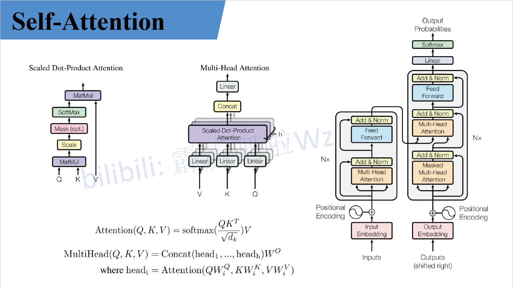
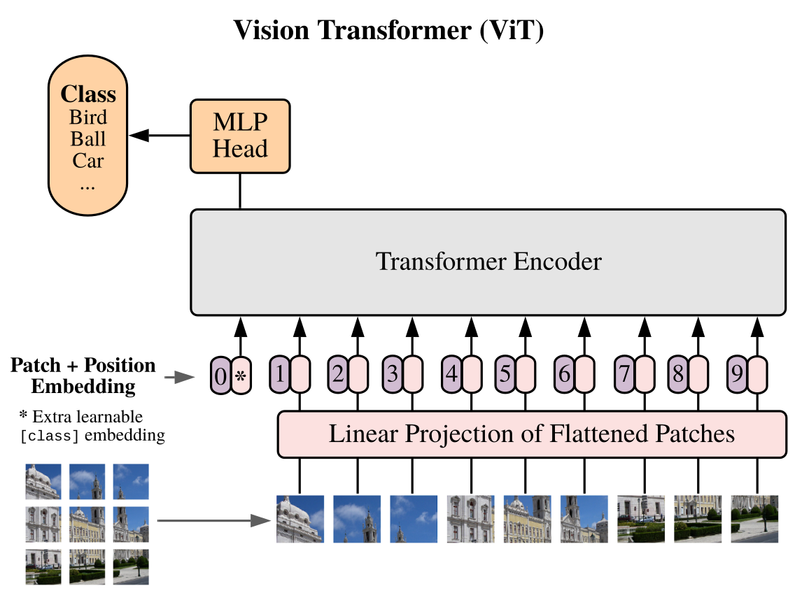
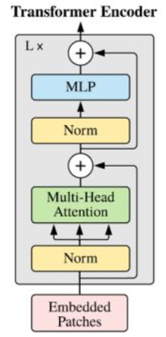
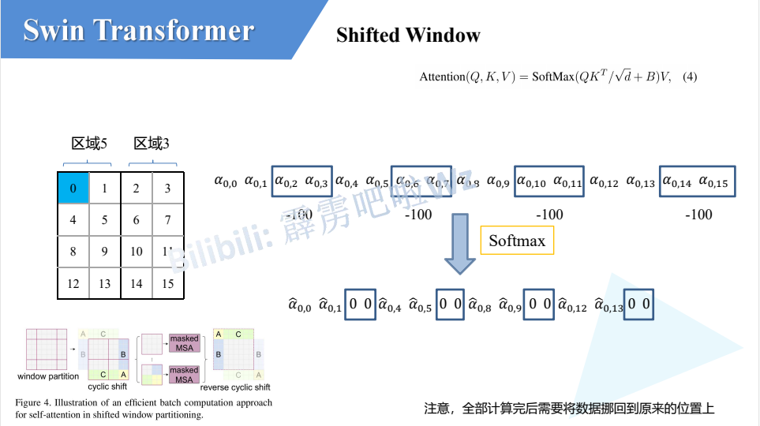
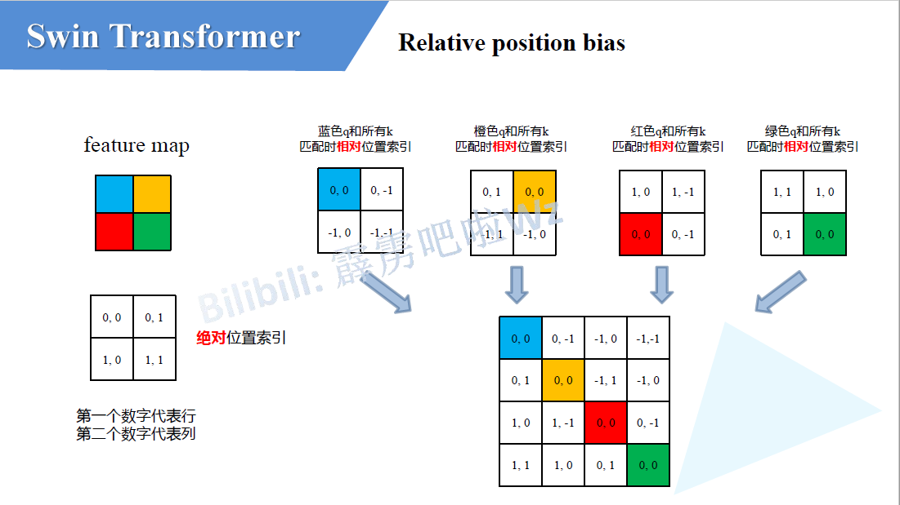
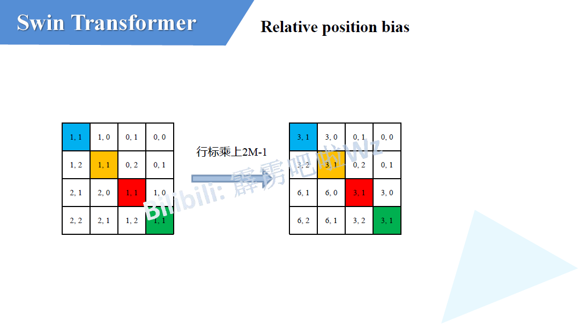
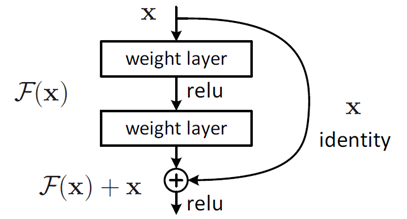

<div id="title" align=center>
<font face="黑体" size=7>

**计算机视觉知识汇总**
</font>
</div>

# 前言

本文中所使用 PPT 截图皆来自于导师[b站up主：霹雳吧啦Wz](https://space.bilibili.com/18161609)。
文中如有不妥地方，欢迎留言指正！

# Transformer主干网络

## Transformer


<div align=center>


</div>

### input Embedding
<div id="im">
<p>

**input Embedding** 就是 **nlp** 中的 **word embedding** 词编码 (只涉及cv知识，其他方向不做详述)

</p>
</div>

### Positional Encoding
<div id="pe">

经过**word embedding** 获得了词与词之间的关系表述，但是**word embedding**是对所有词同时编码无法获得其位置关系，由于**Transforme**r中是并行的处理所有句子，因此需要加入词在句子中的位置信息，所以进行**Positional Embedding**。
论文中给出了两种位置编码形式：
* 根据所给公式进行绝对位置编码：

<div align=center>


</div>

* 使用可训练位置编码，让网络自己学习其位置编码
  由于这两种编码在实验中的效果相差很小，所以作者为了减少参数量选择了根据公式进行绝对位置编码。

</div>

### Encoder

#### Multi-Head self-[Attention](#attn)

<div align=center> 

**$Attention(Q,K,V) = softmax(\frac{QK^T}{\sqrt{d_k}})V$**

</div>


经过编码后的输入$a1$,$a2$(为了方便描述取两个输入)与$Q,K,V$(可训练)权重矩阵相乘生成对应的$q_1,k_1,v_1$ 与 $q_2,k_2,v_2$,再每一个$q_i$与每一个$k_i$做**点积 (dot product)**，由于transformer全都可以并行化操作所以这里其实就是$QK^T$，然后再比上$\sqrt{d_k}$($d_k$是K的维度)，再经过$softmax$后与$V$进行矩阵乘。

这里有几个问题：
* $Q1$：$Q,K,V$分别是什么意思？
* $A1$：首先$Q,K,V$分别是**Query，Key，Value**的缩写，**Query，Key，Value**的概念取自于信息检索系统，举个简单的搜索的例子来说。当你在某电商平台搜索某件商品（年轻女士冬季穿的红色薄款羽绒服）时，你在搜索引擎上输入的内容便是**Query**，然后搜索引擎根据**Query**为你匹配**Key**（例如商品的种类，颜色，描述等），然后根据**Query**和**Key**的相似度得到匹配的内容（Value)。[来源 https://zhuanlan.zhihu.com/p/48508221](https://zhuanlan.zhihu.com/p/48508221)
* $Q2$: **Transformer**中为什么使用不同的$K$ 和 $V$， 为什么不能使用同一个值？或者为什么是$Q,K,V$而不是$K$ 和 $V$ 或者$Q$ 和 $V$？
* $A2$: $Q$ 如果自己跟自己($Q$)相乘的话，那么根据向量点积知识知道，俩个向量越相似，内积越大，当一个向量与自己做内积，再与其他不同词的向量做内积后(行成一个打分向量)，该向量经过**softmax**后，就会变为一个有一个位置的值特殊的大(自己与自己相乘)，其他位置的值非常非常小的状况出现，比如[0.98,0.01,0.05,0.05]那么,这样的得分再与$V$矩阵相乘后得出的加权向量就是一个基本上跟自己本身差不多的矩阵，那就失去了**self attention**的意义了。
* $Q3$：为什么$QK^T$要先除以$\sqrt{d_k}$再**softmax**？
* $A3$:对于一个输入向量  ，**softmax**函数将其映射/归一化到一个分布。在这个过程中，**softmax**先用一个自然底数$\exp$将输入中的元素间差距先“拉大”，再除以$\sum e^x_i$后归一化为一个分布。假设某个输入$x$中最大的的元素下标是$k$，如果输入的数量级变大（每个元素都很大），那么会非常接近1。数量级对**softmax**得到的分布影响非常大。在数量级较大时，**softmax**将几乎全部的概率分布都分配给了最大值对应的标签。那么就将产生一个接近**one-hot**的向量,所以反向传播时梯度就消失为0。
* $Q4$: 为什么$QK^T$是除以$\sqrt{d_k}$而不是随便除以一个数？
* $A4$: $q$ 和 $k$ 的各个分量是互相独立的随机变量，均值是0，方差是1，那么点积 $q·k$的均值是0，方差是$\sqrt{d_k}$，所以$\frac{QK^T - 0}{\sqrt{d_k}}$拉回到均值为0， 方差为1的标准正态分布，防止了数量级大使得梯度消失的情况。


<div align=center> 

**$MultiHead(Q,K,V) = Concat(head_1,head_2,...,head_h)W^O$**
**$where head_i = Attention(QW_i^Q,KW_i^K,VW_i^V)$**

</div>




**self attention**中的输入分别与$W^Q,W^K,W^V$相乘产生$q_i,k_i,v_i(Q,K,V)$, **multi-head self attention** 中每一个head都是一个**self attention**，每一个head都有$W^Q_j,W^K_j,W^V_j$生成每一个head中的$q_j,k_j,v_j$，原文(**线性映射**)直接把**self attention**中的$q_i,k_i,v_i$均分给每个head的$q_i^j,k_i^j,v_i^j$,每一个**head**再做**self attention**然后把每个head的结果$Concat$，最后在做一个线性变换，变换到与输入相同的维度。

问题：
* $Q$: 为什么需要**multi head**呢，只用一个head不行吗？
* $A$: 每个**head**空间中注意到的东西可能都不一样，比如**head**注意到的东西**head**没注意到，**head**注意到的事情**head**没注意到，所以把所有**head**的结果$Concat$相当于注意的更加全面。

#### Add & Norm

**Add** 指残差结构，把**multi-head self attention**的输入与其输出做一个相加，因为**multi-head**后的结果经过了一个线性变换使得输入输出是相同的维度，所以可以相加。

**Norm**指 **Layer Normalization**，通常用于 **RNN** 结构，**Layer Normalization** 会将每一层神经元的输入都转成均值方差都一样的，这样可以加快收敛。
问题：
* $Q$: 为什么不用 **Batch Normalization** 而是用 **Layer Normalization**？
* $A$: [答案](#bn_vs_ln)

#### Feed Forward

**Feed Forward** 层比较简单，是一个**两层的全连接层**，第一层的激活函数为 **Relu**，第二层不使用激活函数，对应的公式如下:
<div align=center> 

**$Max(0,XW_1+b_1)W_2 + b2$**

</div>

$X_{(n,d)}$经过**multi-head self attention、add & norm 、feed forward**之后输入$O_{(n,d)}$


### Decoder

#### Masked Multi-Head Self Attention

**Decoder**中的第一个**multi-head self attention**为 ***Masked***  **multi-head self attention**，所谓**mask**是一个$n * n$的下三角矩阵如图：[https://zhuanlan.zhihu.com/p/338817680](https://zhuanlan.zhihu.com/p/338817680)
<div align=center>


</div>

由于**Transform**的并行操作，所以当$QK^T$经过一些列操作后需要与$V$进行矩阵乘，即$QK^T$中的每一个向量需要与$V$中的每一个向量做点积，但是由于句子是序列化，即当第$k$个单词应该只能注意到$k$以及$k$之前的单词，所以这个操作与我们所希望的是违背的，所以需要一个**mas**k矩阵与$QK^T$按位相乘，产生Mask $QK^T$,再softmax后与$V$相乘得相应结果。操作如下：

<div align=center>


</div>
<div align=center>


</div>

#### 第二个Multi-Head Self Attention

**Decoder block** 第二个 **Multi-Head Attention** 变化不大， 主要的区别在于其中 **Self-Attention** 的 $K, V$矩阵不是使用 上一个 **Decoder block** 的输出计算的，而是使用 **Encoder** 的编码信息矩阵 $C$ 计算的。

根据 **Encoder** 的输出 $C$计算得到 $K, V$，根据上一个 **Decoder block** 的输出 $Z$ 计算 $Q$ (如果是第一个 **Decoder block** 则使用输入矩阵 $X$ 进行计算)，后续的计算方法与之前描述的一致。

这样做的好处是在 **Decoder** 的时候，每一位单词都可以利用到 **Encoder** 所有单词的信息 (这些信息无需 **Mask**)。

#### Softmax 预测输出单词

**Decoder block** 最后的部分是利用 **Softmax** 预测下一个单词，在之前的网络层我们可以得到一个最终的输出 $Z$，因为 **Mask** 的存在，使得单词 $0$ 的输出 $Z_0$ 只包含单词 $0$ 的信息，如下：
<div align=center>


</div>

**Softmax** 根据输出矩阵的每一行预测下一个单词：
<div align=center>


</div>

### Transformer 总结

* **Transformer** 与 **RNN** 不同，可以比较好地并行训练。
* **Transformer** 本身是不能利用单词的顺序信息的，因此需要在输入中添加位置 **Embedding**，否则 **Transformer** 就是一个词袋模型了。
* **Transformer** 的重点是 **Self-Attention** 结构，其中用到的 $Q, K, V$ 矩阵通过输出进行线性变换得到。
* **Transformer** 中 **Multi-Head Attention** 中有多个 **Self-Attention**，可以捕获单词之间多种维度上的相关系数 **attention score**。

---

## Vision Transformer(ViT)
<div id="vit">
<div align=center>



</div>

<div id="patch_linear">

### Patches & Linear Projection of Flattened Patches


由于**标准的transformer模块**要求输入的是一个**token**序列，而一张图片并不是一个序列，把图像分块（**patches**），由块来组成序列，对于$2D$图像$x\in \mathbb{R}^{H×W×C}$将其分为$P \times P$的 **patches**，$x_p\in \mathbb{R}^{N\times(P^2\cdot C)}$，共分成N个，$N = HW/P^2$，最终获得$N$个 $P^2 \cdot C$特征大小的向量(**768**)。在代码实现中直接用一个卷积层来实现的，以为**Vit-B 16**为例，使用卷积核**kernal size**为$16 \times 16$，**stride**为$16$，卷积核个数为$768$来实现，以$224 \times 224 \times 3$($H  W$为224，的$RGB$ $3 channel$)为例：
$H  W$为**224**的图片 分成 $H  W$为**16** 的**patches** $\frac{224 \times 224}{16\times16}$共可以分成**196**（$14 \times 14$）个**patch**，每个**patch**依然是**3**个**channel**，所以对于每一个patch的维度为为**768**（$16 \times16 \times 3$），一张$H$为224，$W$为224的图片生成一个$[196\times768]$的二维**token**矩阵。

</div>

<div id="pe_token">

### Position Embedding & token


对应的每一个patch生成一个**token**，每个**token**都是768维（$[196\times768]$），在所有**token**前面需要**拼接**一个$[1\times768]$可训练的**class token**（该图片所对应的类别）：$Concat([1 \times 768],[196\times768]) \longrightarrow [197\times768]$

$[196\times768]$ **token** 矩阵再经过**Position Embedding** **添加** 可训练的位置信息$[196\times768] \longrightarrow [196\times768]$，对于使用1D、2D、相对位置编码效果其实相差很小，但是使用位置编码对比不适用位置编码的效果还是很明显:
<div align=center>


</div>


</div>

### Transformer Encoder
<div align=center>



</div>

首先Vit中没有**Decoder**，只有**Transformer Encoder**，**Encoder block**也有几点与标准**transformer block**有差别：
* **Vit**中的**Norm**在**Multi-Head Attention**前面，标准**Transformer**中**Norm**在后面，这样做的好处是**Norm**在前面可以加速模型训练
* 在**Multi-Head Attention**与**Add**之间有一个**dropout/dropPath**，图中并没有显示出来

### MLP head

标准的**transformer**中最后的预测因为masked的关系，所以每个每个向量只与他前面的向量有关，每个向量负责预测他当前位置的值。而**Vit**中只需要预测类别，即$Concat([1 \times 768],[196\times768]) \longrightarrow [197\times768]$中的$[1 \times 768]$，所以只预测新拼接的第$0$个**token**即可

### ViT-Base、Large、Huge的区别
<div align=center>


</div>

* **Patch Size**是指，**patch**大小，**patch size**越小 则 **patch** 越多
* **Layer**s是指，**Transformer Encoder** 中 堆叠 **Encoder Block** 的次数
* **Hidden Size**是通过**Embedding**层后每个**token**的**dim**（向量的长度），也是卷积核的个数
* **MLP size**是**Transformer Encoder**中**MLP Block**第一个全连接的节点个数（是**Hidden Size**的四倍）
* **Heads**代表**Transformer**中**Multi-Head Attention**的**heads**数

</div>

## Swin Transformer(SwinT)
### SwinT VS ViT
<div align=center>


</div>

* 特征层的下采样倍率不同，**Swin Transformer**的特征层先经过$4$倍下采样，再经过$8$倍下采样，最后是$16$倍下采样，**ViT**中最开始经过一个$16$倍下采样，之后的所有层都是保持这个$16$倍。可以融合不同倍率特征层的特征。
* **Swin Transformer**中的特征层都是被一个一个的小 [Window](#W_SW) 给分割开了，**ViT** 则是整个特征层没有被分割。

### Swin Transformer 结构

<div align=center>


</div>

#### Architecture

$H\times W \times 3$ 的图像经过 **Patch Partition** 和 **Linear Embedding（Layer Normal）**，变成$\frac{H}{4} \times \frac{W}{4} \times 48$，再经过**Stage1**变为$\frac{H}{4} \times \frac{W}{4} \times C$，再由**Stage2**变成$\frac{H}{8} \times \frac{W}{8} \times 2C$，再经过**Stage3**、**Stage4**变成$\frac{H}{16} \times \frac{W}{16} \times 4C$、$\frac{H}{32} \times \frac{W}{32} \times 8C$，每经过一个 [Patch Merging](#patch_merge) 图像宽高缩减为原来的 <font color="#d71345">一半</font> ，**channel** 变为原来的<font color="#d71345">2倍</font>，**Stage1**由**Linear Embedding**和$2$个**Swin Transformer Block**堆叠而成，而后面的**Stage**均是由**Patch Merging**和 <font color="#d71345">偶数个</font> **Swin Transformer Block**堆叠而成。

偶数个是因为，**Swin Transformer Block**的第一个**block**中**Self Attention**的是[Window Multi-Head Self Attention](#W_MSA)(右图中的<font color="#d71345">W-MSA</font>),第二个**block**中**Self Attention**的是[Shifted-Window Multi-Head Self Attention](#SW_MSA)(右图中的<font color="#d71345">SW-MSA</font>)

<div id="pp_le"></div>

#### Patch Partition & Linear Embedding
**Patch Partition**如上图，$H\times W \times 3$的图像被一个$4 \times 4$大小的窗口分割，每个窗口内分成$16$个**patch**，然后**patch**延**channel**方向进行$Concat$，所以$H\times W \times 3$的图像经过**Patch Partition**宽高变成原来的$\frac{1}{4}$，**channel**由3变成48($3 \times 16$)

**Linear Embedding（Layer Normal）**，经过**Patch Partition**后再通过一个线性层对channel进行调整，调整成图中的$C$（具体的$C$根据，**Swin-Tiny、Swin-Small、Swin-Base、Swin-Large**有所不同）。

实现：**Patch Partition** 和 **Linear Embedding**都是通过卷积层实现的，**kernal size** 为 $4 \times 4$，**stride** 为 $4$， **channel** 为 $48$，类似于ViT中的[Patches & Linear Projection of Flattened Patches](#patch_linear)，还要经过一层**LayerNorm**

<div id="patch_merge"></div>

### Patch Merging

<div align=center>


</div>

如上图，一个$4\times 4$大小的窗口，按位置进行拆分，如上原图中**蓝、黄、绿、红**对应位置的元素，进行拆分合并成**蓝、黄、绿、红**的$2 \times 2$大小的小窗口给，然后在**channel**方向上进行$Concat$，再经过一个**LayerNorm**后，通过一个全连接层将**channel**整合成原图的<font color="#d71345">2倍</font>，宽高变为原来的<font color="#d71345">1半</font>。类似于[Focus](#focus)操作。

这里的全连接层Linear是**权值共享**的

<div id="W_SW"></div>

### Window & Shifted Window

<div id="W_MSA"></div>

#### W-MSA

<div align=center>


</div>

对于普通的**Multi-Head Self Attention**的每一个**token**都会去计算$Q,K,V$，$QK^T$运算完之后再去与&V&联系，每一个**token**都会与所有的**token**去进行沟通。

**Window Multi-Head Self Attention** 把特征图进行分块，每个块内部去进行**Self Attention**，这样做的有点是减少了计算量，但是其缺点是只能块内进行沟通，但是块和块之间是无法通信的。


<div id="SW_MSA"></div>

#### SW-MSA

**Shifted-Window Multi-Head Self Attention** 解决了 **Window Multi-Head Self Attention** 块与块之间无法通讯的问题。

<div align=center>


</div>

如上图，对于 **W-MSA** 中的Window向下向右偏移了两个 **patch**，生成了一个新的 **Window**（上图中**Layer+1** 所示），这个新的 **Window** 就是 **SW-MSA**，对于**Layer+1**中的上方中间的 **Window**，融合了 **Layer** 中的上面两个 **Window** ，对应** Layer+1** 中左侧中间的** Window** 融合了**Layer**中的左侧两个 **Window**，对于**Layer+1**中的中间大的 **Window** 融合了 **Layer** 中的所有四个**Window**，其他**Window**依次类推。这样就解决了 **W-MSA** Window之间无法通讯的问题。

但是这样**SW-MSA**分成$9$个**window**是不利于并行计算的，不像**W-MSA**每一个**Window**都是一个$4\times4$大小的，作者提出了一个方法来解决这个问题：
<div align=center>


</div>

对于$9$个Window标记为$0\sim8$，先将上边的$0,1,2$(图中标记的$A，C$)整体移动到下边，如下图：

<div align=center>


</div>

对于移动后的新的特征图，再把左侧的$3,6,0$(图中标记的$B,A$)整体移动到左边，这样就又组成了一个新的$4\times 4$的特征图，($5$和$3$看作一个整体，$7$和$1$看作一个整体，$8、6、2、0$看作一个整体)，这样就又可以做$4\times4$的并行计算了如下图：

<div align=center>


</div>

但是这样又会有一个新问题，即 $5$ 和 $3$原本是不相邻的，把他们强行划到同一个 $4\times4$ 的Window中去做 **Self Attention**是不对的，$5$ 和 $3$应该在自己的 **Window** 内去进行 **Self Attention** (其他Window类似)，解决方法如下：

<div align=center>



</div>


对$5$ 和 $3$ 中的每一个 **patch** 标记为 $0\sim15$，对于 $patch_0$ 的 $q_0$ 对其他所有 **patch** 的 $k_i$ 做点积生成 $\alpha_{0,0}$,$\alpha_{0,1}$,……,$\alpha_{0,15}$ ，对于跟 $patch_0$ 不在同一个区域中的 patch 的点积结果如图中**蓝色方框内的$\alpha$**，先减去100再做 $softmax$，这样这些 $\alpha$ 经过 $softmax$ 之后就会变为0，一个很大的负数取 $exp$ 结果趋于 $0$，这样就会只做同一区域内的 **Self Attention**，计算结束后再还原会原来的位置即可。


### Relative position bias
<div id="rpb">

<div align=center>

**$Attention(Q,K,V) = softmax(\frac{QK^T}{\sqrt{d_k}} + B)V$**

</div>

与普通的 **Attention** 相比，$\frac{QK^T}{\sqrt{d_k}}$先加$B$，在进行$softmax$，这个$B$就是 **Relative position bias**（相对位置偏置）

<div align=center>



</div>

对于一个$2\times2$的 **feature map**，分别以不同颜色**蓝、黄、红、绿**标识，以**蓝色**为例，当以**蓝色**为基准去计算其他位置的索引时，其他位置的行列坐标减去蓝色的坐标即为关于蓝色的位置索引，然后进行 $flatten$，再把所有位置的 $flatten$ 的索引 $Concat$ 成一个相对位置矩阵。但是作者使用的并不是二维的位置索引，而是一维的位置索引，变化如下图：

<div align=center>


</div>

偏移从 $0$ 开始，行列坐标加上 $M-1$ ，这里的 $M$ 是 **feature map** 的 大小 这里是 $2$， $M-1$ 为 $1$

<div align=center>



</div>

再行列坐标乘上$2M-1$
* Q:为什么是$2M-1$ ？
* A：对于$2\times2$的feature map，其他位置关于基准位置的索引从 $-M + 1 \sim M - 1$ ,以蓝色位列可以去到的最极端的索引为$(-1,-1)$，而对于绿色的来说可以取到的最极端的索引为$(1，1)$，所以对于$2\times2$的 feature map 索引范围是$[-1,0,1]$，二维索引即$[-1,0,1]$的排列组合共有$9$个，即$(2M-1)^2$个。

<div align=center>


</div>

然后再行列坐标相加，变成一维的 **位置索引** 。

<div align=center>


</div>

注意上面是 **位置索引** 而不是 **位置偏置** ，需要拿对应的**位置索引** 去 **相对位置偏置表(Relative position bias table)** 中去取对应的 **相对位置偏置** 即 **Attention** 中的 $B$。

</div>

### Swin-T/S/B/L 区别

<div align=center>


</div>

* **win. sz.** 是指 **Swin Transformer Block** 中的 **Window** 大小，这里四个模型的任何阶段均相同。
* **dim** 是指经过每个 **Stage** 后输出的维度
* **head** 是指 **Swin Transformer Block** 中头的个数
* **S、B、L** 中 **Stage3** 都是堆叠了$18$个 **block**
* **T、S** 除了 **Stage3** 的堆叠次数外完全一样
* **S、B、L** 的 **Stage1** 的 **dim** 分别是$96，128，192$，之后的每一个 **Stage** 的 **dim** 都是之前两倍

### [Swin Transformer Object Detection](#swinod)

---
<div id="cnn"></div>

# CNN主干网络
## CNN基础
### 卷积特性
* ***局部感知***
* ***权值共享***
### 普通2D卷积

<div align=center>


</div>
<div align=center>


</div>

**PYTORCH** 参数：

* **$in\_channels (int)$** – 输入特征图的维度

* **$out\_channels (int)$** – 输出特征图的维度

* **$kernel\_size (int or tuple)$** – 卷积核大小

* **$stride (int or tuple, optional)$** – 步距. 默认: 1

* **$padding (int, tuple or str, optional)$** – 填充添加到输入的所有四个边. 默认: 0

* **$padding\_mode (string, optional)$** – 'zeros', 'reflect', 'replicate' or 'circular'. 默认: 'zeros'

* **$dilation (int or tuple, optional)$** – 空洞卷积. 默认: 1

* **$groups (int, optional)$** – 组卷积的组数. 默认: 1

* **$bias (bool, optional)$** – 是否添加偏置. 默认: True

**PYTORCH** 中 **tensor** 的 **shape**
* input:$(N,C_{in},H_{in},W_{in})$ or $(N,H_{in},W_{in})$ 
* output:$(N,C_{out},H_{out},W_{out})$ or $(N,H_{out},W_{out})$


<div align=center>

  $H_{out} = \lfloor \frac{H_{in} + 2 \times padding[0] - dilation[0] \times (kernel\_size[0] - 1) - 1}{stride[0]} + 1\rfloor$
  $W_{out} = \lfloor \frac{W_{in} + 2 \times padding[1] - dilation[1] \times (kernel\_size[1] - 1) - 1}{stride[1]} + 1\rfloor$


  可以简化为 $N{out} = \lfloor \frac{N_{in} + 2 \times padding -  kernel \_ size}{stride} + 1 \rfloor$
</div>

卷积复现代码:
```python
def _zero_padding2d(x: Tensor, padding: int) -> Tensor:
    """零填充(F.pad())

    :param x: shape = (N, C, Hin, Win)
    :param padding: int
    :return: shape = (N, C, Hout, Wout)"""

    # 开辟一个全为0的特征矩阵
    output = torch.zeros((*x.shape[:2],  # N, C
                          x.shape[-2] + 2 * padding,  # Hout
                          x.shape[-1] + 2 * padding), dtype=x.dtype, device=x.device)  # Wout
    h_out, w_out = output.shape[-2:]

    # 把原特征矩阵 放入 新特征矩阵的 的 padding:h_out - padding, padding:w_out - padding 位置
    output[:, :, padding:h_out - padding, padding:w_out - padding] = x
    return output

def _conv2d(x: Tensor, weight: Tensor, bias: Tensor = None, stride: int = 1, padding: int = 0) -> Tensor:
    """2d卷积(F.conv2d()). 点乘

    :param x: shape = (N, Cin, Hin, Win)
    :param weight: shape = (Cout, Cin, KH, KW)
    :param bias: shape = (Cout,)
    :param stride: int
    :param padding: int
    :return: shape = (N, Cout, Hout, Wout)
    """
    if padding:
        x = _zero_padding2d(x, padding)
    kernel_size = weight.shape[-2]
    
    # Out = (In + 2*P − K) // S + 1
    output_h, output_w = (x.shape[2] - kernel_size) // stride + 1, \
                         (x.shape[3] - kernel_size) // stride + 1
    
    # 开辟一个 shape 为 (x.shape[0], weight.shape[0], output_h, output_w) 空间来存放输出特征图
    output = torch.empty((x.shape[0], weight.shape[0], output_h, output_w),
                         dtype=x.dtype, device=x.device)
    
    # 把 输入特征图的进行切片 start : start + ks 与 与卷积核运算 填入 对应的 输出特征图位置
    for i in range(output.shape[2]):  # Hout
        for j in range(output.shape[3]):  # Wout
            h_start, w_start = i * stride, j * stride
            # h_pos, w_pos = slice(h_start, (h_start + kernel_size)), \
            #                slice(w_start, (w_start + kernel_size))

            # 把原特征图需要卷积的部分切片 
            sample_x = x[:, None, :, h_start:(h_start + kernel_size),
                       w_start: (w_start + kernel_size)]  # N , 1, Cin, kH, kW
            
            weight_ = weight[None, :, :, :, :]  # 1, Cout, Cin, kH, kW

            # 卷积操作
            out_result = sample_x * weight_ # N, Cout, Cin, KH, KW

            # 把 Cin KH KW 相加 填入目标位置
            output[:, :, i, j] = torch.sum(out_result, dim=(-3, -2, -1))

    return output + (bias[:, None, None] if bias is not None else 0)  # 后对齐
```
### 空洞卷积（膨胀卷积）

<div align=center>


<font size = 5> $s = 1, r = 2（表示两个kernel元素距离）,p = 0, k = 3$ </font>

</div>

作用：增大感受野，保持原输入特征图的 $W、H$（通常设置 **padding** ）

<div id="group_conv"></div>

### 组卷积

<div align=center>


<font size = 5> $s = 1, r = 2（表示两个kernel元素距离）,p = 0, k = 3$ </font>

</div>

作用：
减少参数量，相比不分组，则分 $g$ 个组的参数量则为不分组的 **$\frac{1}{g}$**

把 **feature map** 分组，每个卷积核只负责对应该组内的卷积

### 深度可分离卷积


### 不对称卷积


### 转置卷积（Transposed Convolutional）

<div align=center>


<font size = 5> $s = 1, p = 0, k = 3$ </font>

</div>

<div align=center>


<font size = 5> $s = 2, p = 0, k = 3$ </font>

</div>

<div align=center>


<font size = 5> $s = 2, p = 1, k = 3$ </font>

</div>

注意：
* **转置卷积不是卷积的逆运算**
* **转置卷积也是卷积**

作用：
* **上采样（upsampling）**

Step：
* **在输入特征图元素间填充 $s-1 $ 行、$s-1 $列 $0$**
* **在输入特征图四周填充 $k-p-1$ 行、$k-p-1$ 列 $0$**
* **将卷积核参数上下、左右翻转**
* **做正常卷积运算（填充 $0$，步距 $1$，这里的步距并不是上述所说转置卷积的s，而是正常卷积的新步距）**

<div align=center>

$H_{out} = (H_{in} - 1) \ times stride[0] - 2 \ times padding[0] + kernel \_ size[0]$

$W_{out} = (W_{in} - 1) \ times stride[1] - 2 \ times padding[1] + kernel \_ size[1]$

</div>

### 转置卷积的高效操作
<div align=center>


<font size = 5> $把卷积核填入全为0的矩阵对应位置生成稀疏矩阵$ </font>
</div>
<div align=center>


<font size = 5> $把输入特征图展平$ </font>
</div>
<div align=center>


<font size = 5> $把每个位置生成的稀疏矩阵展平再拼接$ </font>
</div>
<div align=center>


<font size = 5> $矩阵乘$ </font>
</div>

<div align=center>


<font size = 5> $O^{1\times4} C^T = P ^{1\times 16} \not ={ I ^{1\times 16}}$ </font>
</div>

<div align=center>


</div>

## AlexNet
### 网络结构
<div align=center>


</div>

### 亮点
* ***首次利用 **GPU** 进行网络加速训练。***
* ***使用了 [ReLU](#relu) 激活函数，而不是传统的 [$Sigmoid$](#sigmoid) 激活函数以及 [$Tanh$](#tanh) 激活函数。***
* ***使用了 **LRN** 局部响应归一化。***
* ***在全连接层的前两层中使用了 **Dropout** 随机失活神经元操作，以减少过拟合。***

LRN：

<div align=center>

$$b_{x,y}^i = \Bigg(\frac{a_{x,y}^i}{\alpha \sum^{min(N-1,i + n / 2)}_{j = max(0,i - n / 2)}(a_{x,y}^i)^2} + k \Bigg)^\beta$$

</div>

从附近的 **channel** 中 不同 **feature map**中的相同位置进行归一化，以如下 $4$ 个**feature map** 为例：

<div align=center>


</div>

**LRN** 的作用：防止过拟合

但是在 **VGG** 中被证明 其实并没有什么用

## VGGNet


### 网络结构
<div align=center>


</div>

### 亮点

* ***通过堆叠多个$3\times3$的卷积核来代替大尺寸的卷积核，论文中提到：可以通过两个$3\times3$的卷积核来代替一个$5\times5$的卷积核，通过堆叠三个$3\times3$的卷积核来代替一个$7\times7$的卷积核，因为他们具有相同的感受野。***

感受野计算公式：
<div align=center>

$F(i) = [F(i + 1) - 1] \times Stride + Kernel\_Size (F(i) 表示 第i层的感受野)$

</div>


## GoogLeNet

<div align=center>


</div>

### Incetption v1

<div align=center>


</div>

#### 亮点

* ***引入了Inception结构（融合不同尺度的特征信息）***
* ***使用1x1的卷积核进行降维以及映射处理，vgg网络中也有使用，这里给出了详细介绍***
* ***添加两个辅助分类器帮助训练***
* ***丢弃全连接层，使用平均池化层（大大减少模型参数）***

#### 结构

与以往的串联的结构不同，**Inception** 结构采用的是多分支的并行结构，$a$ 分为 $4$ 个分支最左侧采用$1\times1$的卷积，第二个分支为$3\times3$的卷积，第三个分支为$5\times5$的卷积，第四个分支为一个$3\times3$的 **max pooling** ，$b$ 在 $a$ 的基础上再第二个和第三个分支的前面加了以$1\times1$的卷积核进行降维，第四个分支在 **max pooling** 层的后面接了一个$1\times1$的卷积，最后把所有分支的结果进行 $Concat$。采用$1\times1$的卷积是为了降维，以降低参数量，第四个分支的卷积在池化后面也是为了降低参数量，先 **pooling** 再 **conv** 可以降低 **conv** 的参数量。

#### 辅助分类器

<div align=center>


</div>


在 **Inception 4(a)** 和 **Inception 4(d)** 的后面都接了一个辅助分类器，两个辅助分类器一样，都是先经过一个$5\times5$ 步距为3的平均池化，在经过一个$1\times1$ 步距为1的卷积层，再经过两个全连接层，最后通过 **softmax** 进行输出预测

### Incetption v2

<div align=center>


</div>

在V1的基础上:
* ***采用了之前vgg网络的通过两个$3\times3$的卷积堆叠来代替$5\times5$的卷积来代减少参数量***
* ***创新性的用了$1\times3 ，3 \times 1$的不对称卷积，同样可以用 $1\times n ，n \times 1$来降低参数量***


### Incetption v3

在V2的基础上:

* ***在辅助分类器中采用了 [Batch Normalization](#bn)***


### Incetption v4

<div align=center>


</div>

在V3的基础上：
* ***引用了残差结构，设计了多种Inception-ResNet结构***

## ResNet

<div align=center>




</div>

### 亮点

* ***超深的网络结构(突破1000层)，解决了模型退化的问题***
* ***提出residual模块，解决了梯度消失的问题***
* ***使用Batch Normalization加速训练(丢弃dropout)***

### 残差结构

<div align=center>


</div>

左侧是ResNet 18/34的残差结构，右侧是ResNet  $50/101/152$ 的残差结构，其中右侧$1\times1$的卷积使用来升降维的，右侧的结构是输入channel为 $256$，经过一个 $64$ 个$1\times1$的卷积对输入特征图进行降维，再经过一个$3\times3$的提却特征，最后经过一个$1\times1$的升维回 $256$ 再与原来的输入进行相加后再relu激活。

### 反向传播

<div align=center>

$y_l = h(x_l) + F(x_l,W_l)$
$x_{l+1} = f(y_l)$

</div>

其中 $x_l$ 和 $x_{l+1}$ 分别表示的是第 $l$ 个残差单元的输入和输出，注意每个残差单元一般包含多层结构。 $F$ 是残差函数，表示学习到的残差，而 $h(x_l) = x_l$ 表示恒等映射， $f$ 是ReLU激活函数。基于上式，我们求得从浅层 $l$ 到深层 $L$ 的学习特征为：

<div align=center>

$$x_L = x_l + \sum_{i=1}^{L-1} F(x_i,W_i)$$

</div>

根据链式求导法则，可以求得反向过程的梯度

<div align=center>

$$ \frac{\partial loss}{\partial x_L} = \frac{\partial loss}{\partial x_L} \cdot \frac{\partial x_L}{\partial x_l} = (1 + \frac{\partial }{ \partial x_l} \sum_{i=l}^{L-1}F(x_i,W_i)) $$

</div>

式子的第一个因子 **$\frac{\partial loss}{\partial x_L}$** 表示的损失函数到达 $L$ 的梯度，小括号中的1表明短路机制可以无损地传播梯度，而另外一项残差梯度则需要经过带有 **weights** 的层，梯度不是直接传递过来的。残差梯度不会那么巧全为 $-1$，而且就算其比较小，有1的存在也不会导致梯度消失。所以残差学习会更容易。要注意上面的推导并不是严格的证明。

### 不同深度的ResNet

<div align=center>


</div>


## ResNeXt

### [组卷积](#group_conv)

<div align=center>


</div>

更新了resnet 50及更深的网络的block


<div align=center>


</div>

上面的 $3$ 种结构在数学计算上是完全等价的，$b$ 的第一层为32组$1\times1$的 **output channel** 为 $4$ 的卷积，$c$ 的第一层为 $128$ 个 $1\times1$的卷积，是等价的，同样的，$b$ 的第二层为32组 $3\times3$的 **output channel** 为 $4$ 的卷积,再 **channel** 方向进行拼接为 $128$ 的特征层，$c$ 的第二层为 $128$ 个$3\times3$的卷积，最后都经过 $256$ 个$1\times1$的卷积升维回 $256维$，$a$ 种的第三层等价于 $b$ 中的 $concat$ 和升维操作。


### resnet 与 resnext结构的对比

<div align=center>


</div>


## MobileNet

**MobileNet** 网络是由google团队在2017年提出的，专注于移动端或者嵌入式设备中的轻量级CNN网络。相比传统卷积神经网络，在准确率小幅降低的前提下大大减少模型参数与运算量。(相比 **VGG16** 准确率减少了$ 0.9\% $，但模型参数只有 **VGG** 的 $1/32$ )

### V1
#### 亮点
* ***Depthwise Convolution(大大减少运算量和参数数量)***
* ***增加超参数α、β(α是控制卷积核个数的倍率银子，β是控制分辨率的因子)***

#### Depthwise Separable Convolution
##### Depthwise Convolution

<div align=center>


</div>


普通卷积的卷积核的 **channel(input channel)** 与 输入特征层的 **channel** 一致，输出特征层的**channel** 与 卷积核的个数一样。***深度卷积的卷积核的 channel 为 1，输入特征矩阵的 channel = 卷积核个数 = 输出特征矩阵的 channel。（每一个卷积核只负责对一个特征层channel进行卷积，然后对应输出一个特征层）***

##### Pointwise Convolution

<div align=center>


</div>

其实就是**kernel_size** 为 $1$ 的普通卷积，**Pointwise Convolution** 通常和 **Depthwise Convolution** 一起使用来构成 **Depthwise Separable Convolution**

对比普通卷积减少的参数量如下：

<div align=center>


</div>

### V2

#### 亮点

* ***Inverted Residuals（倒残差结构）***
* ***Linear Bottlenecks***

#### Inverted Residuals

<div align=center>


</div>

**residual block** 先采用$1\times1$的卷积进行降维，再通过$3\times3$的卷积提取特征，最后通过$1\times1$的卷积进行升维，先降后升是为了减少参数量，而 **Inverted Residuals block** 则相反，先通过$1\times1$的卷积进行升维，再通过DW卷积进行提取特征，最后通过$1\times1$的卷积进行降维，因为 **DW卷积** 对比普通卷积已经减少了很多参数量，这里采用先升后降是为了更好的提取特征。

#### Linear Bottlenecks

<div align=center>


</div>

论文中验证了 **ReLU** 激活函数对低维特征信息照成大量损失，而 **Inverted Residuals** 的最后输出就是低维特征，所以 **Inverted Residuals** 的最后的激活函数是一个线性的激活函数。

## DenseNet

<div align=center>


</div>

### 亮点

* ***减轻了梯度消失***。

* ***加强了 feature 的传递***

* ***加强了特征的重用***

* ***一定程度上减少了参数数列***。
### 对比ResNet

假设输入为一个图片 $X_0$ , 经过一个L层的神经网络, 其中第i层的非线性变换记为 $H_i(*)$ , $H_i(*)$ 可以是多种函数操作的累加如 **BN、ReLU、Pooling或Conv** 等. 第 $i$ 层的特征输出记作 $X_i$ .

传统卷积前馈神经网络将第i层的输出 $X_i$ 作为i+1层的输入,可以写作$X_i = H_i(X_{i- 1})$. 
**ResNet** 增加了旁路连接,可以写作 $X_l = H_l(X_{l - 1}) + X_{l-1}$.
**DenseNet** 如上图所示,第 $i$ 层的输入不仅与 $i-1$ 层的输出相关,还有所有之前层的输出有关.记作:$X_l = H_l \: Concat([X_0,X_1,...,X_{i-1}])$ ,既将 $X_0$ 到 $X_1$ 层的所有输出 **feature map**按**Channel** 组合在一起.这里所用到的非线性变换H为$BN+ReLU+ Conv(3×3)$的组合

由于在 **DenseNet** 中需要对不同层的 **feature map** 进行 $Concat$ 操作,所以需要不同层的 **feature map** 保持相同的 **feature size**,这就限制了网络中**Down sampling**的实现.为了使用 **Down sampling**,作者将 **DenseNet** 分为多个 **Denseblock**,如下图所示:

<div align=center>


</div>

在同一个 **Denseblock** 中要求 **feature size** 保持相同大小,在不同 **Denseblock** 之间设置**transition layers** 实现 **Down sampling** , 在作者的实验中 **transition layer**由$BN + Conv(1×1) ＋2×2 average-pooling$组成.

# 目标检测主流模型
## Two Stage
### RCNN系列
#### RCNN
#### Fast RCNN
#### Faster RNN

<div id="swinod"></div>

### Swin Transformer Object Detection

**Swin Transformer Object Detection** 是基于 **MMDetection** 搭建的这里提供了两种目标检测的方法（**Mask RCNN / Cascade Mask RCNN**），这里以 **Mask RCNN** 为例，整体结构分为四个部分：**backbone、neck、rpn head、roi head**。

$$ 
Mask \: RCNN 
\left\{
\begin{aligned}
Backbone \\
Neck \\
RPN \: head \\
ROI \: head
\end{aligned}
\right.
$$

#### BackBone

由四个 **BasicLayer** 组成，包含 **blocks** 和 **patch merging** 两个结构。**blocks** 中包含若干个基本 **swin transformer** 模块，**patch merging** 负责下采样，每经过一个 **patch merging** 特征图的宽高变为原来的一半，**channel** 变为原来的两倍。以输入图象 $（3，800，1216）$ 为例，首先经过[patch partation & linear embedding](#pp_le)变成$（96，200，304）$，依次输入4个 **BasicLayer** 。输出out依次为：$（1，96，200，304）$ $（1，192，100，152）$ $（1，384，50，76）$ $（1，768，25，38）$。将输出**out** 送进 **FPN** 

#### Neck

$$ Neck \left \{
\begin{aligned}
lateral \_ convs \\\\
fpn\_convs
\end{aligned}
\right.
$$

**Neck** 为 **FPN** 结构，从 **Backbone** 的四个 **Stage** 每一层的输出形成一个金字塔结构，每个 **stage** 输出特征层的 **channe** l作为 **FPN** 的 **input channel**，**FPN**的**output channel**为$256$，输出特征层的数量为$5$。**lateral_convs**通过**kernel size为1，stride为1的卷积** 把四个 **stage**的**channel** $[96, 192, 384, 768]$，统一变成$256$，再通过**fpn_convs**用**kernel size为3，stride为1，padding为1的卷积** 对上述4个 **channel** 为$256$的特征图进行卷积，通过上层特征图通过双线性插值（**F.interpolate**）加到下一层特征图中，最后最上层特征图 $（25，38，256）$直接maxpool生成第五层特征图 $（13，19，256）$。这里共有五个特征层。

#### RPN Head

$$ RPN \: Head \left\{
\begin{aligned}
rpn\_conv \\
rpn\_cls \\
rpn\_reg
\end{aligned}
\right.
$$

这里 **RPN** 结构用三个卷积，把5层特征图—>分类和回归，**rpn_conv** 为 **Conv2d($256, 256$, kernel_size=($3, 3$), stride=($1, 1$), padding=($1, 1$))** 用来提取特征，**rpn_cls** 为 **Conv2d($256, 3$, kernel_size=($1, 1$), stride=$(1, 1$))** 用来分类，这里**out_channel** 为 $3$ 表示 $3$ 个**anchor** 尺度分别为 $（2:1，1:1，1:2）$，**rpn_reg** 为 **Conv2d($256, 12$, kernel_size=($1, 1$), stride=($1, 1$))** 用来对bbox回归，**out_put channel** 代表：($4$个坐标值*$3$ anchor）。

具体运算细节为：根据 **score**(如$200，308，256$)分数得到每层前$1000$个目标，然后加一起，得到**bbox**：$（4741，5）$（因为第五层只有$13 *19 *3$，只有$741$个，不足$1000$个目标）。最后送入**NMS**得到$1426$个目标，只选$1000$ 个得到最后输出的Rois：$（1000，5）$

#### ROI Head 

通过计算 **rois** 中目标的面积，将其分配到5层特征图

$$
  \begin{aligned}
  \bigg[ \log_2 (\frac{S_{1000}}{56+ \epsilon})\bigg]_{floor}
\end{aligned}
$$

**$S_{1000}$** 表示 $1000$ 个候选框的面积，$56+ \epsilon$ 是已经调到最好的尺度比例，$\epsilon $ 为 $1e-6$，这个公式用来判断每一个面积属于哪一个特征层。

通过

```python
# 循环5层特征图i：
roi_feats_t = self.roi_layers[i]（feats[i],rois）
# self.roi_layers：
                  RoIAlign(out=(7,7,scale=0.25)
                  RoIAlign(out=(7,7,scale=0.125)
                  RoIAlign(out=(7,7,scale=0.0625) 
                  RoIAlign(out=(7,7,scale=0.03175)
```
以第一层特征图为例，**feats[i]** 为$（1，200，304，256$）,**rois**为$（689，5）$。$689$是从$1000$个感兴趣区域中计算出的属于第一层特征图的目标。
输出 **roi_feats_t** 维度为$(689,256,7,7)$。
最终输出 **roi_feats** 维度为$（1000，256，7，7）$

最后再对特征图$(1000,256,7,7,)$：分类+回归

```python
cls_score,bbox_pred = self.bbox_head(bbox_feats)
# (1000,81)  (1000,320)
det_bbox,det_label = multiclass_nms(bbox,score)
# (57,5) (57) 
```

## One Stage
### SSD系列
#### SSD
#### DSSD
### RetinaNet
### Yolo系列
#### Yolov1
#### Yolov2
#### Yolov3
#### Yolov3 spp
#### Yolov4
#### Yolov5
<div id="focus"></div>

### DETR


---
# RNN系列
## RNN
## LSTM
## GRU
## BiLSTM
---
# 神经网络知识
## 梯度消失梯度爆炸
## 激活函数

<div id="sigmoid"></div>

### Sigmoid

<div id="tanh"></div>

### Tanh

<div id="relu"></div>

### ReLU
### LeakyReLU
### GeLU
### Mish
## Normalization

<div id="bn"></div>

### Batch Normalization

<div id="ln"></div>

### Layer Normalization
<div id="bn_vs_ln"></div>

### Instance Normalization
### Group Normalization
## 正则
## 损失函数
## 优化器

<div id="attn"></div>

## Attention

---
# 机器学习
---
# 图像处理知识
